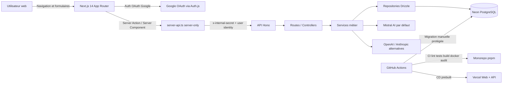
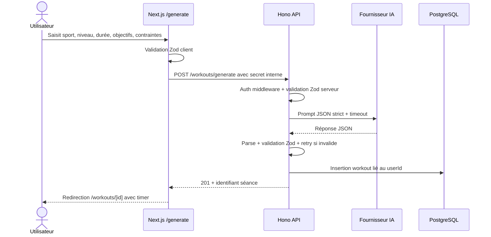

# Livrable Bloc 1 RNCP39583 - Cadrage du projet Alcide

> Bloc officiel : **Cadrer un projet de développement d'applications logicielles**
> Projet : **Alcide / alcide**
> Candidat : Kevin
> Version du livrable : 2026-05-07
> Statut : livrable de cadrage projet exploitable pour la soutenance Bloc 1

---

## 0. Référentiel et périmètre du livrable

Ce document consolide le cadrage amont du projet Alcide selon les attendus officiels du Bloc 1 RNCP39583. Il ne remplace pas le code ni le dossier professionnel général : il sert à démontrer que le projet a été cadré comme un projet logiciel réel, avec besoin, parties prenantes, risques, faisabilité, choix d'architecture, charge, budget et argumentaire client.

Sources RNCP locales utilisées :

| Source | Usage dans ce livrable |
|---|---|
| `docs/rncp/Référentiel Expert en développement logiciel RNCP39583 (1).pdf` | Compétences, activités et critères d'évaluation Bloc 1 |
| `docs/rncp/25 09 15  Réglement spécial de certification - Expert en développement logiciel RNCP39583 (1).pdf` | Format d'épreuve, durée, livrables attendus et compétences éliminatoires |
| `docs/rncp/25-26 Modalités_Evaluations_Titre EDL RNCP39583_YNOV_M2_filiere Info (1).pdf` | Confirmation du format oral individuel : 30 min, dont 20 min de présentation et 10 min d'échange |
| `docs/rncp/matrice-conformite-rncp39583.md` | Écarts Bloc 1 déjà identifiés et actions prioritaires |
| `docs/rncp/dossier-professionnel-rncp39583.md` | Réalignement des preuves existantes sur les 4 blocs officiels |

Les éléments suivants répondent directement aux compétences éliminatoires du Bloc 1 :

| Compétence éliminatoire | Réponse dans ce document |
|---|---|
| **C1.1.1** - Cartographier les acteurs, commanditaire, parties prenantes, rôles et utilisateurs | Section 3 - Cartographie des parties prenantes |
| **C1.2.2** - Évaluer la faisabilité technique, les contraintes et le budget client pour décider du lancement | Sections 8, 12 et 13 |
| **C1.3.2** - Sélectionner l'architecture technique via une étude comparative des solutions, incluant la sécurité | Sections 9 et 10 |
| **C1.4.1** - Évaluer la charge de travail nécessaire à partir des fonctionnalités attendues | Sections 11 et 12 |
| **C1.6** - Proposer les décisions et axes de solutions avec un argumentaire client | Section 14 |

Les estimations de charge et de budget sont des **hypothèses de cadrage**. Elles valorisent le travail comme un projet client, même si le projet a été réalisé dans un contexte de certification et non dans un contrat facturé.

---

## 1. Présentation synthétique du projet

| Élément | Description |
|---|---|
| Nom du projet | **Alcide / alcide** |
| Nature | Application web full-stack de génération d'entraînements sportifs personnalisés par IA |
| Contexte | Projet support à la certification RNCP39583 Expert en développement logiciel, conduit en autonomie et documenté par sprints, ADR, tests, sécurité, CI/CD et déploiement |
| Problématique | Un sportif non expert a besoin d'obtenir rapidement une séance ou un programme adapté à son sport, son niveau, ses objectifs et ses contraintes, sans disposer nécessairement d'un coach personnel ou de compétences de planification sportive |
| Objectif principal | Fournir un outil web permettant de générer, sauvegarder, consulter, exécuter et suivre des séances d'entraînement personnalisées |
| Public cible | Sportifs amateurs ou réguliers, personnes souhaitant structurer leur entraînement, coachs ou structures sportives souhaitant proposer un premier outil numérique d'accompagnement |
| Stack technique | Next.js 14, Hono, TypeScript, PostgreSQL/Drizzle, Auth.js, Mistral AI par défaut, OpenAI/Anthropic via paramètres utilisateur, Zod, pnpm monorepo, Docker, GitHub Actions, Vercel/Neon |

Périmètre fonctionnel cadré :

| Fonctionnalité | Statut preuve projet | Preuves |
|---|---|---|
| Génération de séance IA | Implémentée | `apps/web/app/generate/page.tsx`, `apps/api/src/services/mistral.service.ts`, `packages/shared/src/schemas/workout.schema.ts` |
| Génération de programme multi-semaines | Implémentée | `apps/web/app/programs/generate/page.tsx`, `apps/api/src/services/mistral-program.service.ts`, `packages/shared/src/schemas/program.schema.ts` |
| Authentification OAuth Google | Implémentée | `apps/web/lib/auth.ts`, `apps/api/src/middleware/auth.middleware.ts`, `docs/adr/ADR-004-service-to-service-auth.md` |
| Persistance utilisateur | Implémentée | `apps/api/src/db/schema.ts`, `apps/api/src/repositories/` |
| Liste, détail, suppression des entraînements | Implémentée | `apps/web/app/workouts/`, `apps/api/src/controllers/workout.controller.ts` |
| Timer et exécution de séance | Implémentée | `apps/web/components/Timer.tsx`, `apps/web/app/workouts/[id]/page.tsx` |
| Suivi de session terminée | Implémenté en cours de travail local | `apps/api/src/controllers/session-log.controller.ts`, `apps/web/components/SessionCompletionForm.tsx`, `packages/shared/src/schemas/session-log.schema.ts` |
| Dashboard utilisateur | Implémenté | `apps/web/app/dashboard/page.tsx`, `apps/api/src/controllers/workout.controller.ts` |
| Paramètres IA utilisateur | Implémentés | `apps/web/app/settings/page.tsx`, `apps/api/src/controllers/settings.controller.ts`, `apps/api/src/services/ai.service.ts` |
| CI/CD et déploiement | Documentés et configurés | `.github/workflows/ci.yml`, `.github/workflows/deploy-vercel.yml`, `.github/workflows/db-migrate.yml`, `docs/ci-cd.md`, `docs/deployment.md` |

Hors périmètre de la version cadrée :

- certification médicale ou recommandations de santé personnalisées ;
- suivi biométrique connecté à des montres ou capteurs ;
- paiement en ligne ;
- application mobile native ;
- monitoring externe avec alerting complet ;
- modèle IA auto-hébergé.

---

## 2. Analyse de la demande

### 2.1 Besoin initial

Le besoin initial peut être formulé ainsi :

> Permettre à un utilisateur sportif de générer rapidement une séance ou un programme d'entraînement adapté à son profil, puis de l'enregistrer, le consulter et l'exécuter depuis une interface web simple, sécurisée et accessible.

Dans le cadre RNCP, le commanditaire peut être présenté comme un **commanditaire fictif réaliste** : une structure sportive locale, un coach indépendant ou une salle de sport souhaitant proposer un service numérique d'aide à l'entraînement. Aucune preuve d'entretien client réel n'a été trouvée dans le dépôt ; l'analyse ci-dessous est donc une **formalisation de cadrage** à partir du besoin projet, des preuves fonctionnelles et des choix réalisés.

### 2.2 Utilisateurs visés

| Utilisateur | Besoin | Attentes |
|---|---|---|
| Sportif débutant | Être guidé sans jargon technique | Séance claire, durée maîtrisée, exercices compréhensibles |
| Sportif régulier | Varier les séances et structurer la progression | Programme multi-semaines, objectifs, contraintes, historique |
| Coach ou structure sportive | Proposer un outil d'accompagnement numérique | Génération rapide, fiabilité, cohérence, coût maîtrisé |
| Jury RNCP | Vérifier la capacité à cadrer, développer et justifier un projet logiciel | Preuves techniques, risques, budget, architecture, argumentaire |

### 2.3 Objectifs métiers

| Objectif métier | Indicateur de réussite |
|---|---|
| Réduire le temps de préparation d'une séance | L'utilisateur obtient une séance en quelques étapes depuis `/generate` |
| Rendre l'entraînement plus accessible aux non experts | Formulaires simples, niveaux débutant/intermédiaire/avancé, timer intégré |
| Personnaliser la recommandation | Sport, niveau, durée, objectifs et contraintes envoyés à l'IA |
| Conserver l'historique utilisateur | Workouts, programmes et sessions terminées liés au `userId` |
| Sécuriser les données utilisateur | Authentification, ownership côté repository, secrets serveur uniquement |
| Disposer d'une solution démontrable | Déploiement Vercel/Neon, healthchecks, Docker Compose local |

### 2.4 Contraintes principales

| Contrainte | Impact projet | Réponse proposée |
|---|---|---|
| Budget limité de prototype | Éviter une infrastructure lourde | Vercel/Neon, free tiers ou faibles coûts, Docker pour portabilité |
| Données utilisateur | Empêcher l'accès croisé entre comptes | Auth.js + `x-internal-secret` + `userId` en base |
| Fiabilité IA | Une sortie LLM peut être invalide | JSON mode, extraction JSON, validation Zod, retry |
| Coût IA variable | Risque de dépassement si usage élevé | Rate limiting, budget mensuel, suivi des appels IA, clé utilisateur optionnelle |
| Accessibilité | Application utilisable au clavier et par lecteurs d'écran | Tests Playwright, axe-core, aria-live, focus visible |
| Déploiement | Production démontrable sans procédure manuelle fragile | GitHub Actions, Vercel, migrations Drizzle manuelles et tracées |

### 2.5 Valeur attendue pour les utilisateurs

- **Gain de temps** : la séance est générée automatiquement à partir d'un formulaire court.
- **Personnalisation** : le sport, le niveau, les objectifs et contraintes orientent la génération.
- **Continuité** : l'utilisateur retrouve ses séances, programmes et statistiques.
- **Confiance** : la sécurité, la validation des données et les tests réduisent les risques de régression.
- **Autonomie** : le timer transforme la génération IA en séance directement exécutable.

---

## 3. Cartographie des parties prenantes

Cette section sécurise la compétence éliminatoire **C1.1.1**.

| Partie prenante | Rôle | Attentes | Niveau d'implication | Influence | Preuves ou éléments associés |
|---|---|---|---|---|---|
| Commanditaire fictif : coach indépendant / structure sportive | Porte le besoin client et valide le cadrage | Solution simple, démontrable, coût maîtrisé, risques identifiés | Moyen à fort en cadrage et validation | Fort | Hypothèse de mise en situation Bloc 1, à présenter comme scénario client |
| Utilisateurs finaux sportifs | Utilisent l'application pour générer et suivre des séances | Rapidité, clarté, adaptation, accessibilité, sécurité | Fort en usage, faible en décision technique | Moyen | Parcours `/generate`, `/workouts`, `/programs`, `/dashboard` |
| Développeur / équipe projet | Conçoit, développe, teste, sécurise et déploie | Architecture maintenable, qualité, preuves RNCP | Très fort | Fort | `apps/api/src/`, `apps/web/`, `packages/shared/src/`, `docs/adr/` |
| Jury RNCP / organisme certificateur | Évalue la conformité au référentiel | Preuves alignées Bloc 1, argumentaire, démonstration | Fort pendant l'épreuve | Fort | `docs/rncp/matrice-conformite-rncp39583.md`, présent livrable |
| Fournisseur IA : Mistral AI, alternatives OpenAI/Anthropic | Génération des séances et programmes | Appels API conformes, clé protégée, usage maîtrisé | Moyen | Moyen | `apps/api/src/services/ai.service.ts`, `apps/api/src/services/mistral.service.ts` |
| Hébergeur applicatif : Vercel | Héberge Web et API | Configuration env correcte, builds reproductibles | Moyen | Fort sur disponibilité | `docs/deployment.md`, `.github/workflows/deploy-vercel.yml` |
| Base de données : Neon PostgreSQL | Stockage persistant | Migrations maîtrisées, `DATABASE_URL` sécurisé | Moyen | Fort sur persistance | `apps/api/src/db/schema.ts`, `.github/workflows/db-migrate.yml` |
| Fournisseur OAuth : Google OAuth / Auth.js | Connexion utilisateur | Callbacks corrects, secrets protégés | Moyen | Fort sur authentification | `apps/web/lib/auth.ts`, `.env.example` |
| GitHub Actions | Intégration continue et déploiement contrôlé | Secrets configurés, workflows fiables | Moyen | Moyen à fort sur qualité | `.github/workflows/ci.yml`, `docs/ci-cd.md` |
| Mainteneur futur | Reprend le projet après livraison | Documentation, ADR, tests, changelog | Faible aujourd'hui, fort après livraison | Moyen | `README.md`, `CHANGELOG.md`, `docs/adr/`, `docs/deployment.md` |

Lecture RACI simplifiée :

| Activité | Responsable | Approbateur | Consulté | Informé |
|---|---|---|---|---|
| Cadrage besoin et périmètre | Développeur | Commanditaire fictif / jury | Utilisateurs cibles | Jury |
| Choix architecture | Développeur | Commanditaire fictif / jury | Fournisseurs techniques | Utilisateurs |
| Développement | Développeur | Jury dans le cadre RNCP | Documentation fournisseurs | Commanditaire |
| Sécurité et conformité | Développeur | Jury | OWASP, ADR, tests | Utilisateurs |
| Déploiement | Développeur | Commanditaire fictif | Vercel/Neon/GitHub | Utilisateurs |

---

## 4. Objectifs et enjeux du projet

### 4.1 Enjeux fonctionnels

| Enjeu | Description | Réponse projet |
|---|---|---|
| Personnalisation | Adapter les entraînements aux objectifs et contraintes | Formulaires `WorkoutForm` et `ProgramForm`, schémas Zod |
| Exécution immédiate | Ne pas seulement générer du texte, mais guider une séance | Timer interactif et timeline |
| Historique | Permettre la consultation et le suivi | Tables `workouts`, `training_programs`, `session_logs` |
| Parcours simple | Limiter la friction utilisateur | Pages dédiées : génération, liste, détail, dashboard |

### 4.2 Enjeux techniques

- maintenir une séparation claire frontend / API / base de données / IA ;
- mutualiser les types et schémas via `packages/shared` ;
- éviter la duplication de contrats entre frontend et backend ;
- garder une architecture déployable localement, en Docker et sur Vercel ;
- limiter les dépendances lourdes pour préserver la maintenabilité.

### 4.3 Enjeux de sécurité

Preuves principales : `docs/security/owasp-review.md`, `apps/api/src/middleware/auth.middleware.ts`, `apps/api/src/middleware/rate-limit.middleware.ts`, `apps/api/src/services/ai.service.ts`.

| Risque | Réponse actuelle |
|---|---|
| Accès aux données d'un autre utilisateur | `userId` porté dans les requêtes, ownership en repository, FK base de données |
| Exposition des secrets | `server-only`, variables d'environnement, aucun secret `NEXT_PUBLIC_*` sauf URL API |
| Injection | Zod sur inputs, Drizzle ORM, pas de SQL brut fonctionnel |
| Prompt/LLM output invalide | JSON mode, parsing contrôlé, validation Zod, retry |
| Coût ou abus IA | Rate limiting 5 générations/minute/utilisateur |
| Configuration faible | `validateEnv()` fail-fast au démarrage API |

### 4.4 Enjeux d'accessibilité

L'application doit rester utilisable au clavier et compréhensible avec lecteurs d'écran. Les preuves incluent `apps/web/tests/e2e/accessibility.spec.ts`, `apps/web/tests/e2e/axe.spec.ts`, les composants avec `aria-live`, `role="timer"`, focus visible et pages `loading.tsx`.

### 4.5 Enjeux de maintenabilité

| Choix | Impact maintenabilité |
|---|---|
| Monorepo pnpm | Scripts unifiés, types partagés, build coordonné |
| Architecture Hono en couches | Responsabilités séparées : routes, controllers, services, repositories |
| ADR | Décisions traçables et défendables |
| Tests Vitest + Playwright | Régressions fonctionnelles, accessibilité et sécurité détectables |
| Changelog | Historique de versions lisible |

### 4.6 Enjeux environnementaux et sobriété numérique

Le projet n'a pas de bilan carbone mesuré. Les éléments suivants limitent toutefois l'empreinte dans le cadrage :

- choix d'une architecture web managée plutôt qu'un serveur permanent surdimensionné ;
- PostgreSQL Neon serverless avec mise en veille possible selon l'offre ;
- génération IA limitée par rate limiting et prompts relativement contraints ;
- Next.js Server Components et Server Actions pour éviter une partie du JavaScript client inutile ;
- Docker Compose conservé comme option de portabilité, sans imposer une infrastructure lourde.

Point à compléter avant industrialisation : ajouter une mesure simple de consommation cloud, volume de tokens et nombre de générations par utilisateur.

---

## 5. Opportunités et menaces

Cette section couvre **C1.2.1** : opportunités, menaces, adhérences et impacts.

### 5.1 Matrice SWOT

| Forces | Faiblesses |
|---|---|
| Application full-stack déjà fonctionnelle avec preuves code | Pas d'entretien client réel formalisé |
| Architecture TypeScript cohérente et documentée par ADR | Monitoring externe et alerting non finalisés |
| Validation Zod à plusieurs frontières | Rate limiting in-memory à remplacer pour une production multi-instance |
| Déploiement Vercel/Neon documenté | Budget réel IA dépendant des usages et tarifs API |
| Tests unitaires, E2E et accessibilité | Tests d'intégration DB non automatisés |

| Opportunités | Menaces |
|---|---|
| Marché de l'accompagnement sportif numérique | Coûts IA variables selon volume et modèle |
| Différenciation par génération de programmes et suivi de session | Sorties IA incohérentes ou conseils inadaptés |
| Extension vers RAG d'exercices validés par coach | Dépendance fournisseurs : Vercel, Neon, Mistral, Google OAuth |
| Intégration future avec objets connectés | Risques RGPD et sécurité si données sensibles ajoutées |
| Déploiement rapide et démontrable pour jury/client | Indisponibilité API IA ou quotas fournisseurs |

### 5.2 Opportunités produit

- transformer un générateur ponctuel en carnet d'entraînement progressif ;
- proposer un tableau de bord d'effort et de feedback ;
- permettre à un coach de préparer plus vite des séances initiales ;
- ajouter des exports PDF, une PWA ou un référentiel d'exercices validé.

### 5.3 Opportunités techniques

- contrats partagés Zod pour limiter les désynchronisations ;
- évolution multi-provider IA déjà préparée dans `ai.service.ts` et `settings.controller.ts` ;
- déploiement Vercel/Neon simple à démontrer ;
- possibilité d'auto-hébergement via Docker Compose.

### 5.4 Menaces principales à mettre sous contrôle

| Menace | Impact | Action de contrôle |
|---|---|---|
| Coût IA non plafonné | Dépassement budget | Rate limiting, seuil mensuel, suivi tokens, clé utilisateur optionnelle |
| Réponse IA invalide | Mauvaise UX, erreur génération | JSON mode, validation Zod, retry, tests unitaires |
| Conseil sportif inadapté | Risque d'usage impropre | Disclaimer, contraintes utilisateur, future base d'exercices validée |
| Dépendance fournisseur | Migration plus coûteuse | Services découplés, Docker, PostgreSQL standard, multi-provider |
| Données utilisateur exposées | Risque critique sécurité | Auth, ownership, secrets, revue OWASP |
| Déploiement avant migration DB | Incohérence prod | Workflow migration manuel et protégé |

---

## 6. Diagnostic de l'existant

### 6.1 Situation avant projet

Avant Alcide, l'existant projet était nul : aucun outil local ne permettait de générer, stocker, exécuter et suivre des entraînements personnalisés. L'utilisateur devait s'appuyer sur :

- des programmes génériques trouvés en ligne ;
- des applications sportives fermées ;
- un coach humain, plus personnalisé mais plus coûteux ;
- des notes personnelles sans adaptation IA ni historique structuré.

### 6.2 Limites des solutions existantes

| Solution existante | Limite |
|---|---|
| Programme PDF ou article web | Peu personnalisé, pas interactif, pas lié à l'utilisateur |
| Application fitness généraliste | Peut être fermée, payante ou peu transparente sur la génération |
| Coach humain | Très qualitatif mais disponibilité et coût plus élevés |
| Prompt manuel dans un chatbot IA | Pas de sauvegarde, pas de timer, pas de validation stricte, pas de sécurité applicative |

### 6.3 Alternatives possibles

| Alternative | Avantages | Limites |
|---|---|---|
| Utiliser uniquement ChatGPT / Le Chat / Claude | Rapide à démarrer | Pas d'application dédiée, pas de persistance ni workflow utilisateur |
| Construire une bibliothèque d'entraînements statiques | Contrôle total du contenu | Moins personnalisé, maintenance éditoriale lourde |
| Application no-code | Livraison rapide | Limites sur sécurité, IA, tests, architecture RNCP |
| Application mobile native | Très adaptée au sport | Coût initial plus élevé et complexité multiplateforme |

### 6.4 Justification de la création de Alcide

Alcide est justifié car il combine :

- une personnalisation par IA ;
- une validation technique stricte des entrées et sorties ;
- une persistance par utilisateur ;
- une exécution concrète de séance via timer ;
- une architecture full-stack démontrable et maintenable ;
- des preuves RNCP exploitables sur architecture, sécurité, accessibilité, tests et déploiement.

---

## 7. Risques techniques et fonctionnels

Cette section couvre **C1.2.3** : registre des risques, criticité et indicateurs de contrôle.

Échelle utilisée :

- Probabilité : Faible, Moyenne, Forte
- Impact : Faible, Moyen, Fort, Critique
- Criticité : combinaison qualitative probabilité x impact

| ID | Risque | Probabilité | Impact | Criticité | Mesures de mitigation | Indicateurs de suivi | Preuves |
|---|---|---:|---:|---:|---|---|---|
| R1 | Réponse IA invalide ou non conforme au schéma | Moyenne | Fort | Élevée | JSON mode, extraction JSON, validation Zod, retry limité | Taux d'erreurs génération, logs `[AiService]` | `mistral.service.ts`, `mistral-program.service.ts`, tests Mistral |
| R2 | Coût IA supérieur au budget | Moyenne | Fort | Élevée | Rate limiting, budget mensuel, choix modèle léger, clé utilisateur optionnelle | Nombre d'appels IA, consommation tokens, facturation fournisseur | `rate-limit.middleware.ts`, `ai.service.ts` |
| R3 | Accès aux données d'un autre utilisateur | Faible | Critique | Élevée | Auth middleware, `userId`, ownership repository, FK DB | Tests auth, erreurs 401/403/404, revue OWASP A01 | `auth.middleware.ts`, `schema.ts`, `owasp-review.md` |
| R4 | Secret exposé côté client | Faible | Critique | Élevée | `server-only`, env vars, pas de secret `NEXT_PUBLIC_*` | Revue DevTools, audit code, CI secrets | `server-api.ts`, `.env.example`, `owasp-review.md` |
| R5 | Indisponibilité Mistral/OpenAI/Anthropic | Moyenne | Moyen | Moyenne | Timeout, message utilisateur, multi-provider préparé | Taux 503 IA, durée moyenne appels IA | `ai.service.ts`, `settings.controller.ts` |
| R6 | Déploiement sans migration DB | Moyenne | Fort | Élevée | Workflow `db-migrate` manuel et protégé, séparation build/migration | Logs GitHub Actions migration, healthchecks | `.github/workflows/db-migrate.yml`, `docs/ci-cd.md` |
| R7 | Régression fonctionnelle | Moyenne | Fort | Élevée | CI lint/typecheck/tests/build, smoke E2E, cahier de recettes | Statut CI, coverage, Playwright report | `.github/workflows/ci.yml`, `docs/bloc2/cahier-recettes.md` |
| R8 | Accessibilité insuffisante | Moyenne | Moyen | Moyenne | Tests Playwright accessibilité, axe-core, composants aria | Résultats E2E accessibilité, violations axe | `apps/web/tests/e2e/accessibility.spec.ts`, `axe.spec.ts` |
| R9 | Rate limiting in-memory inadapté au multi-instance | Forte si montée en charge | Moyen | Moyenne | Prévoir Redis/Upstash en production | Écart entre instances, dépassements quota | `rate-limit.middleware.ts`, préconisation section 14 |
| R10 | Vendor lock-in Vercel/Neon | Moyenne | Moyen | Moyenne | PostgreSQL standard, Docker Compose, services découplés | Temps estimé de migration, compatibilité Docker | `docker-compose.yml`, `docs/deployment.md` |
| R11 | Données sportives interprétées comme conseil médical | Moyenne | Fort | Élevée | Disclaimer, limiter au coaching général, ajouter validation coach à terme | Retours utilisateurs, incidents déclarés | À produire : mentions légales et limites d'usage |
| R12 | Monitoring insuffisant en production | Moyenne | Moyen | Moyenne | Healthchecks existants, futur alerting externe | Disponibilité, temps réponse, alertes | `health.routes.ts`, `docs/deployment.md`, à compléter |

---

## 8. Faisabilité technique

Cette section sécurise la compétence éliminatoire **C1.2.2**.

### 8.1 Avis de faisabilité

Avis global : **faisable pour un MVP web certifiant et un pilote client limité**, sous réserve de mettre sous contrôle les coûts IA, le monitoring et les limites métier des recommandations sportives.

| Domaine | Faisabilité | Justification | Contraintes |
|---|---|---|---|
| Frontend | Forte | Next.js 14 déjà en place, pages principales implémentées, composants réutilisables | Maintenir accessibilité et responsive |
| Backend | Forte | API Hono structurée, controllers/services/repositories, erreurs centralisées | Couvrir davantage les repositories avec tests DB |
| Base de données | Forte | PostgreSQL + Drizzle, migrations versionnées, schéma utilisateur/workout/program/session | Gestion migration production et sauvegardes |
| IA | Moyenne à forte | Mistral/OpenAI/Anthropic via service commun, validation Zod | Coût, quotas, latence, qualité de sortie |
| Sécurité | Forte pour MVP | OWASP documenté, secrets, auth, ownership, fail-fast | Durcir pour production multi-tenant |
| Déploiement cloud | Forte | Vercel Web/API + Neon documentés, workflows GitHub Actions | Secrets, quotas et migrations manuelles |
| Sobriété | Moyenne | Cloud managé, serverless, rate limiting | Pas de mesure carbone réelle |

### 8.2 Contraintes identifiées

| Contrainte | Décision de cadrage |
|---|---|
| Délais de prototype | Prioriser MVP fonctionnel : génération, persistance, auth, timer, dashboard |
| Budget | Cibler free tiers ou coûts faibles en phase RNCP/pilote |
| Sécurité | Ne jamais appeler l'IA depuis le navigateur, conserver les secrets côté serveur |
| Qualité IA | Refuser les sorties invalides plutôt que persister des données non conformes |
| Exploitabilité jury | Conserver preuves : ADR, CI, cahier de recettes, sécurité, changelog |
| Production | Déployer Web/API sur Vercel et base sur Neon, migrations manuelles protégées |

### 8.3 Décision de lancement

Le lancement du MVP est recommandé car :

- le besoin utilisateur est clair et limité ;
- les fonctionnalités principales sont réalisables avec la stack existante ;
- les risques critiques disposent de mitigations techniques ;
- le budget de prototype est maîtrisable ;
- l'architecture est portable et documentée ;
- la démonstration RNCP est possible avec preuves locales et production.

Conditions avant un lancement client réel :

1. ajouter une page de limites d'usage sportif et de responsabilité ;
2. mettre un plafond de dépenses IA dans la console fournisseur ;
3. remplacer le rate limiting in-memory par une solution persistante si multi-instance ;
4. ajouter un monitoring externe avec alertes ;
5. tester les repositories avec une base d'intégration.

---

## 9. Veille et comparaison des solutions techniques

Cette section sécurise la compétence éliminatoire **C1.3.2**.

Méthode de veille utilisée :

- analyse des ADR du projet : `docs/adr/`;
- revue des docs projet : `docs/ci-cd.md`, `docs/deployment.md`, `docs/security/owasp-review.md`;
- veille technologique existante : `docs/bloc4/veille-technologique.md`;
- consultation des pages tarifaires officielles Vercel, Neon, Mistral AI et GitHub Actions le 2026-05-07 pour cadrer les hypothèses budgétaires.

### 9.1 Next.js vs autres frameworks frontend

| Option | Avantages | Limites | Impact sécurité / maintenabilité / coût | Décision |
|---|---|---|---|---|
| **Next.js 14 App Router** | Server Components, Server Actions, Auth.js, intégration Vercel, routes API health | Courbe d'apprentissage, logique serveur/client à maîtriser | Secrets conservés serveur, bonne maintenabilité TypeScript, coût faible sur Vercel au prototype | **Retenu** |
| React SPA + Vite | Simple, rapide, excellent DX | Nécessite API auth plus exposée, moins adapté aux Server Actions | Plus de logique côté client, secrets plus délicats, hébergement statique économique | Non retenu |
| Nuxt | Full-stack Vue mature | Écosystème projet déjà React/TypeScript | Bon choix mais rupture avec compétences et packages existants | Non retenu |

Raison du choix : Next.js permet de garder les appels API dans `server-api.ts` côté serveur, ce qui protège `SERVICE_SECRET` et simplifie l'intégration Auth.js.

### 9.2 Hono vs Express / Fastify / NestJS

| Option | Avantages | Limites | Impact sécurité / maintenabilité / coût | Décision |
|---|---|---|---|---|
| **Hono** | Léger, TypeScript natif, middleware simple, Web APIs standards | Écosystème plus jeune qu'Express | Faible surface, architecture claire, coût runtime réduit | **Retenu** |
| Express | Très mature, écosystème massif | Types externes, middleware plus verbeux | Maintenable mais moins typé nativement | Non retenu |
| Fastify | Performant, schémas intégrés | Configuration plus riche à apprendre | Très bon choix mais plus complexe pour MVP | Non retenu |
| NestJS | Architecture opinionated, DI, modules | Surdimensionné pour MVP solo | Maintenable en équipe mais coût de complexité élevé | Non retenu |

Preuve : `docs/adr/ADR-002-hono-backend.md`.

### 9.3 PostgreSQL/Drizzle vs autres solutions

| Option | Avantages | Limites | Impact sécurité / maintenabilité / coût | Décision |
|---|---|---|---|---|
| **PostgreSQL + Drizzle** | SQL relationnel robuste, migrations, types TS, JSONB flexible | Tests DB à ajouter, nécessite gestion migrations | Requêtes paramétrées, standard portable, Neon free/usage-based possible | **Retenu** |
| Prisma + PostgreSQL | Très productif, écosystème mature | Génération client plus lourde, abstraction forte | Maintenable mais plus volumineux | Non retenu |
| Supabase | Auth + DB + API intégrés | Dépendance plateforme, architecture moins séparée | Rapide mais moins aligné avec démonstration backend Hono | Non retenu |
| Firebase/Firestore | Serverless, temps réel | NoSQL, moins adapté aux relations utilisateur/workouts/programmes | Coût et modélisation moins prévisibles | Non retenu |

Preuve : `apps/api/src/db/schema.ts`, migrations `apps/api/drizzle/`, `docs/adr/ADR-001-monorepo-pnpm.md`.

### 9.4 Mistral AI vs OpenAI / Anthropic / modèle local

| Option | Avantages | Limites | Impact sécurité / maintenabilité / coût | Décision |
|---|---|---|---|---|
| **Mistral AI** | JSON mode, modèle par défaut adapté, fournisseur européen, coût cadrable | Qualité et quotas à surveiller | Appels serveur uniquement, validation Zod, budget à plafonner | **Retenu par défaut** |
| OpenAI | Référence marché, modèles robustes, JSON mode | Coût potentiellement supérieur selon usage | Déjà préparé dans `ai.service.ts`, nécessite clé et suivi budget | Alternative |
| Anthropic | Très bonne qualité rédactionnelle | API différente, coût selon modèle | Support préparé dans `ai.service.ts`, attention au format JSON | Alternative |
| Modèle local | Contrôle données, pas de coût token externe | Besoin GPU/CPU, maintenance, latence | Plus sobre côté données, moins sobre infra pour MVP | Non retenu pour MVP |

Preuves : `docs/adr/ADR-003-mistral-ai.md`, `apps/api/src/services/ai.service.ts`, `apps/api/src/controllers/settings.controller.ts`.

### 9.5 Vercel/Neon vs autres hébergements

| Option | Avantages | Limites | Impact sécurité / maintenabilité / coût | Décision |
|---|---|---|---|---|
| **Vercel Web/API + Neon PostgreSQL** | Déploiement rapide, HTTPS, previews, PostgreSQL managé, workflows existants | Vendor lock-in, quotas, fonctions serverless | Faible coût prototype, rollback Vercel, migrations Neon séparées | **Retenu comme cible canonique** |
| Fly.io + Neon | Docker, région EU, contrôle API | Configuration plus manuelle | Portable, mais cible secondaire | Supporté |
| Railway | Simple | Coût/free tier variable selon période | À vérifier avant choix client | Non retenu comme cible canonique |
| VPS Docker | Contrôle fort, coût prévisible | Maintenance SSL, backups, monitoring | Plus de responsabilité sécurité | Alternative industrialisation |

Preuves : `docs/adr/ADR-006-deployment-architecture.md`, `docs/adr/ADR-007-ci-cd-vercel-neon.md`, `docs/deployment.md`.

### 9.6 GitHub Actions vs autres CI/CD

| Option | Avantages | Limites | Impact sécurité / maintenabilité / coût | Décision |
|---|---|---|---|---|
| **GitHub Actions** | Intégré au dépôt, secrets, workflows CI/CD/DB, large écosystème | Quotas selon plan, configuration YAML | Traçable, auditable, coût faible au prototype | **Retenu** |
| Vercel auto-deploy seul | Simple | Peut déployer avant CI complète | Moins contrôlé pour RNCP | Non retenu seul |
| GitLab CI | Complet | Migration dépôt nécessaire | Pertinent si dépôt GitLab | Non retenu |
| Jenkins | Très flexible | Maintenance serveur | Surdimensionné pour MVP | Non retenu |

Preuves : `.github/workflows/ci.yml`, `.github/workflows/deploy-vercel.yml`, `.github/workflows/db-migrate.yml`, `docs/ci-cd.md`.

---

## 10. Architecture proposée

Cette section couvre **C1.5** : architecture schématisée, maintenable, sécurisée, extensible et attentive à l'impact environnemental.

### 10.1 Architecture logique globale

Légende :

- rectangles : composants applicatifs ou fournisseurs ;
- cylindre : stockage persistant ;
- flèches : flux d'appel ou de déploiement ;
- la frontière `server-only` évite l'exposition des secrets dans le navigateur.

### 10.2 Flux de génération d'une séance

### 10.3 Composants d'architecture

| Couche | Choix | Responsabilité | Preuves |
|---|---|---|---|
| Frontend | Next.js 14 App Router | Pages, Server Actions, auth, UX, accessibilité | `apps/web/app/`, `apps/web/components/` |
| API | Hono | Routes HTTP, middlewares, erreurs | `apps/api/src/app.ts`, `apps/api/src/routes/` |
| Métier | Services TypeScript | Génération, règles métier, appels IA | `apps/api/src/services/` |
| Données | Repositories Drizzle | Accès PostgreSQL, ownership | `apps/api/src/repositories/` |
| Contrats | Zod partagé | Inputs, sorties IA, types communs | `packages/shared/src/` |
| Auth | Auth.js + secret interne | OAuth Google côté web, identité transmise serveur à serveur | `apps/web/lib/auth.ts`, `apps/api/src/middleware/auth.middleware.ts` |
| IA | Mistral par défaut, OpenAI/Anthropic préparés | Génération de contenu structuré | `apps/api/src/services/ai.service.ts` |
| CI/CD | GitHub Actions | Qualité, build, audit, déploiement, migrations | `.github/workflows/` |
| Déploiement | Vercel + Neon | Production web/API et base managée | `docs/deployment.md` |

---

## 11. Fonctionnalités attendues et priorisation

Cette section alimente **C1.4.1** : fonctions recensées, caractérisées, ordonnées et hiérarchisées.

| Fonction | Priorité | Description | Statut projet | Preuves |
|---|---|---|---|---|
| Authentification | Must | Connexion OAuth Google, session utilisateur | Implémenté | `apps/web/lib/auth.ts` |
| Génération de séance | Must | Créer une séance personnalisée | Implémenté | `apps/web/app/generate/page.tsx`, `mistral.service.ts` |
| Persistance des séances | Must | Sauvegarder les séances par utilisateur | Implémenté | `schema.ts`, `workout.repository.ts` |
| Liste et détail entraînement | Must | Retrouver et consulter ses séances | Implémenté | `apps/web/app/workouts/` |
| Sécurité ownership | Must | Isoler les données entre utilisateurs | Implémenté | `auth.middleware.ts`, `owasp-review.md` |
| Validation Zod | Must | Valider inputs et sorties IA | Implémenté | `packages/shared/src/schemas/` |
| Déploiement | Must | Rendre l'application démontrable | Implémenté/documenté | `docs/deployment.md`, `.github/workflows/` |
| Génération de programme | Should | Créer un cycle multi-semaines | Implémenté | `programs/generate/page.tsx`, `mistral-program.service.ts` |
| Timer interactif | Should | Exécuter la séance étape par étape | Implémenté | `Timer.tsx` |
| Suivi de session | Should | Enregistrer effort, feedback, notes | Implémenté localement | `SessionCompletionForm.tsx`, `session-log.controller.ts` |
| Dashboard | Should | Afficher statistiques utilisateur | Implémenté | `dashboard/page.tsx` |
| Paramètres IA | Should | Choisir provider, modèle, clé personnelle | Implémenté | `settings/page.tsx`, `ai.service.ts` |
| Tests E2E et accessibilité | Should | Valider parcours et RGAA/WCAG | Implémenté | `apps/web/tests/e2e/` |
| Monitoring externe | Could | Alerting disponibilité | À produire | Healthchecks existants, alerting absent |
| Export PDF | Could | Imprimer une séance | Non implémenté | Axe d'amélioration |
| PWA/offline timer | Could | Utiliser le timer hors ligne | Non implémenté | Axe d'amélioration |
| Paiement / abonnement | Won't MVP | Monétisation | Hors périmètre | Non applicable |

---

## 12. Estimation de charge

Cette section sécurise la compétence éliminatoire **C1.4.1**.

Hypothèses :

- estimation en jours-homme de 7 heures ;
- périmètre : MVP web exploitable et démontrable, proche de l'état actuel du projet ;
- profil : développeur full-stack TypeScript autonome ;
- hors commercialisation, design de marque complet, conseil juridique, validation médicale, mobile natif ;
- inclut documentation RNCP/client car elle fait partie des livrables de cadrage et de soutenance.

| Lot | Charge estimée | Commentaire |
|---|---:|---|
| Cadrage besoin, périmètre, parties prenantes | 3 JH | Formalisation demande, utilisateurs, contraintes |
| Conception fonctionnelle et UX | 5 JH | Parcours génération, liste, détail, timer, dashboard |
| Architecture et ADR | 5 JH | Monorepo, backend, IA, auth, tests, déploiement |
| Mise en place monorepo et outillage | 4 JH | pnpm, TypeScript, ESLint, scripts |
| Frontend Next.js | 12 JH | Pages, composants, formulaires, dashboard, états |
| Backend Hono | 11 JH | Routes, controllers, services, middleware, erreurs |
| Base de données et migrations | 5 JH | Schéma, Drizzle, seed, migrations |
| Intégration IA | 7 JH | Prompts, providers, validation, retry, timeout |
| Authentification et sécurité | 6 JH | Auth.js, service-to-service, OWASP, secrets |
| Tests et accessibilité | 8 JH | Vitest, Playwright, axe-core, cahier de recettes |
| CI/CD et déploiement | 5 JH | GitHub Actions, Vercel, Neon, Docker |
| Documentation projet et RNCP | 6 JH | README, ADR, deployment, sécurité, dossier |
| Maintenance corrective initiale | 4 JH | Bugs, encodage, coverage, ajustements prod |
| **Total prévisionnel** | **81 JH** | **567 heures** |

Répartition macro :

| Type d'activité | JH | Part |
|---|---:|---:|
| Cadrage / conception / architecture | 13 | 16% |
| Développement frontend | 12 | 15% |
| Développement backend / DB / IA | 23 | 28% |
| Sécurité / tests / accessibilité | 14 | 17% |
| Déploiement / CI/CD | 5 | 6% |
| Documentation / maintenance initiale | 14 | 17% |

Points de vigilance sur la charge :

- une vraie validation métier par coach ajouterait 3 à 7 JH ;
- des tests d'intégration DB automatisés ajouteraient 2 à 4 JH ;
- un monitoring externe complet ajouterait 2 à 3 JH ;
- une application mobile native multiplierait significativement la charge.

---

## 13. Estimation des coûts et budget prévisionnel

Cette section couvre **C1.4.2** et contribue à **C1.2.2**.

### 13.1 Hypothèses budgétaires

| Hypothèse | Valeur retenue | Commentaire |
|---|---:|---|
| Valorisation du temps humain | 450 EUR HT / JH | Hypothèse de cadrage client, non facturée dans le projet RNCP |
| Charge prévisionnelle | 81 JH | Voir section 12 |
| Marge risque projet | 15% | Couvre dérives IA, sécurité, déploiement, corrections |
| Période pilote hébergement | 3 mois | Prototype ou soutenance |
| Volume prototype IA | Faible à moyen | À confirmer par métriques d'usage réelles |

### 13.2 Budget de réalisation initiale

| Poste | Calcul | Montant estimé |
|---|---:|---:|
| Développement et cadrage | 81 JH x 450 EUR | 36 450 EUR HT |
| Marge de risque | 15% du coût humain | 5 468 EUR HT |
| Mise en service pilote | Forfait vérification env, smoke, migration | 900 EUR HT |
| **Total réalisation prévisionnelle** |  | **42 818 EUR HT** |

Ce montant est une valorisation projet client. Dans le cadre RNCP, il sert à démontrer la capacité à chiffrer le projet et non à déclarer une facturation réelle.

### 13.3 Budget de fonctionnement mensuel

Les tarifs cloud évoluent. Les montants ci-dessous sont des hypothèses de budget, à vérifier au moment d'un engagement commercial.

| Poste | Hypothèse prototype | Hypothèse pilote professionnel | Commentaire |
|---|---:|---:|---|
| Vercel Web/API | 0 EUR/mois si usage personnel compatible Hobby | Environ 20 USD/mois par développeur en Pro, hors surconsommation | Le choix dépend de l'usage personnel/commercial et des quotas |
| Neon PostgreSQL | 0 EUR/mois si free tier suffisant | Ordre de grandeur 15 USD/mois en usage Launch intermittent | À suivre : stockage, compute, backups |
| API IA | 0 à 20 EUR/mois en tests limités | 20 à 100 EUR/mois selon volume, modèle et tokens | Mettre un plafond de dépense fournisseur |
| GitHub Actions | Inclus si quotas suffisants | Surcoût possible si dépassement de minutes/stockage | CI actuelle raisonnable pour MVP |
| Nom de domaine | Non requis pour RNCP | 12 à 25 EUR/an | Optionnel pour pilote client |
| Monitoring externe | 0 EUR/mois minimal | 0 à 30 EUR/mois | Healthchecks présents, alerting à ajouter |
| Sauvegarde / rétention | Incluse ou limitée selon offre | Variable | À cadrer selon exigence client |
| **Total fonctionnement** | **0 à 50 EUR/mois** | **55 à 180 EUR/mois** | Hors taxes, hors dépassement important |

Sources tarifaires officielles consultées le 2026-05-07 :

- Vercel pricing et plans : `https://vercel.com/pricing`, `https://vercel.com/docs/plans/hobby`
- Neon pricing : `https://neon.com/pricing`
- Mistral AI pricing : `https://mistral.ai/pricing`
- GitHub Actions billing : `https://docs.github.com/en/billing/concepts/product-billing/github-actions`

### 13.4 Budget recommandé pour décision client

| Scénario | Usage | Budget recommandé |
|---|---|---:|
| Soutenance / prototype personnel | Démo, faible trafic, tests limités | 0 à 50 EUR/mois |
| Pilote client limité | Quelques dizaines/centaines d'utilisateurs, contrôle des coûts IA | 55 à 180 EUR/mois |
| Production commerciale | Usage régulier, support, monitoring, sauvegardes, conformité renforcée | À chiffrer après métriques pilote |

Recommandation budgétaire : lancer un pilote limité avec plafond IA, suivi mensuel et revue après 30 jours d'usage réel.

---

## 14. Préconisations et argumentaire client

Cette section sécurise la compétence éliminatoire **C1.6**.

### 14.1 Solution recommandée

Je recommande de valider le lancement d'un MVP Alcide basé sur :

- Next.js 14 pour l'interface et les Server Actions ;
- Hono pour une API TypeScript légère et maintenable ;
- PostgreSQL/Drizzle pour une persistance relationnelle standard ;
- Mistral AI par défaut, avec architecture multi-provider préparée ;
- Auth.js OAuth Google pour éviter la gestion de mots de passe ;
- Vercel/Neon pour un pilote rapide et démontrable ;
- GitHub Actions pour sécuriser lint, types, tests, build, audit et déploiement.

### 14.2 Pourquoi cette architecture est adaptée

| Argument client | Justification |
|---|---|
| Rapidité de mise en service | Stack déjà fonctionnelle, déploiement documenté, CI/CD en place |
| Coût maîtrisé au démarrage | Free tiers ou faibles coûts possibles, pas de serveur GPU |
| Sécurité intégrée | Secrets côté serveur, Auth.js, ownership, OWASP documenté |
| Maintenabilité | Monorepo, types partagés, architecture en couches, ADR |
| Évolutivité raisonnable | PostgreSQL standard, multi-provider IA, Docker possible |
| Démonstrabilité | URLs production, healthchecks, cahier de recettes, tests |

### 14.3 Pourquoi le projet est faisable

- Les fonctionnalités coeur existent déjà dans le dépôt.
- Les risques techniques majeurs sont identifiés avec mitigation.
- Les dépendances externes sont limitées et substituables.
- La base de données et les migrations sont versionnées.
- Les workflows CI/CD cadrent la qualité et la livraison.
- Le budget de fonctionnement peut rester faible en phase pilote.

### 14.4 Limites connues

| Limite | Risque client | Préconisation |
|---|---|---|
| Pas de validation médicale | Mauvaise interprétation des conseils | Ajouter limites d'usage, validation coach et mentions |
| Monitoring externe incomplet | Incident détecté tardivement | Ajouter UptimeRobot, Vercel alerts ou équivalent |
| Rate limiting in-memory | Limite multi-instance | Migrer vers Redis/Upstash si trafic réel |
| Tests DB manquants | Régression repository possible | Ajouter Testcontainers ou DB de test |
| Coût IA variable | Dépassement budget | Plafond fournisseur, suivi tokens, modèles économiques |
| Dépendance Vercel/Neon | Migration future | Maintenir Docker Compose et PostgreSQL standard |

### 14.5 Décision demandée au client

Décision proposée :

> Valider le cadrage du MVP Alcide pour un pilote limité, avec budget mensuel plafonné, périmètre fonctionnel centré sur génération / persistance / timer / suivi, et sécurisation progressive avant production commerciale.

Conditions de validation :

1. validation du périmètre Must/Should de la section 11 ;
2. acceptation des hypothèses de charge et budget des sections 12 et 13 ;
3. accord sur les limites d'usage sportif non médical ;
4. mise en place d'un plafond de consommation IA ;
5. ajout d'un monitoring externe avant ouverture à des utilisateurs réels ;
6. validation d'une démonstration de bout en bout : login, génération, détail, timer, session terminée, dashboard.

---

## 15. Écarts ou preuves à produire

### 15.1 Ce qui est déjà prouvé dans le projet

| Domaine | Preuves existantes |
|---|---|
| Architecture | `docs/adr/`, `README.md`, `apps/api/src/`, `apps/web/`, `packages/shared/src/` |
| Sécurité | `docs/security/owasp-review.md`, `auth.middleware.ts`, `rate-limit.middleware.ts`, `validate-env.ts` |
| IA structurée | `mistral.service.ts`, `mistral-program.service.ts`, `ai.service.ts`, schémas Zod |
| Authentification | `apps/web/lib/auth.ts`, `docs/adr/ADR-004-service-to-service-auth.md` |
| Base de données | `apps/api/src/db/schema.ts`, `apps/api/drizzle/` |
| CI/CD | `.github/workflows/ci.yml`, `.github/workflows/deploy-vercel.yml`, `.github/workflows/db-migrate.yml` |
| Déploiement | `docs/deployment.md`, `docs/ci-cd.md`, `docker-compose.yml` |
| Tests | `apps/api/tests/`, `apps/web/tests/e2e/`, `docs/bloc2/cahier-recettes.md` |
| Accessibilité | `apps/web/tests/e2e/accessibility.spec.ts`, `apps/web/tests/e2e/axe.spec.ts`, composants aria |
| Historique | `CHANGELOG.md`, `docs/sprints/`, `docs/bloc4/compte-rendu-activite.md` |

### 15.2 Ce qui reste à documenter ou renforcer

| Écart | Niveau de priorité | Action recommandée |
|---|---:|---|
| Entretien commanditaire réel absent | Élevé | Présenter clairement le commanditaire comme fictif et formaliser un guide d'entretien simulé |
| Mentions d'usage sportif non médical | Élevé | Ajouter une page ou section de limitation de responsabilité |
| Monitoring externe avec alertes | Élevé | Ajouter un service de supervision ou formaliser les seuils et canaux |
| Tests d'intégration DB | Moyen | Ajouter Testcontainers ou base de test dédiée |
| Budget IA réel | Moyen | Relever les usages tokens et coûts sur un mois pilote |
| Mesure d'impact environnemental | Moyen | Ajouter métriques de consommation cloud/tokens et axes de réduction |
| Harmonisation documentaire | Moyen | Aligner chiffres de tests, version et cible déploiement entre anciens docs |

### 15.3 Éléments à ajouter au support oral

- une slide dédiée aux **5 compétences éliminatoires Bloc 1** ;
- une cartographie parties prenantes simple et visuelle ;
- une matrice risques avec 5 à 6 risques majeurs seulement ;
- un schéma architecture logique + flux IA ;
- un tableau charge/budget très lisible ;
- une conclusion sous forme de décision client : "je recommande de lancer le pilote sous conditions".

---

## Conclusion Bloc 1

Alcide est un projet logiciel cadré autour d'un besoin clair : aider un sportif à générer et suivre des entraînements personnalisés via une application web sécurisée. Le projet est faisable techniquement avec la stack retenue, sous réserve de maintenir le contrôle des coûts IA, de formaliser les limites d'usage sportif et de renforcer le monitoring avant une ouverture réelle.

La recommandation client est de valider un MVP pilote, car les preuves techniques sont déjà nombreuses, les risques sont identifiés, l'architecture est défendable et le budget de fonctionnement peut rester limité pendant la phase d'expérimentation.
