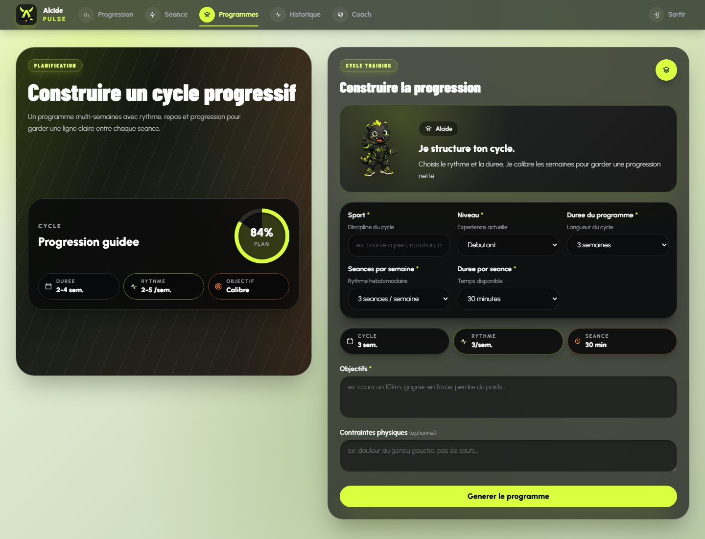

# B2-A30 - Prototype authentifié desktop et mobile

> Date : 2026-07-21
> Production : `https://ai-sport-web.vercel.app`
> Session : Auth.js réelle, fichier local hors Git

## Méthode

Le script `apps/web/scripts/capture-rncp-prototype.mjs` ouvre Chromium avec le
`storageState` Alcide déjà contrôlé, charge les formulaires privés en production
et capture uniquement la zone principale. Il n'affiche ni adresse électronique
ni donnée personnelle. Le profil mobile utilise un viewport de 390 x 844 px et
le script échoue en cas de débordement horizontal.

La suite `apps/web/tests/e2e/generate.spec.ts` a ensuite exécuté six scénarios
authentifiés sur la production :

1. formulaire privé accessible après connexion ;
2. labels associés à tous les champs ;
3. erreur explicite sur le sport vide ;
4. erreurs de formulaire annoncées avec `role=alert` ;
5. utilisation à 390 px sans débordement horizontal ;
6. aucune violation axe critique ou sérieuse sur le formulaire privé.

Résultat local : 6/6 en 15,7 s.

Le workflow distant a ensuite exécuté la même suite sur le commit
`81b2b0bd6afa0cf3a33cca6d7ee045ae5808709d` : run GitHub Actions
[`29820498452`](https://github.com/Kevinmrgt/aiSport/actions/runs/29820498452),
6/6 en succès. La session dédiée a été restaurée depuis GitHub Secrets, utilisée
uniquement pour le domaine Alcide, puis supprimée du runner.

## Captures et empreintes

| Capture                      |  Dimensions | SHA-256                                                            |
| ---------------------------- | ----------: | ------------------------------------------------------------------ |
| génération séance desktop    |  1440 x 992 | `A2E6530CA4E189359641F1CA611A4F99A7D0C3F6010E629FC0B81F9AB239443C` |
| génération programme desktop | 1440 x 1101 | `2CB08B244579FCB3546173E10459536819268E43943E8122957E4336F7FD6E97` |
| génération séance mobile     |  390 x 1634 | `481517A35F7AD80E0A7B186681A88790F8372CFC046DA5D61AB68002532E79BC` |

## Limite

Le contrôle mobile et axe est automatisé. Il ne remplace pas le zoom manuel,
les contrastes exhaustifs ou la restitution par un lecteur d'écran.
