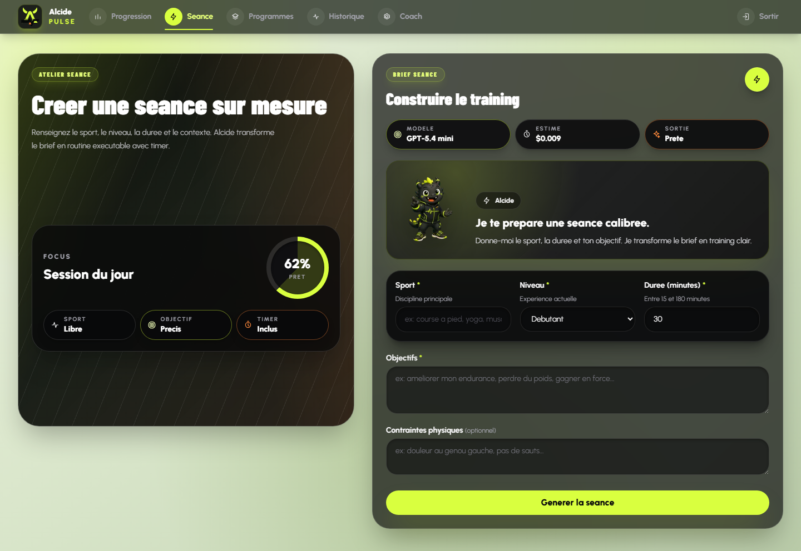
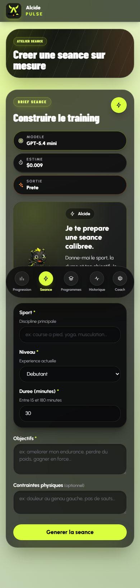

# Dossier Bloc 2 RNCP39583 - Alcide

> Concevoir et développer des applications logicielles
> Version applicative : `0.13.0-rc.3`
> Baseline de production contrôlée : `ac02d219802614d1da4064e542f8de6c5487e5eb`
> Dossier anonymisé, finalisé le 21 juillet 2026

## 1. Cadre officiel et composition du rendu

L'évaluation du Bloc 2 est une mise en situation professionnelle sous la forme
d'un projet individuel. Le candidat remet le code source du logiciel, la
documentation associée et un dossier écrit de 30 pages maximum hors annexes.
Le référentiel public France Compétences et le règlement spécial Ynov
identifient seize éléments à présenter.

| Attendu officiel                                 | Emplacement principal dans ce rendu           |
| ------------------------------------------------ | --------------------------------------------- |
| Protocole de déploiement continu                 | section 3 et manuel de déploiement            |
| Critères de qualité et de performance            | section 3, annexes B2-A28 et B2-A29           |
| Protocole d'intégration continue                 | section 4                                     |
| Architecture maintenable                         | section 5                                     |
| Présentation d'un prototype                      | section 7 et annexe B2-A30                    |
| Frameworks et paradigmes                         | section 6                                     |
| Jeu de tests unitaires                           | section 8 et annexe B2-A31                    |
| Mesures de sécurité                              | section 9 et revue OWASP                      |
| Accessibilité aux personnes handicapées          | section 10                                    |
| Historique des versions                          | section 11 et `CHANGELOG.md`                  |
| Dernière version fonctionnelle, fiable et viable | sections 7 et 11                              |
| Cahier de recettes                               | section 12 et `docs/bloc2/cahier-recettes.md` |
| Plan de correction des bogues                    | section 13                                    |
| Manuel de déploiement                            | section 14                                    |
| Manuel utilisateur                               | section 15                                    |
| Manuel de mise à jour                            | section 16                                    |

Le jury est composé de deux professionnels externes. Un bloc est validé si au
moins 50 % des neuf compétences sont acquises et si aucune compétence
éliminatoire n'est non acquise. Les quatre compétences éliminatoires sont
C2.2.1, C2.2.2, C2.2.3 et C2.3.1.

Sources : [fiche RNCP39583](https://www.francecompetences.fr/recherche/rncp/39583/),
référentiel officiel pages 7 à 10 et règlement spécial Ynov version 1.01 du
15 septembre 2025 fournis avec le dossier.

## 2. Synthèse de conformité factuelle

Cette synthèse décrit les preuves disponibles. Elle ne remplace pas la décision
du jury.

| Compétence                                     | Preuve principale                                             | État avant dépôt                                        |
| ---------------------------------------------- | ------------------------------------------------------------- | ------------------------------------------------------- |
| C2.1.1 Environnements, qualité, performance    | Node 24, Docker, Vercel, Neon, healthchecks, mesure A29       | étayé                                                   |
| C2.1.2 Intégration continue                    | CI `29817362423`, rapports et images Docker                   | étayé                                                   |
| C2.2.1 Prototype                               | production, recette authentifiée, captures desktop/mobile A30 | étayé                                                   |
| C2.2.2 Tests unitaires                         | shared 14 tests, API 155, Web 43, PostgreSQL 8                | étayé                                                   |
| C2.2.3 Sécurité, accessibilité, conformité     | OWASP, A35 sécurité, A36 public/authentifié                   | étayé sur l'automatisable ; limites humaines explicites |
| C2.2.4 Déploiement progressif et versionnement | Git, CI, migration, CD `29817698665`, smoke tests             | étayé                                                   |
| C2.3.1 Cahier de recettes                      | 60 scénarios, résultats et anomalies reliés, A34 à A36        | étayé ; gel CI/CD à confirmer                           |
| C2.3.2 Correction des bogues                   | registre B2-BUG et tests de non-régression                    | étayé                                                   |
| C2.4.1 Documentation d'exploitation            | trois manuels présents et versionnés                          | étayé                                                   |

Le risque résiduel principal concerne la portée humaine de C2.2.3. Les actions
d'accessibilité sont démontrées sur un échantillon public/privé, mais un zoom
navigateur réel, les fonds composites et un lecteur d'écran restent requis
avant toute déclaration de conformité exhaustive au RGAA.

## 3. C2.1.1 - Environnements, déploiement continu, qualité et performance

### Environnements de développement et de test

| Composant              | Choix réel                               | Contrôle                                          |
| ---------------------- | ---------------------------------------- | ------------------------------------------------- |
| Poste candidat         | Windows, PowerShell, Codex desktop       | commandes et traces datées                        |
| Gestion de sources     | Git et GitHub                            | branches, commits, pull requests, tags            |
| Monorepo               | pnpm workspaces 11.9                     | lockfile figé et installation `--frozen-lockfile` |
| Runtime et compilation | Node.js 24, TypeScript 5.7               | typecheck et builds CI                            |
| Web                    | Next.js 15 App Router                    | build et healthcheck Web                          |
| API                    | Hono sur Node.js                         | tests HTTP, liveness et readiness                 |
| Données                | PostgreSQL 16 et Drizzle ORM             | migrations et tests d'intégration réels           |
| IA                     | OpenAI côté serveur                      | validation Zod, timeout et gestion des erreurs    |
| Tests                  | Vitest, Testing Library, Playwright, axe | quatre rapports de couverture et rapports E2E     |
| Production             | Vercel Web/API et Neon                   | CD, smoke tests et monitoring                     |

Le déploiement continu commence uniquement après une CI verte sur `main` :
migration Drizzle, déploiement API, smoke test API, déploiement Web puis smoke
test Web. Le run `29817698665` a exécuté cette séquence sur la baseline
`ac02d219...`. Les healthchecks ont ensuite répondu HTTP 200 avec la version
`0.13.0-rc.3`, PostgreSQL `ok` et configuration IA `ok`.

### Critères mesurables retenus

| Critère                                | Objectif                                            | Résultat observé                                           |
| -------------------------------------- | --------------------------------------------------- | ---------------------------------------------------------- |
| Lint et typecheck                      | aucune erreur                                       | réussi                                                     |
| Tests                                  | 100 % des suites sélectionnées réussies             | réussi                                                     |
| Couverture de chaque périmètre runtime | majorité des lignes, seuils CI respectés            | shared 100 %, API 85,64 %, Web 69,04 %, PostgreSQL 93,70 % |
| Audit de dépendances                   | aucune vulnérabilité connue au niveau low           | réussi                                                     |
| Production Web/API                     | 100 % de réponses valides sur 50 requêtes par route | 150/150                                                    |
| Latence healthchecks                   | p95 inférieur ou égal à 1 000 ms                    | Web 508,63 ms, API 339,66 ms, readiness 267,11 ms          |
| Build Web                              | bundle initial partagé documenté                    | 102 kB sur le build local final                            |

La mesure A29 est une mesure séquentielle depuis le poste candidat. Elle ne
constitue pas un test de charge distribué et ne mesure pas le temps d'une
génération IA payante. Les timeouts et erreurs fournisseur sont couverts par
les tests API ; la génération réelle et le nettoyage des données sont décrits
dans B2-A25.

## 4. C2.1.2 - Protocole d'intégration continue

Le workflow `.github/workflows/ci.yml` applique les étapes suivantes :

1. checkout du commit et installation figée par `pnpm-lock.yaml` ;
2. compilation du package partagé ;
3. lint, typecheck et tests de politiques de déploiement/session ;
4. tests et couvertures shared, API et Web ;
5. migrations et tests d'intégration PostgreSQL 16 ;
6. tests Playwright publics et accessibilité axe ;
7. build de tous les packages ;
8. audit des dépendances bloquant dès le niveau low ;
9. construction des images Docker API et Web ;
10. publication des rapports de couverture et du rapport Playwright.

Le run `29817362423` sur `main` a réussi les six jobs. Les rapports bruts API,
Web, PostgreSQL et Playwright sont disponibles comme artefacts GitHub Actions.
La branche de finalisation ajoute le rapport autonome `shared` afin que ce
périmètre ne soit plus seulement exercé indirectement par l'API.

## 5. Architecture logicielle maintenable

```text
Navigateur
  -> Next.js App Router et Server Actions
  -> API Hono protégée par secret interservice et identité utilisateur
  -> controllers -> services métier -> repositories
  -> PostgreSQL / OpenAI

GitHub Actions
  -> qualité et tests -> migration -> API -> Web -> smoke tests
```

Les responsabilités sont séparées : interface et orchestration serveur dans
`apps/web`, API dans `apps/api`, contrats Zod et types dans `packages/shared`.
Les contrôleurs traduisent HTTP, les services portent les règles métier et les
repositories isolent PostgreSQL. Les contrôles d'ownership sont effectués avec
l'identité utilisateur reçue du Web et non avec un identifiant fourni librement
par le navigateur.

Les décisions d'architecture sont tracées dans huit ADR. Les risques résiduels
connus sont l'observabilité encore fondée sur des logs simples et le rate limit
en mémoire, non partagé entre instances.

## 6. Frameworks, bibliothèques et paradigmes

| Élément                   | Usage                                            | Justification                                       |
| ------------------------- | ------------------------------------------------ | --------------------------------------------------- |
| Next.js et React          | interface, rendu serveur, actions                | séparation serveur/client et routage structuré      |
| Hono                      | API HTTP                                         | surface légère, middlewares explicites, testabilité |
| Drizzle ORM               | accès PostgreSQL et migrations                   | schéma typé et requêtes paramétrées                 |
| Zod                       | validation des entrées et sorties IA             | contrats exécutables et erreurs structurées         |
| Vitest et Testing Library | tests unitaires/composants                       | tests rapides centrés sur le comportement           |
| Playwright et axe         | recettes navigateur et accessibilité automatisée | validation du rendu réel                            |

Le projet applique une architecture en couches, l'injection de dépendances dans
les services testés, des fonctions pures pour les calculs et statistiques, des
contrats partagés, des composants React composables et une stratégie
fail-fast dans la CI/CD.

## 7. C2.2.1 - Prototype fonctionnel, ergonomique et sécurisé

Le prototype cible une application Web responsive. Il couvre la connexion
OAuth, la génération d'une séance ou d'un programme, les listes et filtres, le
détail, le Timer, le journal de séance, le dashboard, les paramètres et la
suppression contrôlée. Les routes privées redirigent sans session et les données
sont filtrées par propriétaire.





La recette B2-A25 a créé une séance et un programme réels, vérifié leur durée,
le Timer, les onglets, les listes, le dashboard et les paramètres, puis supprimé
uniquement les données de recette. B2-A30 ajoute des captures actuelles sans
adresse électronique ni donnée personnelle affichée.

## 8. C2.2.2 - Harnais de tests unitaires

| Rapport        | Tests |  Lignes | Branches | Fonctions | Périmètre                                               |
| -------------- | ----: | ------: | -------: | --------: | ------------------------------------------------------- |
| Shared         |    14 |   100 % |  92,85 % |     100 % | schémas workout, programme, journal                     |
| API unitaire   |   155 | 85,64 % |  80,40 % |   95,38 % | controllers, services, middlewares, schémas             |
| API PostgreSQL |     8 | 93,70 % |     80 % |     100 % | repositories et ownership sur PostgreSQL 16             |
| Web            |    43 | 69,04 % |  78,03 % |   80,88 % | composants, formulaires, utilitaires et pages publiques |

Les rapports distinguent volontairement les tests unitaires des tests
d'intégration et E2E. Les pages serveur Web difficiles à instancier restent
visibles à 0 % dans le rapport ; elles sont complétées par les recettes
Playwright, sans gonfler artificiellement le taux unitaire. Les seuils de chaque
périmètre runtime dépassent la majorité demandée par le référentiel.

Le harnais couvre notamment validation des formulaires, invariants de durée IA,
retry et timeout, erreurs 401/403/404/429/503, ownership, Timer, focus des
dialogues, statistiques, contrats partagés et accès PostgreSQL.

## 9. C2.2.3 - Sécurité et conformité fonctionnelle

La revue `docs/security/owasp-review.md` relie les contrôles aux catégories
OWASP Top 10. Les mesures effectivement mises en oeuvre comprennent :

- OAuth via Auth.js et routes privées côté serveur ;
- secret interservice et propagation contrôlée de l'identité ;
- ownership sur chaque ressource utilisateur ;
- validation Zod des entrées HTTP et sorties IA ;
- requêtes Drizzle paramétrées ;
- CSP, CORS et en-têtes de sécurité ;
- secrets exclus du navigateur et du dépôt ;
- rate limiting, timeout et erreurs explicites ;
- audit de dépendances bloquant en CI ;
- actions GitHub épinglées et chaîne CI/CD testée ;
- journalisation des erreurs d'authentification, limites et appels IA.

B2-A27 consigne la correction de vulnérabilités de dépendances découvertes par
la CI. L'audit final local ne remonte aucune vulnérabilité connue. Les risques
non masqués sont le rate limit mémoire et l'absence de SIEM centralisé.

B2-A35 complète cette revue par des exécutions ciblées : charge SQL-like
insérée et relue sur PostgreSQL 16.14 avec table intacte, XSS inerte dans React
et deux navigateurs, HTML et neuf scripts de production sans marqueur de
secret, CORS hostile refusé et CSP/headers effectifs contrôlés. La CSP n'autorise
pas `unsafe-eval` mais conserve `unsafe-inline`, présenté comme risque résiduel.

## 10. C2.2.3 - Accessibilité et handicap

Le référentiel choisi est le RGAA 4.1.2, fondé sur WCAG 2.1 A/AA. Les actions
implémentées comprennent structure sémantique, lien d'évitement, labels,
messages `role="alert"`, navigation clavier, gestion du focus des dialogues et
du Timer, noms accessibles, reflow responsive et contrastes corrigés.

Les preuves automatisées réelles sont :

- 12/12 contrôles Chromium et 12/12 Firefox sur le périmètre public B2-A20 ;
- redirections sans session et démarrage OAuth réel B2-A24 ;
- interactions authentifiées et corrections de focus B2-A25 ;
- six tests Playwright authentifiés, dont reflow à 390 px et axe sur le
  formulaire privé B2-A30 ;
- 33/33 contrôles B2-A36 sur trois pages publiques et cinq privées : reflow
  640/320 pixels CSS, cycle clavier complet, focus visible, contrastes axe,
  arbre d'accessibilité et alertes ;
- 2/2 tests de structure après correction des deux titres de formulaire en
  `h2`, plus le contre-contrôle authentifié de `/programs/generate` ;
- ratios opaques représentatifs de 17,36:1 en public et 8,19:1 en privé.

L'attendu officiel porte sur la présentation des actions mises en œuvre pour
permettre l'accès aux personnes en situation de handicap. Ces actions sont
désormais mesurées et reproductibles. Limite : axe et l'arbre d'accessibilité
ne couvrent pas tout le RGAA ni la restitution vocale réelle. Le zoom UI, les
fonds composites et NVDA/Narrator restent à exécuter ; le dossier ne revendique
donc pas de conformité exhaustive au RGAA.

## 11. C2.2.4 - Historique, dernière version et viabilité

| Jalons                | Contenu vérifiable                                                                   |
| --------------------- | ------------------------------------------------------------------------------------ |
| 0.10 à 0.12           | programmes, Timer, journaux, dashboard et durcissement progressif                    |
| 0.13.0-rc.1           | PostgreSQL et chaîne Docker validés                                                  |
| 0.13.0-rc.2           | audit dépendances et CD Vercel canonique                                             |
| 0.13.0-rc.3           | corrections issues de la recette authentifiée                                        |
| finalisation du rendu | OAuth Playwright sécurisé, dépendances corrigées, shared couvert, mobile authentifié |

`CHANGELOG.md`, les commits, les pull requests et les tags conservent
l'historique. La baseline `10596d2...` a passé la CI, la migration, les deux
déploiements, les smoke tests et l'E2E authentifié 6/6. Les endpoints Web/API
répondent en version `0.13.0-rc.3`. Le gel documentaire corrigé est identifié
par le tag `rncp-bloc2-2026-07-21-v2` ; le premier gel reste historique.

## 12. C2.3.1 - Cahier de recettes

Le cahier `docs/bloc2/cahier-recettes.md` couvre authentification, séances,
programmes, listes, filtres, détail, suppression, Timer, journaux, dashboard,
paramètres, erreurs IA, sécurité, accessibilité, healthchecks et déploiement.
Chaque ligne distingue attendu, résultat, méthode, environnement, preuve et
anomalie associée.

Les résultats reposent sur trois niveaux complémentaires : tests unitaires et
d'intégration, Playwright public/authentifié, puis recette manuelle de
production B2-A25. Une simple lecture du code n'est jamais enregistrée comme
une recette exécutée.

La campagne de fermeture B2-A34 à B2-A36 ajoute les erreurs OpenAI, pagination,
suppression en erreur, journal avec notes de douleur, modèle interdit,
dashboard vide/alimenté, parcours Timer/journal/dashboard de production,
injection, XSS, secrets, CORS, CSP et audit accessibilité multi-page. Les 60
scénarios disposent maintenant d'un résultat, d'une limite ou d'un risque
accepté ; la candidate doit encore passer par la CI/CD avant gel définitif.

## 13. C2.3.2 - Plan de correction des bogues

Le plan `docs/rncp/bloc2-plan-correction-bogues-rncp39583.md` décrit détection,
qualification, priorité, cause, correctif, non-régression et preuve. Les défauts
réellement trouvés concernent notamment ownership, invariants IA, Timer,
accessibilité, CSP, Docker, CI/CD, dépendances, messages de formulaire, filtres
et cohérence documentaire. La campagne finale ajoute l'allowlist serveur des
modèles IA, la préservation de la confirmation de journalisation et la
hiérarchie des titres de formulaire.

Une anomalie n'est déclarée corrigée qu'après modification et contre-recette.
Les éléments encore humains ou externes restent des réserves, pas des bogues
fictivement clôturés.

## 14. C2.4.1 - Manuel de déploiement

Le manuel `docs/deployment.md` décrit prérequis, variables d'environnement,
installation, migrations, seed, déploiement Vercel/Neon, Docker Compose,
healthchecks et rollback. La CI empêche le déploiement si les contrôles ou la
migration échouent. Les secrets sont stockés dans les environnements dédiés et
ne sont pas inclus dans l'archive source.

Séquence résumée : installer depuis le lockfile, valider les variables, migrer,
construire, déployer l'API, vérifier sa readiness, déployer le Web puis lancer
les smoke tests.

## 15. C2.4.1 - Manuel utilisateur

Le manuel `docs/rncp/bloc2-manuel-utilisateur-alcide.md` présente la connexion,
la génération, la consultation, le Timer, le journal, le dashboard, les
paramètres, les suppressions et les messages d'erreur. Il est destiné à un
utilisateur non technique et sépare les actions métier des opérations
d'administration.

La démonstration de production B2-A25 montre que ces parcours sont
manipulables et que le manuel correspond à l'interface réellement déployée.

## 16. C2.4.1 - Manuel de mise à jour

Le manuel `docs/rncp/bloc2-manuel-mise-a-jour.md` décrit branche, pull request,
tests, dépendances, migration, déploiement, vérification et rollback. Il impose
une sauvegarde avant opération sensible, des migrations non destructrices et
la rotation des secrets si nécessaire.

La mise à jour des dépendances est contrôlée par lockfile, audit local, audit CI
et tests complets. B2-A27 fournit un exemple réel où une nouvelle alerte a fait
échouer la CI puis a été corrigée sans relâcher le seuil de sécurité.

## 17. Matrice finale des preuves

| Compétence | Annexes principales                   | Démonstration                                    |
| ---------- | ------------------------------------- | ------------------------------------------------ |
| C2.1.1     | B2-A21, A22, A28, A29                 | healthchecks et protocole CD                     |
| C2.1.2     | B2-A16, A23, A27, A28                 | run CI et artefacts                              |
| C2.2.1     | B2-A25, A26, A30                      | production desktop/mobile                        |
| C2.2.2     | B2-A19, A28, A31                      | rapports de couverture séparés                   |
| C2.2.3     | B2-A20, A23 à A30, A35, A36           | OWASP, sécurité navigateur, axe, clavier, reflow |
| C2.2.4     | B2-A22, A25, A28                      | Git, migration, CD, smoke tests                  |
| C2.3.1     | B2-A12, A20, A25, A26, A30, A34 à A36 | cahier et recettes exécutées                     |
| C2.3.2     | B2-A13, A25, A27, A34, A36            | anomalies et non-régressions                     |
| C2.4.1     | manuels et B2-A22                     | déployer, utiliser, mettre à jour                |

L'index détaillé et les pièces complètes figurent dans le PDF d'annexes. Les
preuves historiques sont conservées dans le dépôt mais ne sont pas incluses
comme preuves finales du paquet jury.

## 18. Vérifications administratives restant avant dépôt

Les vérifications suivantes dépendent de la convocation ou de la plateforme de
dépôt et ne peuvent pas être déduites du référentiel public :

1. demander au campus la date et l'heure exactes, le nommage, la taille maximale
   et le niveau d'anonymisation attendu sur DigiformaCertif ;
2. déposer le dossier, les annexes et l'archive source avant l'échéance.

Ces points sont fournis sous forme de checklist dans le paquet final.

## 19. Conclusion

Alcide dispose d'un code source versionné, d'une architecture structurée, de
tests couvrant majoritairement chaque périmètre runtime, d'une CI/CD réelle,
d'une production contrôlée, d'un cahier de recettes, d'un plan de correction et
des trois manuels demandés. Les preuves finales incluent désormais la session
Playwright hors Git, la couverture autonome de `shared`, les recettes métier et
sécurité finales, le reflow/clavier authentifié multi-page, les captures
actuelles et une mesure de performance reproductible.

Le dossier est techniquement consolidé. Les actions d'accessibilité exécutées
sont présentées avec leurs limites, sans déclaration de conformité exhaustive
au RGAA. Il reste à appliquer les consignes administratives exactes du campus
avant le dépôt.
