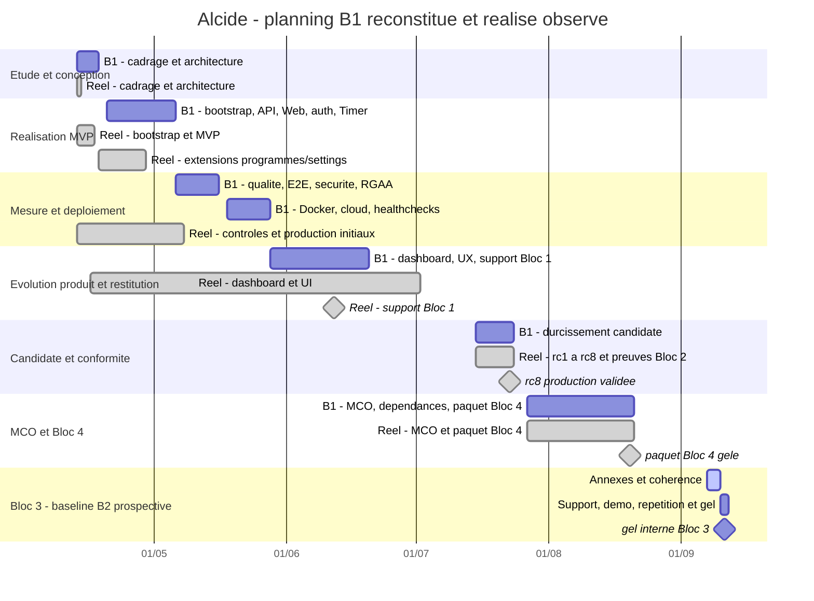

# B3-A01 - Planning prévisionnel / réalisé du projet Alcide

> Compétence couverte : **C.3.1 - Planifier l'exécution du projet**  
> Projet : **Alcide**  
> Responsable et auteur de la consolidation : **Kevin Marguet**  
> Date de consolidation : **2026-09-07**  
> Baseline logicielle observée : **`0.13.0-rc.8`** dans `package.json` et `CHANGELOG.md`  
> Baseline Git observée : **`d950b6b`**, dernier commit de `main` au 2026-08-20  
> Unité de charge : **jour-homme équivalent (JH-éq.), 1 JH = 7 heures**

## 1. Objet, conclusion et règle d'honnêteté

Cette annexe fournit la feuille de route, l'ordonnancement, les jalons, les dépendances, les charges, les ressources et les responsabilités attendus pour C.3.1. Elle distingue trois natures d'information :

- le **réalisé attesté**, daté par Git, les revues de sprint, le changelog et les preuves CI/CD ;
- le **prévu contemporain**, limité aux objectifs et rubriques « prochain sprint » réellement présents dans les revues de sprint ;
- la **baseline B1 reconstituée le 2026-09-07**, qui transforme les preuves dispersées en planning prévisionnel/réalisé comparable.

Il n'existe pas dans le dépôt de Gantt initial, de feuille de temps signée ni d'export Jira/GitHub Projects couvrant toute la période. Les dates prévisionnelles B1, charges prévues et charges réalisées ci-dessous sont donc des **estimations rétrospectives de pilotage**, et non des enregistrements contemporains. Elles ne doivent pas être présentées au jury comme un planning créé avant le démarrage ni comme des heures facturées.

Cette limite ne remet pas en cause les livrables observés. Elle limite seulement la force de preuve sur l'anticipation initiale et sur le temps réellement consommé. Pour la phase Bloc 3 encore ouverte, la baseline B2 de la section 11 constitue en revanche un plan prospectif daté.

## 2. Correspondance avec les critères officiels C.3.1

Le référentiel local, page 11, demande une feuille de route et un calendrier, une méthode justifiée, l'identification des ressources humaines, financières et matérielles, des rôles, des responsabilités, ainsi que le listing et l'affectation des tâches. Ses critères demandent aussi un outil de planification argumenté, des phases d'étude, de mesure, de conception, de réalisation et de restitution, ainsi qu'une affectation compatible avec les compétences et les éventuelles situations de handicap.

| Attendu officiel                                               | Réponse apportée dans cette annexe               |
| -------------------------------------------------------------- | ------------------------------------------------ |
| Méthodologie choisie et justifiée                              | Section 4                                        |
| Outil de planification argumenté et compatible avec la méthode | Section 4.3                                      |
| Feuille de route et planning détaillé                          | Sections 5, 6 et 7                               |
| Phases étude, mesure, conception, réalisation et restitution   | Colonne « Phase RNCP » du WBS et Gantt section 6 |
| Lots, tâches et ordonnancement                                 | WBS section 5 et chemin critique section 7       |
| Charges prévues et réalisées                                   | Sections 3 et 5 ; limites explicites section 13  |
| Jalons et points de vigilance                                  | Sections 7 et 8                                  |
| Ressources humaines, techniques et financières                 | Section 9                                        |
| Rôles, responsabilités et affectation                          | RACI section 10                                  |
| Prise en compte d'une éventuelle situation de handicap         | Sections 9.1 et 10.3                             |

Sources réglementaires :

- `docs/rncp/Référentiel Expert en développement logiciel RNCP39583 (1).pdf`, pages 11-12 ;
- `docs/rncp/25 09 15  Réglement spécial de certification - Expert en développement logiciel RNCP39583 (1).pdf`, pages 3-4.

## 3. Sources, fiabilité et méthode de chiffrage

### 3.1 Hiérarchie des preuves

| Niveau             | Nature                                   | Exemples                                                                                        | Usage autorisé                                                                                      |
| ------------------ | ---------------------------------------- | ----------------------------------------------------------------------------------------------- | --------------------------------------------------------------------------------------------------- |
| A - observé        | Horodatage ou résultat vérifiable        | historique Git de `main`, SHA, tags, version de `package.json`, CI/CD et healthchecks consignés | Prouver une date de livraison ou un résultat                                                        |
| B - documenté      | Intention ou bilan versionné             | objectifs et rétrospectives de `docs/sprints/`, `CHANGELOG.md`, ADR                             | Prouver le contenu prévu ou réalisé, sous réserve des incohérences signalées                        |
| C - reconstruit    | Donnée créée pour la consolidation C.3.1 | dates B1, charges JH-éq., coûts valorisés, RACI par « casquette »                               | Expliquer le pilotage qui aurait dû être formalisé ; ne pas présenter comme preuve historique brute |
| D - non disponible | Donnée absente                           | feuilles de temps, factures cloud/IA, capacité contractuelle, validation client réelle          | Afficher `ND`, demander une preuve au candidat, ne pas inventer                                     |

### 3.2 Données observées

- le dépôt contient **12 revues de sprint**, `docs/sprints/sprint-01.md` à `sprint-12.md` ;
- les sprints 01 et 02 indiquent tous deux `2026-04-13 au 2026-04-20`, le sprint 03 indique `2026-04-13`, les sprints 04 à 11 indiquent également le 13 avril et le sprint 12 indique le 16 avril ; ces valeurs se chevauchent et ne prouvent pas douze périodes calendaires ;
- l'historique de `main` commence le **2026-04-13**, compte **167 commits** jusqu'au **2026-08-20**, avec activité sur 21 dates civiles ;
- le 13 avril concentre 20 commits et les revues 01 à 11 : les « sprints » doivent donc être compris comme des **incréments fonctionnels documentés**, pas comme onze itérations temporelles Scrum complètes ;
- `CHANGELOG.md` trace `0.1.0` à `0.12.0`, puis les candidates `0.13.0-rc.2`, `rc.3`, `rc.5`, `rc.6`, `rc.7`, `rc.8` ;
- la preuve `docs/rncp/bloc2-annexes/B2-A43-simplification-interface-recette-production-2026-07-23.md` consigne pour `rc.8` une CI à six jobs réussis, une CD avec migration/API/Web/smoke réussis et les healthchecks Web/API en HTTP 200.

### 3.3 Méthode de charge

La charge prévue B1 est une estimation par WBS : chaque tâche est découpée, classée par complexité et convertie en JH-éq. La charge réalisée est une **charge équivalente reconstituée** à partir du périmètre effectivement livré, des boucles de correction visibles, des tests, des documents et des validations. Les commits servent à borner les dates et à identifier les reprises ; **un commit n'est jamais converti mécaniquement en heures**.

Échelle utilisée :

| Taille | Repère                                    | Charge indicative |
| ------ | ----------------------------------------- | ----------------: |
| XS     | correction ou preuve isolée               |        0,5 JH-éq. |
| S      | tâche bornée dans une couche              |          1 JH-éq. |
| M      | fonctionnalité ou contrôle multi-fichiers |      2 à 3 JH-éq. |
| L      | lot transverse Web/API/DB/CI              |      4 à 6 JH-éq. |
| XL     | campagne de durcissement et restitution   |  7 JH-éq. ou plus |

Les valeurs restent arrondies au demi-JH. L'absence de timesheet impose une confiance **faible à moyenne** sur la quantité d'heures, mais n'empêche pas de prouver le contenu et la séquence des livraisons.

## 4. Cadre méthodologique

### 4.1 Méthode retenue

Alcide a été conduit selon une approche **itérative inspirée de Scrum, adaptée à un projet individuel**, complétée par un flux Kanban documentaire :

1. sélectionner un incrément Must/Should selon la valeur démontrable et le risque RNCP ;
2. formuler les objectifs de l'incrément dans `docs/sprints/` ;
3. concevoir et implémenter verticalement, du contrat partagé à l'interface ;
4. contrôler par lint, typecheck, tests, build, audit et, lorsque disponible, recette de production ;
5. documenter la revue, les décisions ADR, les anomalies et le changelog ;
6. intégrer seulement après le franchissement des gates qualité.

La Definition of Done utilisée pour les lots logiciels est : code versionné, critères fonctionnels couverts, lint/typecheck/tests/build réussis, sécurité et accessibilité vérifiées au niveau pertinent, documentation et changelog mis à jour. Pour une preuve RNCP, s'ajoutent la date, la baseline, le résultat, les limites et un chemin de reproduction.

### 4.2 Justification

- l'incertitude des sorties IA et les contraintes OAuth/production nécessitent des boucles courtes ;
- le projet est individuel : un Scrum complet avec rôles et cérémonies d'équipe créerait une surcharge artificielle ;
- les livrables RNCP imposent néanmoins des jalons, des validations et une traçabilité ;
- le flux limite le travail en cours à un lot principal par personne et autorise les corrections urgentes de production ;
- les ADR, sprints, CI/CD et preuves datées fournissent une piste d'audit cohérente avec cette approche.

### 4.3 Outil de planification

L'outil retenu est un **Gantt de niveau macro adossé à un WBS et à un RACI** :

- le Gantt rend visibles calendrier, chevauchements, jalons et chemin critique ;
- le WBS décrit les tâches, charges, dépendances, écarts et preuves ;
- le RACI clarifie les responsabilités même lorsqu'une seule personne porte plusieurs rôles ;
- les revues de sprint et le changelog restent l'outil de flux et de preuve d'incrément.

Ce montage est compatible avec la méthode itérative : le macro-planning fixe les jalons ; le contenu de chaque incrément peut être repriorisé tant que les dépendances et gates de sortie restent respectées. Le Gantt n'est pas utilisé comme une fausse preuve de prédiction parfaite.

Alternatives écartées : un cycle en V, trop rigide pour les itérations IA/OAuth ; un Kanban seul, insuffisant pour visualiser les échéances et dépendances exigées par C.3.1 ; un Scrum complet, inadapté à l'absence d'équipe réelle.

## 5. WBS - planning B1 reconstitué et réalisé observé

### 5.1 Calendrier, charges et écarts

Les périodes « prévues B1 » ont été normalisées le 2026-09-07 pour constituer une baseline comparable. Elles ne remplacent pas les dates observées. `NC` signifie non clôturé et `ND` donnée non disponible.

| ID  | Phase RNCP                | Lot / tâche                                                                              | Prévu B1    | Réalisé observé       | Charge prévue | Réalisé reconstruit | Écart de charge | Statut / explication de l'écart                                                           |
| --- | ------------------------- | ---------------------------------------------------------------------------------------- | ----------- | --------------------- | ------------: | ------------------: | --------------: | ----------------------------------------------------------------------------------------- |
| T01 | Étude                     | Besoin, périmètre MVP, contraintes RNCP et risques initiaux                              | 13-14/04    | 13/04                 |          2 JH |              2,5 JH |            +0,5 | Terminé ; documentation initiale et cadrage créés le 13/04                                |
| T02 | Conception                | Architecture monorepo, Hono, schémas Zod, PostgreSQL/Drizzle, IA et ADR 001-003          | 15-17/04    | 13/04                 |        3,5 JH |                4 JH |            +0,5 | Terminé ; plusieurs choix structurants consolidés dans une même journée de commits        |
| T03 | Réalisation               | Bootstrap pnpm/TypeScript et CI initiale                                                 | 20-22/04    | 13/04                 |        2,5 JH |                3 JH |            +0,5 | Terminé en avance calendaire par rapport à B1 ; B1 est rétrospective                      |
| T04 | Réalisation               | API, génération IA, persistance et contrats partagés du MVP                              | 23-29/04    | 13/04                 |          6 JH |                6 JH |               0 | Terminé ; périmètre v0.1-v0.3                                                             |
| T05 | Réalisation               | Web, authentification, CRUD, liste, détail et Timer                                      | 30/04-05/05 | 13-16/04              |          5 JH |              5,5 JH |            +0,5 | Terminé ; correctifs OAuth et FK ajoutés le 16/04                                         |
| T06 | Mesure                    | Tests unitaires, seuil de couverture et gates lint/typecheck/build                       | 06-08/05    | 13/04-07/05           |          4 JH |                5 JH |              +1 | Terminé ; reprise après coverage à 54 %, puis audits du 07/05                             |
| T07 | Mesure                    | E2E, OWASP, RGAA/WCAG et recettes                                                        | 11-15/05    | 13/04-22/07           |          4 JH |                7 JH |              +3 | Terminé pour la candidate ; scope élargi aux recettes authentifiées, reflow 400 % et NVDA |
| T08 | Réalisation               | Docker, Vercel/Neon, migrations et CI/CD de production                                   | 18-22/05    | 13/04-04/05           |        3,5 JH |                6 JH |            +2,5 | Terminé ; surcoût de stabilisation serverless, builds Vercel et changement de cible cloud |
| T09 | Mesure                    | Healthchecks, readiness, supervision et preuves de disponibilité                         | 25-27/05    | 13/04-28/07           |        2,5 JH |                4 JH |            +1,5 | Terminé ; le liveness initial a été complété par readiness et monitoring horaire          |
| T10 | Réalisation               | Programmes, paramètres IA, journal de séance et Timer enrichi                            | 28/05-05/06 | 18-28/04              |          5 JH |                6 JH |              +1 | Terminé ; extension de périmètre produit post-MVP                                         |
| T11 | Réalisation               | Pagination, filtres et dashboard utilisateur                                             | 08-10/06    | 16/04                 |          3 JH |              3,5 JH |            +0,5 | Terminé ; livré dans `0.12.0` avant la date B1 normalisée                                 |
| T12 | Conception / Réalisation  | Refonte visuelle, navigation, responsive et feedback de chargement                       | 11-19/06    | 16/04-01/07           |          4 JH |              5,5 JH |            +1,5 | Terminé ; plusieurs itérations visuelles et correctifs contraste/mobile                   |
| T13 | Restitution               | Support Bloc 1 et consolidation documentaire intermédiaire                               | 08-12/06    | 12/06                 |          2 JH |                2 JH |               0 | Terminé ; deck Bloc 1 versionné                                                           |
| T14 | Mesure / Réalisation      | Candidate 0.13 : Node 24, sécurité dépendances, TLS, ownership, tests DB et CD canonique | 15-20/07    | 15-20/07              |          5 JH |                6 JH |              +1 | Terminé ; `rc.1` à `rc.3`, durcissement plus large que prévu                              |
| T15 | Mesure / Restitution      | Recettes Bloc 2, accessibilité humaine, corrections reflow/focus et paquets de preuves   | 21-22/07    | 21-22/07              |          6 JH |                8 JH |              +2 | Terminé ; boucles de contre-recette et corrections NVDA additionnelles                    |
| T16 | Réalisation / Restitution | Accès jury sécurisé, quota atomique, simplification métier et livraison `rc.8`           | 23/07       | 23/07                 |          4 JH |                5 JH |              +1 | Terminé ; ajout d'un accès jury et quota 30 non prévus dans le MVP initial                |
| T17 | Mesure                    | MCO, mises à jour dépendances, monitoring et preuve d'alerte                             | 27/07-18/08 | 27/07-18/08           |          4 JH |                5 JH |              +1 | Terminé ; mises à jour Dependabot et correction finale de l'audit                         |
| T18 | Restitution               | Dossier et paquet Bloc 4                                                                 | 28/07-20/08 | 28/07-20/08           |          4 JH |                5 JH |              +1 | Terminé ; plusieurs passes de mise en forme et vérification PDF                           |
| T19 | Restitution               | Annexes Bloc 3 C.3.1 à C3.4.2 et cohérence des preuves                                   | 07-09/09    | En cours depuis 07/09 |          4 JH |                  NC |              NC | Baseline B2 prospective ; clôture conditionnée aux gates section 11                       |
| T20 | Restitution               | Support final, démonstration, répétition 30 min et gel de remise                         | 10-11/09    | Non démarré au 07/09  |          2 JH |                  NC |              NC | Date cible interne ; à déplacer sans changer l'ordre si la date de jury diffère           |

Synthèse des lots clôturés T01 à T18 :

| Mesure          |                                     Prévu B1 |                                                                                                     Réalisé reconstruit |                                                                 Écart |
| --------------- | -------------------------------------------: | ----------------------------------------------------------------------------------------------------------------------: | --------------------------------------------------------------------: |
| Charge          |                                    70 JH-éq. |                                                                                                               89 JH-éq. |                                                    +19 JH, soit +27 % |
| Cause dominante |           Baseline MVP + conformité standard | Correctifs serverless, extension programmes/settings, accessibilité humaine, accès jury/quota, campagnes de restitution | Dérive de périmètre et de qualité, pas simple retard de développement |
| Confiance       | Faible, car baseline créée après réalisation |                                                                      Faible à moyenne, car absence de feuilles de temps |                Les chiffres servent au pilotage, pas à la facturation |

### 5.2 Dépendances, responsables et preuves

| ID  | Prédécesseur(s) | Responsable opérationnel                | Gate / jalon de sortie                               | Preuves principales                                                |
| --- | --------------- | --------------------------------------- | ---------------------------------------------------- | ------------------------------------------------------------------ |
| T01 | Aucun           | Kevin - chef de projet                  | M0 : périmètre et contraintes identifiés             | `README.md`, documentation initiale, commit `680320d`              |
| T02 | T01             | Kevin - architecte / développeur        | Architecture et contrats validables                  | `docs/adr/ADR-001-*` à `ADR-003-*`, commit `f09aad3`               |
| T03 | T02             | Kevin - DevOps                          | Build et contrôles automatisables                    | `.github/workflows/ci.yml`, commits `2bcccc8`, `7411876`           |
| T04 | T02, T03        | Kevin - développeur API/DB              | API et génération persistée                          | `apps/api/src/`, `packages/shared/src/`, sprints 01-03             |
| T05 | T04             | Kevin - développeur Web                 | Parcours MVP exécutable                              | `apps/web/`, sprint 02-03, commits `f7ca8c6`, `30848bd`            |
| T06 | T04, T05        | Kevin - QA                              | Seuils qualité franchis                              | tests API/Web, BUG-001, preuve du 07/05                            |
| T07 | T05, T06        | Kevin - QA / accessibilité              | Parcours critiques contrôlés                         | `apps/web/tests/e2e/`, `docs/security/`, annexes B2-A34 à B2-A41   |
| T08 | T03, T04, T05   | Kevin - DevOps                          | Environnements reproductibles et déployables         | Dockerfiles, `docker-compose.yml`, ADR-006/007, workflows CD       |
| T09 | T08             | Kevin - DevOps / QA                     | Santé et disponibilité vérifiables                   | routes health/readiness, workflow monitoring, preuve du 28/07      |
| T10 | T04, T05        | Kevin - développeur full-stack          | Parcours programmes et suivi disponibles             | services programme/session, commits `751c460`, `e3684b8`           |
| T11 | T04, T05        | Kevin - développeur full-stack          | Pilotage utilisateur sur données persistées          | sprint 12, commit `a6fe108`                                        |
| T12 | T05, T07        | Kevin - UI / accessibilité              | Interface responsive et contrôlée                    | commits `dfc1a3f`, `65a6e25`, série du 01/07                       |
| T13 | T01-T12         | Kevin - chef de projet                  | Restitution intermédiaire                            | commit `48e9fb6`, `docs/rncp/pptx-alcide/`                         |
| T14 | T06-T12         | Kevin - DevSecOps                       | M4 : candidate `0.13` techniquement durcie           | `CHANGELOG.md`, tag `v0.13.0-rc.1`, preuves B2 du 20/07            |
| T15 | T14             | Kevin - QA / documentaliste             | Anomalies de recette fermées et preuves rendues      | annexes B2-A34 à B2-A41, commits des 21-22/07                      |
| T16 | T14, T15        | Kevin - full-stack / DevOps             | M5 : `rc.8` déployée et utilisable par le jury       | `CHANGELOG.md`, B2-A42, B2-A43, CI/CD et HTTP 200 du 23/07         |
| T17 | T16             | Kevin - maintenance / DevOps            | Vulnérabilités connues traitées et monitoring prouvé | commits des 27-28/07 et `8bfc17a` du 18/08                         |
| T18 | T17             | Kevin - documentaliste / chef de projet | M6 : paquet Bloc 4 gelé                              | commits `d1a9037`, `4d9b8da`, `d950b6b`                            |
| T19 | T16, T18        | Kevin - chef de projet                  | M7 : annexes Bloc 3 cohérentes et datées             | `docs/rncp/bloc3-annexes/`                                         |
| T20 | T19             | Kevin - présentateur / QA               | M8 : démo répétée, support gelé et plan B prêt       | support Bloc 3, script de démo, preuves locales/production à dater |

## 6. Vue Gantt consolidée

Le Gantt juxtapose le macro-prévisionnel B1 et les fenêtres réellement observées. Les dates B1 restent une reconstruction. Les tâches transverses de mesure ont été raccourcies visuellement à leur fenêtre d'activité globale ; elles ne supposent pas une activité quotidienne continue.

## 7. Jalons, chemin critique et points de validation

### 7.1 Jalons

| Jalon                     | Critère de passage                                                        | Cible B1/B2 | Réalisé / état                                                   | Écart et décision                                                        |
| ------------------------- | ------------------------------------------------------------------------- | ----------- | ---------------------------------------------------------------- | ------------------------------------------------------------------------ |
| M0 - cadrage              | besoin, contraintes, architecture cible et risques listés                 | 14/04       | 13/04                                                            | Avance apparente de 1 jour ; comparaison limitée car B1 est reconstituée |
| M1 - MVP                  | génération, persistance, auth, liste, détail et Timer                     | 05/05       | noyau le 13/04, correctifs auth/DB le 16/04                      | Livraison observée plus tôt ; stabilisation poursuivie                   |
| M2 - gate qualité initial | lint, typecheck, tests, build et seuil coverage                           | 15/05       | contrôles initiaux le 13/04, audit daté le 07/05                 | Gate initial franchi ; campagne finale étendue jusqu'au 22/07            |
| M3 - production 0.12      | migrations, Web/API accessibles, healthchecks                             | 27/05       | production/CI-CD consolidées le 04/05 puis preuve datée le 07/05 | Correctifs serverless absorbés avant gel                                 |
| M4 - candidate 0.13       | runtime, TLS, ownership, tests et CD durcis                               | 20/07       | `rc.1` à `rc.3` le 20/07                                         | Conforme à la fenêtre reconstruite                                       |
| M5 - candidate jury       | accès sécurisé, quota, CI/CD, healthchecks et recette                     | 23/07       | `0.13.0-rc.8` le 23/07                                           | Atteint ; valeur et sécurité supérieures au MVP initial                  |
| M6 - paquet Bloc 4        | dossier, annexes, MCO et audit dépendances finalisés                      | 20/08       | 20/08, commit `d950b6b`                                          | Atteint                                                                  |
| M7 - annexes Bloc 3       | sept points couverts, cohérents, sourcés et sans faux historique          | 09/09       | En cours le 07/09                                                | Gate de contenu section 11                                               |
| M8 - gel oral Bloc 3      | support, démo locale/production, captures de secours et répétition 30 min | 11/09       | Non démarré le 07/09                                             | Date interne à rebaser sur la date de jury réelle                        |

### 7.2 Chemin critique

Le chemin critique fonctionnel et de soutenance est :

`T01 cadrage -> T02 architecture -> T03 CI -> T04 API/DB/IA -> T05 parcours Web -> T06 qualité -> T08 déploiement -> T09 santé production -> T14 durcissement candidate -> T15 recettes -> T16 accès jury/rc.8 -> T19 annexes Bloc 3 -> T20 démonstration et gel`.

T10 à T13 apportent de la valeur ou des restitutions intermédiaires, mais ne doivent pas retarder une correction bloquante du chemin critique. T17-T18 sont nécessaires à la cohérence globale de la certification et précèdent la consolidation Bloc 3 dans l'état actuel du dépôt.

### 7.3 Marges et règles de replanification

- réserve recommandée : **10 % de la charge restante** et un créneau de reprise de production avant le gel ;
- WIP individuel : **une tâche principale**, plus une correction urgente à la fois ;
- aucun déploiement de dernière minute après le gel, sauf défaut éliminatoire confirmé ;
- un échec lint/typecheck/test/build, une migration non validée ou un healthcheck non-200 bloque le jalon suivant ;
- une preuve documentaire incohérente bloque le gel du support, même si le logiciel fonctionne ;
- en cas de dérive, priorité à C.3.1, C3.2.1 et C3.4.2, puis aux autres éléments de preuve Bloc 3.

## 8. Analyse des écarts et mesures prises

| Écart observé                            | Cause                                                                                              | Impact                                                   | Décision / traitement                                                            | État                                                                    |
| ---------------------------------------- | -------------------------------------------------------------------------------------------------- | -------------------------------------------------------- | -------------------------------------------------------------------------------- | ----------------------------------------------------------------------- |
| Absence de planning initial versionné    | Pilotage d'abord centré sur le code et les incréments                                              | Risque fort sur la compétence éliminatoire C.3.1         | Créer B1 reconstituée, B2 prospective et conserver la limite dans le discours    | Traité dans cette annexe ; preuve historique initiale irrécupérable     |
| Dates de sprints superposées             | Les « sprints » ont servi d'incréments documentaires                                               | Impossible de déduire onze durées Scrum                  | Utiliser Git pour le réalisé et ne pas additionner les dates des sprints         | Traité                                                                  |
| +19 JH-éq. estimés sur les lots clôturés | Correctifs Vercel/serverless, extensions produit, accessibilité humaine, accès jury et restitution | Valorisation humaine +27 %                               | Priorisation Must/Should, gates, ajout de preuves et réduction du risque de démo | Clôturé ; charge exacte ND sans timesheet                               |
| T07 qualité étendu jusqu'au 22/07        | Le niveau de preuve est passé d'automatisé à authentifié/humain                                    | Allongement calendaire mais réduction du risque RNCP     | Recettes de production, reflow 400 %, focus, NVDA et contre-recettes             | Clôturé                                                                 |
| T08 plus coûteux que prévu               | Instabilités Vercel, proxy OAuth, migrations et architecture serverless                            | Retard potentiel de démo                                 | Correctifs successifs, CD canonique, migration bloquante et smoke tests          | Clôturé                                                                 |
| Périmètre produit élargi après MVP       | Programmes, paramètres IA, session logs, UX premium                                                | Charge et surface de test accrues                        | Intégrer seulement après MVP ; tests et contrats partagés                        | Clôturé                                                                 |
| Accès jury absent du périmètre initial   | OAuth réel inadapté au jury                                                                        | Risque de démo                                           | Session jury sécurisée, révocable, quota 30 et seed de secours                   | Clôturé sur `rc.8`                                                      |
| Pas de factures ni mesure de temps       | Projet de formation individuel                                                                     | Coût réel non vérifiable                                 | Séparer valorisation, enveloppe et dépense prouvée ; conserver `ND`              | Limite ouverte à compléter par le candidat si justificatifs disponibles |
| Date de jury non inscrite dans le dépôt  | Donnée externe au projet                                                                           | Le jalon M8 peut ne pas correspondre à l'échéance réelle | Rebaser B2 en conservant dépendances et marges dès que la date est connue        | Ouvert                                                                  |

## 9. Ressources nécessaires et capacité

### 9.1 Ressources humaines

Le projet est **réellement individuel**. Kevin porte les responsabilités de chef de projet, architecte, développeur full-stack, QA, DevOps et documentaliste. Ces rôles sont des casquettes d'une même personne : ils ne créent aucune capacité parallèle. Les outils d'assistance au développement ne sont ni responsables ni approbateurs.

| Ressource / rôle                            | Compétences mobilisées                                       |                      Capacité de référence | Lots principaux                  | Point de vigilance                                                                    |
| ------------------------------------------- | ------------------------------------------------------------ | -----------------------------------------: | -------------------------------- | ------------------------------------------------------------------------------------- |
| Kevin - chef de projet / Product Owner      | cadrage, priorisation, planning, arbitrage, preuves          | 4 JH/semaine en moyenne, pic ponctuel 5 JH | T01, T13, T18-T20                | Arbitrer le WIP et préserver le temps de restitution                                  |
| Kevin - architecte / développeur full-stack | Next.js, Hono, TypeScript, Drizzle, IA, Auth.js              |            incluse dans la capacité unique | T02, T04, T05, T10-T12, T14, T16 | Pas de parallélisation humaine réelle                                                 |
| Kevin - QA / accessibilité / sécurité       | Vitest, Playwright, OWASP, RGAA/WCAG, recette                |            incluse dans la capacité unique | T06, T07, T09, T14-T17           | Séparer auteur et contrôleur n'est pas possible sur le projet solo                    |
| Kevin - DevOps / maintenance                | GitHub Actions, Docker, Vercel, Neon, migrations, monitoring |            incluse dans la capacité unique | T03, T08, T09, T14, T17          | Dépendance aux services externes et secrets                                           |
| Commanditaire pédagogique / jury            | expression des attentes et validation finale                 |  disponibilité externe non contractualisée | M7-M8                            | **Rôle externe ou simulé**, aucune validation client réelle ne doit être inventée     |
| Utilisateur test                            | retour d'usage et recette                                    |           ponctuelle ; preuve à identifier | T07, T15, T16, T20               | Le candidat a souvent joué lui-même ce rôle ; limiter les conclusions de satisfaction |

La capacité théorique sur la période du 13 avril au 20 août, à 4 JH/semaine en moyenne, est d'environ 74 JH. Le réalisé reconstruit de 89 JH implique des semaines de pointe proches de 5 JH et confirme une tension de capacité. Cette comparaison reste indicative sans temps déclaratif.

Aucune situation individuelle de handicap n'est documentée dans le dépôt. Le planning ne prétend donc pas qu'une adaptation a été appliquée. Si une personne rejoint le projet, l'affectation est revue avec elle : poste et logiciels accessibles, navigation clavier et lecteur d'écran, consignes écrites, réunions enregistrables ou asynchrones, tâches fractionnées, horaires adaptés, binômage et marge de 20 % sur la tâche concernée si nécessaire. Cette marge remplace l'objectif de vélocité ; elle ne doit pas conduire à retirer les missions à la personne.

### 9.2 Ressources techniques et matérielles

| Ressource                           | Usage                                | Lots dépendants        | Disponibilité / plan B                   | Preuve                                      |
| ----------------------------------- | ------------------------------------ | ---------------------- | ---------------------------------------- | ------------------------------------------- |
| Poste Windows, IDE et terminal      | développement, tests, documentation  | Tous                   | poste local ; sauvegarde Git             | contexte du dépôt, CRA                      |
| Node.js 24 LTS et pnpm 11.9         | runtime et monorepo                  | T03-T17                | runtime Docker/CI                        | `.nvmrc`, `package.json`, workflows         |
| Git et GitHub                       | versioning, revue, CI/CD, Dependabot | T03, T06-T18           | clone local ; branches et tags           | `.git`, `.github/workflows/`                |
| Next.js 15 / Hono / TypeScript      | Web et API                           | T04, T05, T10-T16      | images Docker et lockfile                | manifests et sources                        |
| PostgreSQL Neon / Drizzle           | persistance et migrations            | T04, T08, T11, T14-T16 | PostgreSQL Docker local + seed           | schéma DB, migrations, `docker-compose.yml` |
| OpenAI côté serveur                 | génération de séances/programmes     | T04, T10, T14-T16      | données seedées si IA indisponible       | ADR-008, services IA, seed                  |
| Auth.js / Google OAuth / accès jury | identité et démonstration            | T05, T14-T16, T20      | session jury temporaire et révocable     | `apps/web/lib/auth.ts`, B2-A42              |
| Vitest, Playwright, axe             | mesure qualité et non-régression     | T06, T07, T14-T16, T20 | smoke public + captures de secours       | scripts `package.json`, tests               |
| Docker / Compose                    | reproductibilité locale              | T08, T09, T20          | environnement de secours à la production | Dockerfiles, `docker-compose.yml`           |
| Vercel Web/API                      | production et démo                   | T08, T09, T14-T16, T20 | Docker local si indisponible             | workflows CD, B2-A43                        |
| Documents RNCP et générateurs PDF   | restitution                          | T13, T15, T18-T20      | sources Markdown conservées              | `docs/rncp/`, outils de build               |

### 9.3 Ressources financières

Le tableau est une **enveloppe de planification**, pas une comptabilité. Le coût humain est une valorisation à **450 EUR/JH-éq.**, hypothèse ronde à remplacer si un taux officiel est fourni. Les dépenses réelles cloud, IA et domaine sont `ND` faute de facture ou export de consommation.

| Poste                   | Hypothèse prévue B1                      |                                 Enveloppe prévue |                                     Réalisé / consommé prouvé | Risque et contrôle                                                 |
| ----------------------- | ---------------------------------------- | -----------------------------------------------: | ------------------------------------------------------------: | ------------------------------------------------------------------ |
| Travail humain T01-T18  | 70 JH x 450 EUR                          |                             31 500 EUR valorisés |             89 JH-éq. reconstruits, soit 40 050 EUR valorisés | +8 550 EUR de valorisation ; non facturé dans le cadre pédagogique |
| Vercel Web/API          | prototype, enveloppe de dépassement      |                                          100 EUR |                                                            ND | surveiller quotas et logs ; Docker local en secours                |
| Neon PostgreSQL         | base prototype, enveloppe de dépassement |                                           60 EUR |                                                            ND | seed, sauvegarde et PostgreSQL local                               |
| OpenAI                  | générations limitées, essais et démo     |                                          100 EUR |                                                            ND | quota jury 30, validation serveur, données seedées                 |
| Domaine / communication | optionnel                                |                                           40 EUR |                                                            ND | utiliser les URLs Vercel si non engagé                             |
| Réserve de risque       | 10 % de la charge humaine B1             |                                        3 150 EUR | Absorbée virtuellement par la dérive ; aucune dépense prouvée | replanifier et geler le scope                                      |
| **Total enveloppe B1**  | hors dépense réelle vérifiée             | **34 650 EUR valorisés + 300 EUR opérationnels** |        **40 050 EUR valorisés + dépenses opérationnelles ND** | ne pas présenter comme devis accepté ni facture                    |

Pour la baseline B2, 6 JH sont réservés, soit 2 700 EUR valorisés. Aucune nouvelle dépense cloud n'est autorisée par ce planning sans justification et preuve.

## 10. RACI et affectation des tâches

### 10.1 Légende et personnes derrière les rôles

- **R** : réalise la tâche ;
- **A** : porte la responsabilité finale et accepte le résultat ;
- **C** : consulté avant décision ;
- **I** : informé du résultat.

`K-CP`, `K-DEV`, `K-QA` et `K-OPS` sont quatre rôles tenus par **la même personne, Kevin**. `COM` désigne le commanditaire pédagogique ou simulé ; `UT` l'utilisateur test ; `JURY` les évaluateurs finaux. La matrice décrit la responsabilité, pas une équipe fictive.

### 10.2 Matrice

| Mission / lots                                      | K-CP | K-DEV | K-QA | K-OPS | COM | UT  | JURY |
| --------------------------------------------------- | ---- | ----- | ---- | ----- | --- | --- | ---- |
| Cadrage, périmètre, risques - T01                   | A/R  | C     | C    | C     | C   | C   | I    |
| Architecture et contrats - T02                      | A    | R     | C    | C     | I   | I   | I    |
| Bootstrap et CI - T03                               | A    | C     | C    | R     | I   | I   | I    |
| Développement MVP et extensions - T04, T05, T10-T12 | A    | R     | C    | C     | I   | C   | I    |
| Tests, sécurité, accessibilité - T06, T07, T14, T15 | A    | C     | R    | C     | I   | C   | I    |
| Déploiement, DB, santé - T08, T09, T16, T17         | A    | C     | C    | R     | I   | C   | I    |
| Restitutions Blocs 1/2/4 - T13, T15, T18            | A/R  | C     | C    | C     | I   | I   | I    |
| Annexes et support Bloc 3 - T19                     | A/R  | C     | C    | C     | C   | C   | I    |
| Démonstration et validation finale - T20            | A/R  | C     | R    | R     | C   | C   | I    |

Règle : une seule personne ne doit pas comptabiliser quatre charges en parallèle parce qu'elle porte quatre casquettes. Le planning somme le temps de Kevin une seule fois.

### 10.3 Critères d'affectation

- architecture, API, Web et IA sont affectés à `K-DEV` au regard de la maîtrise TypeScript/full-stack ;
- tests, sécurité, accessibilité et recettes sont affectés à `K-QA` au regard des outils Vitest/Playwright/axe et du référentiel ;
- migrations, CD, healthchecks et monitoring sont affectés à `K-OPS` ;
- Kevin conserve `A` en tant que chef de projet et assume les arbitrages de capacité ;
- une validation externe n'est considérée acquise que si une preuve datée existe ; sinon `COM` reste `C/I` et la validation est qualifiée de pédagogique ou simulée ;
- toute situation de handicap déclarée déclenche une revue de tâche, outil, capacité et délai avec la personne concernée, sans présumer de ses besoins.

## 11. Baseline B2 prospective - finalisation Bloc 3

Cette baseline est créée avant la fin de la phase ; elle peut donc être utilisée comme véritable prévision à contrôler. La date de jury n'étant pas prouvée dans le dépôt, le 11 septembre est un **gel interne**, pas une date officielle.

| ID B2 | Date cible | Charge | Tâche                                                                   | Dépendances  | Responsable  | Critère de terminé                                             |
| ----- | ---------- | -----: | ----------------------------------------------------------------------- | ------------ | ------------ | -------------------------------------------------------------- |
| B2-01 | 07/09      |   1 JH | Inventaire des preuves, version, Git et critères Bloc 3                 | M5, M6       | K-CP / K-QA  | sources vérifiées, limites listées, baseline identifiée        |
| B2-02 | 08/09      |   1 JH | Finaliser planning, tableau de pilotage et arbitrage                    | B2-01        | K-CP         | C.3.1, C3.2.1, C3.2.2 couverts et cohérents                    |
| B2-03 | 09/09      |   1 JH | Finaliser management, compétences, comptes rendus et satisfaction       | B2-01        | K-CP         | C3.3.1, C3.3.2, C3.4.1 couverts sans équipe/client fictifs     |
| B2-04 | 10/09      |   1 JH | Rejouer démo locale et production, préparer compte/seed/captures        | B2-02, B2-03 | K-QA / K-OPS | dernière version identifiée, parcours réussi et secours testés |
| B2-05 | 11/09      |   1 JH | Assembler le support, contrôler toutes les références et répéter 30 min | B2-04        | K-CP         | support lisible, 30 min, transitions et questions préparées    |
| B2-06 | 11/09      |   1 JH | Réserve de correction et gel                                            | B2-05        | K-CP         | aucun écart éliminatoire ouvert, archive de remise contrôlée   |

Points de contrôle quotidiens : avancement B2, reste à faire, risque, décision et preuve produite. Si la date réelle de jury est postérieure, conserver la séquence et déplacer B2-04 à B2-06 au plus près du gel afin de revalider la production courante.

## 12. Mode d'emploi à l'oral

Message recommandé :

> « Le projet a bien été conduit par incréments, mais je n'avais pas versionné de Gantt ni de timesheet au démarrage. J'ai donc séparé le réalisé objectivable par Git et CI/CD d'une baseline rétrospective B1, puis j'ai créé une baseline B2 réellement prospective pour la finalisation. Le planning montre les cinq phases attendues, les dépendances, les jalons, la capacité unique du projet solo, les ressources et les écarts. Je ne présente ni les charges reconstruites comme des heures facturées, ni le commanditaire pédagogique comme un client réel. »

En présentation, montrer successivement :

1. le Gantt macro et le chemin critique ;
2. trois écarts significatifs : absence de baseline initiale, stabilisation Vercel, extension qualité/accessibilité ;
3. la capacité solo et le RACI par casquette ;
4. la baseline B2 et les gates avant démonstration.

## 13. Limites probatoires et actions de renforcement

| Limite                                                      | Conséquence                                   | Action si la preuve existe chez le candidat                                 |
| ----------------------------------------------------------- | --------------------------------------------- | --------------------------------------------------------------------------- |
| Aucun planning daté avant le 13/04                          | B1 ne prouve pas l'anticipation initiale      | joindre un agenda, ticket ou export réellement daté ; ne jamais antidater   |
| Aucune feuille de temps                                     | charges réelles non auditables                | remplacer les JH-éq. par un export de suivi du temps et conserver l'écart   |
| Aucun justificatif financier                                | dépenses opérationnelles et coût réel `ND`    | joindre factures/exports Vercel, Neon, OpenAI, domaine après anonymisation  |
| Sprints 01-11 datés le même jour ou se chevauchant          | pas de vélocité Scrum calendaire fiable       | les qualifier d'incréments, utiliser Git pour les bornes réelles            |
| Projet individuel                                           | pas de coordination multi-développeur prouvée | assumer le cas solo ; présenter le RACI comme séparation de responsabilités |
| Commanditaire et utilisateur test non identifiés par preuve | validation externe limitée                    | joindre un compte rendu signé ou retour réel ; sinon conserver « simulé »   |
| Date officielle de jury absente                             | M8 est une cible interne                      | rebaser B2 dès confirmation de la date officielle                           |

## 14. Index de preuves reproductibles

| Question                        | Commande ou fichier                                                                        |
| ------------------------------- | ------------------------------------------------------------------------------------------ |
| Version applicative             | `package.json` et `CHANGELOG.md` (`0.13.0-rc.8`)                                           |
| Baseline Git                    | `git show -s --date=iso-strict --pretty=fuller d950b6b`                                    |
| Chronologie                     | `git log --date=short --pretty=format:'%ad%x09%h%x09%s'`                                   |
| Nombre de commits sur `main`    | `git rev-list --count main`                                                                |
| Revues de sprint                | `docs/sprints/sprint-01.md` à `docs/sprints/sprint-12.md`                                  |
| Décisions structurantes         | `docs/adr/ADR-001-monorepo-pnpm.md` à `ADR-008-openai-server-side.md`                      |
| Version et contenu des releases | `CHANGELOG.md`                                                                             |
| Validation production `rc.8`    | `docs/rncp/bloc2-annexes/B2-A43-simplification-interface-recette-production-2026-07-23.md` |
| Accès et quota jury             | `docs/rncp/bloc2-annexes/B2-A42-acces-jury-securise-2026-07-23.md`                         |
| CI/CD et auth candidate         | `docs/rncp/bloc2-annexes/B2-A28-validation-main-ci-cd-auth-2026-07-21.md`                  |
| MCO et paquet Bloc 4            | `docs/rncp/bloc4-annexes/`, commits du 28/07 au 20/08                                      |
| Exigence C.3.1                  | référentiel RNCP local pages 11-12 et règlement spécial pages 3-4                          |

## 15. Verdict C.3.1

Le document couvre matériellement la méthode, l'outil de planification, les phases, les tâches/lots, l'ordonnancement, les charges, les dépendances, les jalons, les ressources humaines/techniques/financières et les responsabilités. La conformité de fond est démontrable ; la limite majeure reste l'absence d'un planning initial et de temps réels enregistrés. La soutenance doit présenter cette limite explicitement et utiliser la baseline B2 comme preuve d'une planification désormais prospective.
