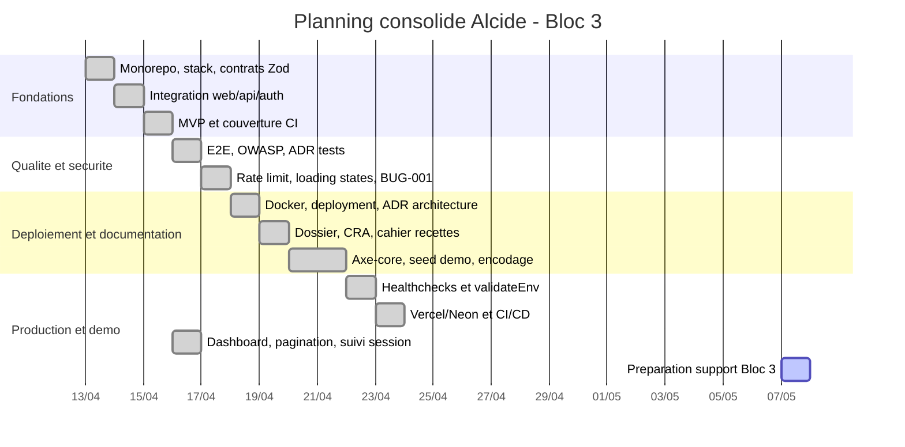

# Livrable Bloc 3 RNCP39583 - Pilotage du projet Alcide

> Bloc officiel : **Coordonner et piloter un projet de développement d'applications logicielles**
> Projet : **Alcide / alcide**
> Candidat : Kevin
> Version du livrable : 2026-05-07
> Objet : support de préparation à l'oral Bloc 3 de 45 minutes, incluant le pilotage projet et la démonstration de la dernière version logicielle.

---

## 0. Référentiel et périmètre du livrable

Ce document consolide les preuves de pilotage du projet Alcide selon les attendus officiels du Bloc 3 RNCP39583. Il ne vise pas à redémontrer le développement ou la sécurité en détail : ces éléments sont utilisés seulement comme **preuves de pilotage**, de suivi qualité, de gestion des risques, d'arbitrage, de validation et de démonstration.

Sources RNCP locales consultées :

| Source | Usage dans ce livrable |
|---|---|
| `docs/rncp/Référentiel Expert en développement logiciel RNCP39583 (1).pdf` | Activités A3.1 à A3.4, compétences C.3.1 à C3.4.2, critères d'évaluation |
| `docs/rncp/25 09 15  Réglement spécial de certification - Expert en développement logiciel RNCP39583 (1).pdf` | Format officiel Bloc 3 : oral 45 min, présentation 30 min, échange 15 min, démonstration logicielle |
| `docs/rncp/25-26 Modalités_Evaluations_Titre EDL RNCP39583_YNOV_M2_filiere Info (1).pdf` | Confirmation du format : oral individuel 45 min |
| `docs/rncp/matrice-conformite-rncp39583.md` | Risques et écarts déjà identifiés pour le Bloc 3 |
| `docs/rncp/dossier-professionnel-rncp39583.md` | Réalignement des preuves existantes sur les 4 blocs officiels |

Compétences éliminatoires Bloc 3 à sécuriser :

| Compétence éliminatoire | Attendu officiel | Réponse dans ce document |
|---|---|---|
| **C.3.1** - Planifier l'exécution du projet | Méthodologie, ordonnancement, planning prévisionnel, ressources, responsabilités | Sections 2, 3, 4 et 6 |
| **C3.2.1** - Piloter l'avancement du projet | Outil de suivi, indicateurs mesurables, suivi délais/qualité/coûts/risques/RH | Sections 5, 8, 9 et 10 |
| **C3.4.2** - Réaliser une démonstration de la dernière version logicielle | Logiciel utilisable, démonstration des fonctionnalités attendues, vocabulaire adapté client | Section 14 et fichier `bloc3-script-demo-logiciel.md` |

Important : plusieurs éléments de pilotage n'étaient pas formalisés comme livrables autonomes avant ce document. Lorsqu'un élément est une **reconstruction de pilotage** à partir de preuves existantes, il est indiqué comme tel. Les preuves techniques existantes ne sont pas inventées.

---

## 1. Présentation synthétique du projet

| Élément | Description |
|---|---|
| Nom du projet | **Alcide / alcide** |
| Objectif | Générer, sauvegarder, consulter et exécuter des entraînements ou programmes sportifs personnalisés par IA |
| Nature | Application web full-stack |
| Utilisateurs | Sportifs amateurs ou réguliers souhaitant structurer leur entraînement ; jury RNCP comme évaluateur du projet ; commanditaire simulé pour la validation pédagogique |
| Livrable logiciel final | Version applicative `0.12.0` d'après `package.json` et `CHANGELOG.md` |
| Stack | Next.js 14, Hono, TypeScript, PostgreSQL/Drizzle, Auth.js, Mistral AI par défaut, OpenAI/Anthropic via paramètres utilisateur, Zod, pnpm monorepo, Docker, GitHub Actions, Vercel/Neon |
| Déploiement cible documenté | Web : `https://alcide-web.vercel.app` ; API : `https://alcide-api.vercel.app` ; DB : Neon PostgreSQL |

Périmètre fonctionnel démontrable :

| Fonctionnalité | Statut | Preuves |
|---|---|---|
| Authentification | Implémentée | `apps/web/lib/auth.ts`, `apps/api/src/middleware/auth.middleware.ts`, `docs/adr/ADR-004-service-to-service-auth.md` |
| Génération d'entraînement | Implémentée | `apps/web/app/generate/page.tsx`, `apps/api/src/services/mistral.service.ts`, `packages/shared/src/schemas/workout.schema.ts` |
| Génération de programme | Implémentée | `apps/web/app/programs/generate/page.tsx`, `apps/api/src/services/mistral-program.service.ts`, `packages/shared/src/schemas/program.schema.ts` |
| Liste et détail des entraînements | Implémentés | `apps/web/app/workouts/`, `apps/api/src/routes/workout.routes.ts` |
| Timer et suivi de session | Implémentés | `apps/web/components/Timer.tsx`, `apps/web/components/SessionCompletionForm.tsx`, `apps/api/src/routes/session-log.routes.ts` |
| Dashboard | Implémenté | `apps/web/app/dashboard/page.tsx`, `apps/api/src/controllers/session-log.controller.ts` |
| Paramètres IA | Implémentés | `apps/web/app/settings/page.tsx`, `apps/api/src/routes/settings.routes.ts` |
| Healthchecks | Implémentés | `apps/api/src/routes/health.routes.ts`, `apps/web/app/api/health/route.ts` |

Limites à présenter honnêtement au jury :

- les échanges client sont reconstitués pour la soutenance, le projet ayant été conduit en autonomie ;
- le CRA et le dépôt contiennent désormais 12 revues de sprint ; les anciennes mentions de 10 sprints sont historiques ;
- `docs/deployment.md`, `package.json` et `CHANGELOG.md` sont alignés sur `0.12.0` depuis l'audit documentaire du 2026-05-07 ;
- le smoke E2E Firefox n'a pas été relancé avec succès localement le 2026-05-07 car le navigateur Playwright Firefox n'était pas installé ; le smoke Chromium a validé 24 tests.

---

## 2. Méthodologie projet

### 2.1 Méthode choisie

Le projet a été piloté avec une approche **itérative inspirée de Scrum**, adaptée à un projet individuel :

| Élément de méthode | Application dans le projet | Preuves |
|---|---|---|
| Sprints courts | 12 revues de sprint documentent des incréments successifs | `docs/sprints/sprint-01.md` à `docs/sprints/sprint-12.md` |
| Backlog fonctionnel et technique | Les objectifs de sprint priorisent MVP, sécurité, tests, déploiement, dashboard et suivi | `docs/sprints/`, `CHANGELOG.md` |
| Définition de terminé | Code livré, tests/lint/typecheck/build, documentation mise à jour, changelog | `.github/workflows/ci.yml`, `docs/ci-cd.md` |
| Revue de sprint | Chaque sprint contient objectifs, réalisations, métriques, livrables RNCP | `docs/sprints/` |
| Amélioration continue | Bugs documentés et corrections tracées | `docs/bloc4/bugs/`, `CHANGELOG.md` |
| Décisions d'architecture | ADR pour les choix structurants | `docs/adr/` |

### 2.2 Justification du choix

Cette méthode est cohérente avec le contexte du projet :

- un produit logiciel évolutif dont le périmètre fonctionnel a progressé par incréments ;
- un besoin de démonstration régulière devant jury/client ;
- une forte dépendance à des validations techniques : IA, auth, DB, tests, CI/CD, déploiement ;
- un projet individuel nécessitant une méthode légère, sans cérémonies lourdes.

Alternatives non retenues :

| Méthode | Pourquoi non retenue |
|---|---|
| Cycle en V strict | Peu adapté à l'incertitude IA et aux ajustements fréquents du MVP |
| Scrum complet avec équipe | Projet réalisé seul, pas d'équipe de développement réelle |
| Kanban seul | Adapté au flux continu, mais moins lisible pour démontrer des jalons RNCP |

### 2.3 Gestion des priorités

Priorisation utilisée pour piloter les livrables :

| Priorité | Contenu | Exemple projet |
|---|---|---|
| Must have | Fonctionnalités nécessaires à la démonstration et aux compétences RNCP | Auth, génération, persistance, détail, timer, CI, tests, healthchecks |
| Should have | Éléments renforçant la valeur et la qualité | Programmes multi-semaines, dashboard, paramètres IA, accessibilité axe-core |
| Could have | Améliorations non bloquantes | Export PDF, PWA, monitoring externe avancé |
| Won't have v1 | Hors périmètre pour la soutenance | Paiement, mobile natif, capteurs sportifs, modèle IA auto-hébergé |

---

## 3. Planning détaillé

### 3.1 Lecture du planning

Le dépôt contient surtout un **planning rétrospectif prouvé** par sprints, changelog et compte rendu d'activité. Pour répondre au Bloc 3, le tableau ci-dessous consolide :

- le lot de travail ;
- le jalon attendu ;
- les dépendances ;
- les preuves réellement présentes ;
- l'écart éventuel entre la formalisation attendue et les preuves existantes.

### 3.2 Phases et jalons

| Phase | Sprints | Objectif | Jalons / livrables | Dépendances | Preuves |
|---|---:|---|---|---|---|
| Cadrage et architecture initiale | 01 | Poser le monorepo, la stack et les premiers contrats | Monorepo pnpm, Next.js, Hono, Drizzle, Mistral, CI initiale | Choix stack et schémas partagés | `docs/sprints/sprint-01.md`, `docs/adr/ADR-001-monorepo-pnpm.md`, `ADR-002`, `ADR-003` |
| MVP fonctionnel | 02-03 | Relier frontend, backend, auth et données | Génération, liste, détail, suppression, pages d'erreur, coverage CI | Auth service-to-service, API Hono, DB | `docs/sprints/sprint-02.md`, `sprint-03.md`, `docs/adr/ADR-004-service-to-service-auth.md` |
| Qualité, sécurité, accessibilité | 04-05 | Sécuriser le parcours et les contrôles qualité | E2E, OWASP, rate limit, loading states, bug coverage | MVP fonctionnel | `docs/sprints/sprint-04.md`, `sprint-05.md`, `docs/security/owasp-review.md`, `docs/bloc4/bugs/BUG-001-coverage-threshold.md` |
| Déploiement et portabilité | 06 | Préparer local, Docker et cloud | Dockerfiles, docker-compose, guide déploiement, ADR déploiement | Build applicatif stable | `docs/sprints/sprint-06.md`, `docs/deployment.md`, `docker-compose.yml`, `apps/*/Dockerfile` |
| Documentation RNCP et recettes | 07-09 | Formaliser preuves, CRA, changelog, bugs | Dossier professionnel, cahier recettes, BUG-002, encodage UTF-8 | Fonctionnalités MVP et tests | `docs/sprints/sprint-07.md`, `sprint-08.md`, `sprint-09.md`, `docs/bloc2/cahier-recettes.md`, `CHANGELOG.md` |
| Robustesse production | 10-11 | Healthchecks, fail-fast env, Vercel/Neon, CI/CD | `/health`, `/api/health`, validateEnv, CD Vercel, migrations | Secrets et déploiement | `docs/sprints/sprint-10.md`, `sprint-11.md`, `.github/workflows/`, `docs/ci-cd.md` |
| Version démontrable enrichie | 12 | Ajouter pilotage utilisateur et version live | Pagination, filtres, dashboard, seed Neon, auth Vercel | DB migrée, API live | `docs/sprints/sprint-12.md`, `apps/web/app/dashboard/page.tsx`, `apps/api/src/db/seed.ts` |
| Préparation Bloc 3 | Consolidation 2026-05-07 | Formaliser pilotage, support oral et script démo | Présent livrable + support + script | Documents RNCP, sprints, ADR, tests | `docs/rncp/bloc3-*.md` |

### 3.3 Vue planning Mermaid

### 3.4 Écarts planning

| Écart constaté | Impact Bloc 3 | Traitement dans ce livrable |
|---|---|---|
| Planning initial peu formalisé comme Gantt ou rétroplanning | Risque sur C.3.1 | Planning consolidé et dépendances explicités ci-dessus |
| Dates de certains sprints regroupées sur la même journée | Lisibilité faible pour le jury | Présenter les sprints comme incréments documentaires, pas comme jours calendaires stricts |
| CRA mentionnant 10 sprints alors que 12 existent | Incohérence documentaire | Signaler l'écart et s'appuyer sur les 12 fichiers `docs/sprints/` |
| Ancienne version erronée dans `deployment.md` | Risque de confusion version | Résolu le 2026-05-07 : `deployment.md` annonce `0.12.0` comme version de référence applicative |

---

## 4. Ressources nécessaires

### 4.1 Ressources humaines

Le projet a été conduit en autonomie. Pour l'oral, il faut expliquer que le candidat a assumé plusieurs rôles projet, tout en distinguant les rôles réellement tenus des rôles simulés ou cibles.

| Rôle | Personne / entité | Responsabilités | Statut preuve |
|---|---|---|---|
| Chef de projet | Candidat | Planning, priorisation, suivi, documentation, arbitrages | Prouvé par `docs/sprints/`, `CHANGELOG.md`, `docs/bloc4/compte-rendu-activite.md` |
| Développeur full-stack | Candidat | Next.js, Hono, TypeScript, Drizzle, IA, UI | Prouvé par `apps/web/`, `apps/api/src/`, `packages/shared/src/` |
| Responsable qualité | Candidat | Tests unitaires, E2E, coverage, cahier recettes | Prouvé par `apps/api/tests/`, `apps/web/tests/e2e/`, `docs/bloc2/cahier-recettes.md` |
| Responsable DevOps | Candidat | Docker, GitHub Actions, Vercel, Neon, migrations | Prouvé par `.github/workflows/`, `docker-compose.yml`, `docs/ci-cd.md` |
| Commanditaire | Simulé / contexte certification | Validation des jalons et attentes utilisateur | À présenter comme mise en situation, pas comme preuve réelle |
| Utilisateur test | Simulé / candidat | Recettes, démonstration, parcours utilisateur | Prouvé partiellement par cahier de recettes et tests E2E |

### 4.2 Ressources techniques

| Ressource | Usage | Preuve |
|---|---|---|
| Poste Windows + IDE | Développement local | Contexte de travail local |
| Node.js 24 et pnpm 11.9 | Runtime et package manager | `package.json`, `.nvmrc`, `pnpm-lock.yaml` |
| Docker / Docker Compose | Démo locale et portabilité | `docker-compose.yml`, `apps/api/Dockerfile`, `apps/web/Dockerfile` |
| PostgreSQL / Neon | Persistance applicative | `apps/api/src/db/schema.ts`, `docs/deployment.md` |
| GitHub Actions | CI, CD, migrations | `.github/workflows/ci.yml`, `deploy-vercel.yml`, `db-migrate.yml` |
| Vercel | Hébergement web et API | `docs/ci-cd.md`, `docs/deployment.md`, `docs/adr/ADR-007-ci-cd-vercel-neon.md` |
| Mistral AI | Génération IA | `docs/adr/ADR-003-mistral-ai.md`, `apps/api/src/services/mistral.service.ts` |
| Auth.js / OAuth | Authentification utilisateur | `apps/web/lib/auth.ts` |
| Zod | Validation des entrées, sorties IA et contrats partagés | `packages/shared/src/schemas/` |

---

## 5. Outil de suivi projet

### 5.1 Outil utilisé ou reconstitué

Le projet ne contient pas de capture d'un outil Kanban externe. Le suivi est donc démontré par un **système de pilotage documentaire et technique** :

| Besoin de suivi | Outil / preuve projet | Ce que cela démontre |
|---|---|---|
| Suivi des lots | `docs/sprints/sprint-01.md` à `sprint-12.md` | Objectifs, réalisations, métriques par incrément |
| Suivi des versions | `CHANGELOG.md` | Historique des versions `0.1.0` à `0.12.0` |
| Suivi des décisions | `docs/adr/` | Arbitrages documentés et conséquences |
| Suivi des anomalies | `docs/bloc4/bugs/BUG-001-coverage-threshold.md`, `BUG-002-readme-utf16.md` | Incidents, causes, corrections, validations |
| Suivi qualité | `.github/workflows/ci.yml`, `docs/ci-cd.md` | Lint, typecheck, coverage, build, audit, E2E smoke |
| Suivi déploiement | `.github/workflows/deploy-vercel.yml`, `db-migrate.yml` | Migration bloquante, déploiement API/Web, smoke tests, reprise manuelle |
| Suivi Kanban daté | `docs/rncp/preuve-suivi-projet-2026-05-07.md` | Export Kanban, tableau de pilotage, preuve de redeploiement API et `/health` en `0.12.0` |

À présenter au jury : "L'outil de suivi principal est reconstitué dans le dépôt par des artefacts versionnés. Une preuve datée de type export Kanban / tableau de pilotage a été ajoutée pour la soutenance ; pour une équipe réelle, ce système serait complété par un tableau GitHub Projects ou Jira."

### 5.2 Tableau de bord Bloc 3 consolidé

| Indicateur | Valeur constatée | Date / source | Usage pilotage |
|---|---:|---|---|
| Sprints documentés | 12 | `docs/sprints/` | Avancement par incrément |
| ADR | 7 | `docs/adr/` | Suivi des décisions structurantes |
| Bugs documentés | 2 | `docs/bloc4/bugs/` | Suivi anomalies et corrections |
| Tests unitaires API | 69 passants | `pnpm test`, 2026-05-07 | Qualité backend |
| Tests unitaires Web | 1 passant | `pnpm test`, 2026-05-07 | Qualité composant Timer |
| Coverage API statements | 81.57% | `pnpm test:coverage`, 2026-05-07 | Seuil CI supérieur à 70% |
| Smoke E2E Chromium | 24 passants | Playwright Chromium, 2026-05-07 | Validation parcours publics, auth, accessibilité |
| Smoke E2E Firefox | Non validé localement | Firefox Playwright absent, 2026-05-07 | Risque outillage à corriger avant soutenance |
| Healthcheck API | Route présente | `apps/api/src/routes/health.routes.ts` | Validation disponibilité API |
| Healthcheck Web | Route présente | `apps/web/app/api/health/route.ts` | Validation disponibilité Web |
| Healthcheck API production | HTTP 200 | `curl https://alcide-api.vercel.app/health`, 2026-05-07 | Vérification disponibilité démo |
| Healthcheck Web production | HTTP 200 | `curl https://alcide-web.vercel.app/api/health`, 2026-05-07 | Vérification disponibilité démo |
| Racine Web production | HTTP 200 | `curl -I https://alcide-web.vercel.app`, 2026-05-07 | Vérification accès application |
| Version de référence | 0.12.0 | `package.json`, `CHANGELOG.md` | Dernière version à démontrer |

### 5.3 Suivi des coûts

Le budget réel n'est pas prouvé par facture. Le suivi coûts est donc un **suivi prévisionnel de projet de certification** :

| Poste | Choix retenu | Pilotage coût |
|---|---|---|
| Développement | Projet individuel | Coût humain à valoriser en charge, non facturé réellement |
| Hébergement Web/API | Vercel | Free tier / coût faible pour prototype |
| Base de données | Neon PostgreSQL | Free tier suffisant pour démonstration |
| IA | Mistral AI ou clé utilisateur | Risque de consommation à surveiller par quotas et plan B seed |
| Monitoring externe | Non prouvé | À produire avant livraison client réelle |

---

## 6. Répartition des missions

### 6.1 Cas particulier du projet individuel

Le projet étant individuel, l'affectation des missions ne correspond pas à une distribution réelle entre plusieurs développeurs. La conformité Bloc 3 est démontrée en expliquant :

- les rôles assumés par le candidat ;
- les responsabilités qui auraient été réparties dans une équipe ;
- les adaptations prévues si le projet était confié à une équipe réelle, y compris handicap et contexte international.

### 6.2 RACI consolidé

| Mission | Chef de projet | Dév full-stack | QA | DevOps | Commanditaire simulé | Utilisateur test |
|---|---|---|---|---|---|---|
| Cadrage besoin et périmètre | A/R | C | C | C | C/I | C |
| Architecture applicative | A | R | C | C | I | I |
| Développement Web | A | R | C | I | I | C |
| Développement API / DB | A | R | C | C | I | I |
| Intégration IA | A | R | C | I | I | C |
| Tests unitaires / coverage | A | C | R | I | I | I |
| E2E / accessibilité | A | C | R | I | I | C |
| CI/CD et déploiement | A | C | C | R | I | I |
| Démonstration et validation | A/R | C | C | C | C | C |

Légende : R = Responsible, A = Accountable, C = Consulted, I = Informed.

### 6.3 Style managérial adapté

| Situation | Style appliqué / à appliquer | Justification |
|---|---|---|
| Décision architecture et sécurité | Directif sur les contraintes non négociables | Secrets, ownership, CI et validation Zod ne doivent pas dépendre d'un compromis faible |
| Exploration IA, UX, dashboard | Participatif en contexte équipe ; auto-revue en contexte solo | Les retours utilisateurs peuvent faire évoluer la priorisation |
| Corrections de bugs bloquants | Persuasif et factuel | Décider à partir des indicateurs : CI rouge, coverage, reproductibilité |
| Montée en compétences | Délégatif progressif en équipe | Permettre à un membre de monter sur une zone maîtrisable avec revue |

Prise en compte handicap et contexte international :

- documentation écrite en Markdown, accessible de manière asynchrone ;
- tâches découpées en lots courts et explicitement assignables ;
- rituels possibles en asynchrone pour limiter la fatigue ou les contraintes horaires ;
- outils compatibles avec lecteurs d'écran et navigation clavier à privilégier ;
- vocabulaire client non exclusivement technique pendant les démonstrations.

---

## 7. Arbitrages réalisés

### 7.1 Arbitrage 1 - Monorepo pnpm

| Élément | Détail |
|---|---|
| Contexte | Le frontend, l'API et les schémas Zod doivent rester synchronisés |
| Options | Monorepo pnpm ; deux dépôts séparés ; npm workspaces |
| Critères | Partage de types, vitesse d'installation, cohérence CI, lisibilité jury |
| Décision | Monorepo pnpm avec `apps/web`, `apps/api`, `packages/shared` |
| Impact | Moins de duplication, contrats partagés, build ordonné `shared -> api -> web` |
| Preuve | `docs/adr/ADR-001-monorepo-pnpm.md`, `pnpm-workspace.yaml`, `packages/shared/src/` |

### 7.2 Arbitrage 2 - Next.js + Hono + PostgreSQL/Drizzle

| Élément | Détail |
|---|---|
| Contexte | Livrer une application full-stack maintenable avec séparation claire des couches |
| Options | Next.js seul ; Next.js + Express ; Next.js + Hono ; NestJS |
| Critères | TypeScript, légèreté, architecture en couches, sécurité, déploiement |
| Décision | Next.js pour Web, Hono pour API, PostgreSQL/Drizzle pour persistance |
| Impact | Couches lisibles : routes, controllers, services, repositories ; requêtes typées |
| Preuve | `docs/adr/ADR-002-hono-backend.md`, `apps/api/src/routes/index.ts`, `apps/api/src/db/schema.ts` |

### 7.3 Arbitrage 3 - Mistral AI comme fournisseur IA

| Élément | Détail |
|---|---|
| Contexte | Générer des entraînements structurés en JSON et validables |
| Options | Mistral AI ; OpenAI ; Gemini ; modèle local Ollama |
| Critères | Coût prototype, JSON mode, qualité suffisante, protection des secrets |
| Décision | Mistral AI avec JSON mode et validation Zod |
| Impact | Génération IA côté serveur, retry sur sortie invalide, plan B seed si IA indisponible |
| Preuve | `docs/adr/ADR-003-mistral-ai.md`, `apps/api/src/services/mistral.service.ts`, `mistral-program.service.ts` |

### 7.4 Arbitrage 4 - Déploiement Vercel/Neon et portabilité Docker

| Élément | Détail |
|---|---|
| Contexte | Disposer d'une version démontrable et d'un mode local reproductible |
| Options | Vercel/Neon ; Fly.io/Neon ; Railway ; VPS Docker ; local uniquement |
| Critères | URL live, coût, simplicité, migrations explicites, rollback, portabilité |
| Décision | Production canonique Vercel Web/API + Neon ; Docker conservé comme alternative |
| Impact | Smoke tests production, CD prebuilt, migrations DB manuelles et auditées |
| Preuve | `docs/adr/ADR-007-ci-cd-vercel-neon.md`, `docs/ci-cd.md`, `.github/workflows/deploy-vercel.yml`, `docker-compose.yml` |

### 7.5 Arbitrage 5 - Auth service-to-service

| Élément | Détail |
|---|---|
| Contexte | Appeler l'API Hono depuis Next.js sans exposer la session ni les secrets au navigateur |
| Options | Cookie CORS credentials ; JWT partagé ; secret interne service-to-service |
| Critères | Sécurité, simplicité, découplage Auth.js/Hono, performance |
| Décision | Header `x-internal-secret` + `x-user-id`, côté serveur uniquement |
| Impact | API protégée, ownership par utilisateur, secret non exposé au client |
| Preuve | `docs/adr/ADR-004-service-to-service-auth.md`, `apps/web/lib/server-api.ts`, `apps/api/src/middleware/auth.middleware.ts` |

### 7.6 Arbitrage 6 - Stratégie tests et couverture

| Élément | Détail |
|---|---|
| Contexte | Sécuriser la qualité sans bloquer le projet par des tests d'intégration lourds |
| Options | Unitaires seuls ; E2E seuls ; pyramide unitaires + E2E ; intégration DB complète |
| Critères | Vitesse CI, couverture des risques, stabilité, coût maintenance |
| Décision | Vitest pour logique métier, Playwright/axe pour flux et accessibilité, seuil coverage 70% |
| Impact | CI plus rapide, détection régressions clés, limite assumée sur repositories DB |
| Preuve | `docs/adr/ADR-005-testing-strategy.md`, `apps/api/vitest.config.ts`, `apps/web/tests/e2e/` |

---

## 8. Communication projet

### 8.1 Canaux et artefacts

| Communication | Fréquence / moment | Objectif | Preuves |
|---|---|---|---|
| Revues de sprint | À chaque incrément | Résumer avancement, métriques, livrables, prochaine étape | `docs/sprints/` |
| Changelog | À chaque version | Communiquer changements, corrections, sécurité | `CHANGELOG.md` |
| ADR | Lors d'une décision structurante | Expliquer contexte, options, décision, conséquences | `docs/adr/` |
| Fiches anomalies | Lors d'un bug notable | Décrire incident, cause, correction, validation | `docs/bloc4/bugs/` |
| Documentation CI/CD | Lors de la mise en production | Partager procédure de build, déploiement, rollback | `docs/ci-cd.md`, `docs/deployment.md` |
| Matrice RNCP | Avant soutenance | Identifier écarts et priorités de conformité | `docs/rncp/matrice-conformite-rncp39583.md` |

### 8.2 Comptes rendus client reconstitués

Ces comptes rendus sont des **supports de soutenance reconstitués** à partir des preuves du dépôt. Ils ne doivent pas être présentés comme des emails client réels.

| Point | Objet | Décisions / validations | Preuves associées |
|---|---|---|---|
| CR client 1 - MVP | Valider que l'utilisateur peut générer et consulter une séance | MVP validé sous réserve d'améliorer suppression, erreurs et tests | `sprint-02.md`, `sprint-03.md`, `apps/web/app/generate/page.tsx` |
| CR client 2 - Qualité | Valider sécurité, accessibilité et non-régression | Ajout E2E, OWASP, rate limiting, loading states | `sprint-04.md`, `sprint-05.md`, `docs/security/owasp-review.md` |
| CR client 3 - Livraison | Valider version démontrable avec dashboard, Vercel/Neon et healthchecks | Version de soutenance prête avec plan B local/seed | `sprint-12.md`, `docs/ci-cd.md`, `docs/deployment.md` |

---

## 9. Pilotage par indicateurs

### 9.1 Indicateurs qualité et avancement

| Domaine | Indicateur | Valeur / statut | Source |
|---|---|---:|---|
| Avancement | Versions livrées | `0.1.0` à `0.12.0` | `CHANGELOG.md` |
| Avancement | Sprints documentés | 12 | `docs/sprints/` |
| Décisions | ADR | 7 | `docs/adr/` |
| Tests | Unitaires passants | 70 | `pnpm test`, 2026-05-07 |
| Coverage | Statements API | 81.57% | `pnpm test:coverage`, 2026-05-07 |
| E2E | Smoke Chromium | 24 passants | Playwright, 2026-05-07 |
| E2E | Firefox | Bloqué par navigateur absent | Playwright, 2026-05-07 |
| Bugs | Bugs documentés | 2 résolus | `docs/bloc4/bugs/` |
| CI/CD | Gates CI | lint, typecheck, coverage, build, E2E smoke, Docker, audit | `.github/workflows/ci.yml` |
| Déploiement | Smoke prod documenté | API `/health`, Web `/api/health` | `.github/workflows/deploy-vercel.yml` |
| Sécurité | Ownership et secrets | Implémentés | `ADR-004`, `auth.middleware.ts`, `server-api.ts` |
| Accessibilité | Axe + RGAA smoke | Smoke Chromium validé | `apps/web/tests/e2e/axe.spec.ts`, `accessibility.spec.ts` |

### 9.2 Indicateurs de dette technique

| Dette / limite | Niveau | Plan de traitement |
|---|---|---|
| Tests d'intégration DB absents | Moyen | Ajouter Testcontainers ou DB CI dédiée pour repositories |
| E2E Firefox non installé localement | Faible à moyen avant soutenance | Exécuter `pnpm --filter web exec playwright install firefox` puis relancer smoke |
| Monitoring externe non prouvé | Moyen | Mettre en place UptimeRobot, Vercel Monitoring ou Better Stack avant livraison client |
| Incohérences documentaires version/sprints | Moyen | Harmoniser `deployment.md`, CRA, dossier et changelog avant dépôt final |
| Rate limit in-memory | Moyen production | Migrer vers Redis/Upstash pour instances multiples |

---

## 10. Gestion des risques pendant le projet

| Risque | Probabilité | Impact | Mesure de maîtrise | Preuves |
|---|---|---|---|---|
| Sortie IA invalide | Moyenne | Élevé | JSON mode, validation Zod, retry, erreur propre | `ADR-003`, `mistral.service.ts`, tests Mistral |
| Coût ou indisponibilité IA | Moyenne | Moyen | Rate limit, plan B seed, clé utilisateur dans settings | `rate-limit.middleware.ts`, `seed.ts`, `settings.routes.ts` |
| Accès aux données d'un autre utilisateur | Faible à moyenne | Élevé | `userId`, ownership repository, auth middleware | `schema.ts`, `auth.middleware.ts`, tests ownership |
| Régression logicielle | Moyenne | Élevé | Vitest, Playwright, CI, coverage 70% | `.github/workflows/ci.yml`, `pnpm test` |
| Échec de déploiement | Moyenne | Élevé | Migration bloquante, Vercel prebuilt, smoke tests, reprise manuelle | `deploy-vercel.yml`, `db-migrate.yml` |
| Démo bloquée par réseau ou OAuth | Moyenne | Élevé soutenance | Démo locale, données seed, captures alternatives, healthchecks | `docs/deployment.md`, `seed.ts`, script démo |
| Incohérence documentaire | Moyenne | Moyen jury | Matrice RNCP, consolidation Bloc 3, liste d'écarts | `matrice-conformite-rncp39583.md`, section 15 |
| Accessibilité insuffisante | Faible à moyenne | Moyen | Tests RGAA, axe-core, navigation clavier | `accessibility.spec.ts`, `axe.spec.ts` |

---

## 11. Évaluation des besoins en compétences

### 11.1 Compétences mobilisées

| Compétence | Niveau mobilisé dans le projet | Preuves |
|---|---|---|
| Pilotage itératif | Intermédiaire | Sprints, changelog, CRA |
| Architecture full-stack TypeScript | Avancé projet | ADR, `apps/web`, `apps/api`, `packages/shared` |
| IA applicative | Intermédiaire | Mistral service, Zod, retry |
| Backend et DB | Intermédiaire à avancé | Hono, Drizzle, PostgreSQL |
| Frontend Next.js | Avancé projet | App Router, Server Actions, pages protégées |
| Qualité et tests | Intermédiaire | Vitest, Playwright, coverage, cahier recettes |
| DevOps | Intermédiaire | Docker, GitHub Actions, Vercel/Neon |
| Sécurité applicative | Intermédiaire | OWASP, auth, secrets, rate limit |
| Accessibilité | Intermédiaire | RGAA, axe-core, composants accessibles |

### 11.2 Compétences à renforcer

| Besoin | Pourquoi | Plan de montée en compétences |
|---|---|---|
| Pilotage outillé Kanban/Jira/GitHub Projects | Améliorer preuve C3.2.1 en équipe réelle | Créer un board GitHub Projects avec backlog, statuts, échéances, responsables |
| Gestion budgétaire | Le coût n'est pas suivi par facture | Produire budget prévisionnel et suivi consommations IA/hébergement |
| Tests d'intégration DB | Les repositories sont exclus du coverage | Ajouter Testcontainers PostgreSQL ou workflow CI DB |
| Monitoring/alerting | Healthchecks présents mais alerting absent | Mettre en place alertes externes et journal d'incident |
| Management d'équipe | Projet individuel | Simuler puis pratiquer RACI, délégation, rituels, gestion conflit |
| Accessibilité approfondie | Axe ne couvre pas tout RGAA | Compléter par audit manuel clavier/lecteur d'écran |

### 11.3 Plan de développement des compétences

| Action | Public cible | Modalité | Échéance recommandée |
|---|---|---|---|
| Atelier GitHub Projects + backlog | Chef de projet / équipe | Autoformation + mise en place board | Avant soutenance ou v2 |
| Formation courte Testcontainers | Backend / QA | Documentation + spike technique | Sprint v2 |
| Mise en place monitoring externe | DevOps | Tutoriel Vercel/Better Stack/UptimeRobot | Avant livraison client réelle |
| Revue accessibilité manuelle | Frontend / QA | Checklist RGAA + tests clavier | Avant démo finale |
| Revue post-mortem incident | Toute équipe | Atelier 30 min après bug majeur | À chaque incident |

Adaptations handicap : supports écrits, temps de revue asynchrone, tâches granularisées, réunions courtes, documentation claire, outils compatibles clavier et lecteurs d'écran.

---

## 12. Points de validation

| Point de validation | Critère | Statut | Preuves / commandes |
|---|---|---|---|
| Validation fonctionnelle MVP | Générer, consulter, supprimer une séance | Implémenté | `apps/web/app/generate/page.tsx`, `workouts/`, `docs/bloc2/cahier-recettes.md` |
| Validation programme | Générer et consulter un programme multi-semaines | Implémenté | `apps/web/app/programs/`, `program.routes.ts` |
| Validation timer/suivi | Exécuter une séance et enregistrer un feedback | Implémenté | `Timer.tsx`, `SessionCompletionForm.tsx`, `session-log.routes.ts` |
| Validation technique | Tests unitaires passants | Validé le 2026-05-07 | `pnpm test` |
| Validation coverage | Coverage API > 70% | Validé : 81.57% statements | `pnpm test:coverage` |
| Validation E2E Chromium | Smoke public, auth, accessibilité | Validé : 24 tests | Commande Playwright Chromium |
| Validation E2E Firefox | Cross-browser | À corriger localement | Installer Firefox Playwright |
| Validation sécurité | Ownership, secrets, Zod, rate limit | Implémenté | `docs/security/owasp-review.md`, ADR-004 |
| Validation accessibilité | Axe et RGAA smoke | Partiel mais documenté | `axe.spec.ts`, `accessibility.spec.ts` |
| Validation déploiement | Healthchecks Web/API | Documenté | `docs/ci-cd.md`, `deploy-vercel.yml` |
| Validation finale démo | Scénario 5-8 min + plan B | À exécuter avant jury | `bloc3-script-demo-logiciel.md` |

---

## 13. Indicateurs de satisfaction

Les indicateurs de satisfaction ne sont pas prouvés par une enquête utilisateur réelle. Ils sont proposés comme grille de validation commanditaire pour la soutenance.

| Axe | Indicateur | Cible | Méthode de mesure |
|---|---|---:|---|
| Compréhension utilisateur | L'utilisateur comprend le parcours sans aide | 80% des étapes réussies | Grille de démo ou test utilisateur court |
| Génération | Une séance ou un programme est généré sans erreur bloquante | 1 génération réussie en démo | Test live ou plan B seed |
| Utilité | Le contenu généré est structuré et exploitable | Validation qualitative commanditaire | Revue de la séance générée |
| Performance perçue | Temps d'attente acceptable | Moins de 45 s pour IA ; immédiat avec seed | Chronométrage démo |
| Sécurité | Aucun accès aux données d'autrui | 0 cas d'ownership cassé | Tests et démonstration explicative |
| Maintenabilité | CI, tests, docs et changelog à jour | CI verte / tests locaux passants | `pnpm test`, `pnpm test:coverage` |
| Accessibilité | Navigation publique utilisable au clavier | Smoke Chromium OK | Playwright accessibility |

Limites connues :

- pas d'enquête satisfaction réelle historisée ;
- pas de métriques production utilisateur ;
- pas de monitoring externe avec SLA ;
- dépendance au fournisseur IA pendant la démo.

---

## 14. Démonstration de la dernière version logicielle

### 14.1 Objectif de la démonstration

Montrer que la dernière version logicielle est utilisable, qu'elle répond au périmètre fonctionnel attendu et qu'elle a été pilotée jusqu'à une version démontrable.

### 14.2 Ordre recommandé

| Étape | Durée cible | Fonctionnalité | Message jury |
|---|---:|---|---|
| 1 | 30 s | Ouvrir Web + healthchecks | La version est accessible et vérifiable |
| 2 | 45 s | Authentification | Les données sont rattachées à un utilisateur |
| 3 | 90 s | Génération d'entraînement | Le besoin principal est couvert |
| 4 | 60 s | Consultation + timer | L'utilisateur peut exécuter la séance |
| 5 | 60 s | Suivi de session | Le feedback utilisateur enrichit le dashboard |
| 6 | 75 s | Génération programme | Le produit dépasse la séance unique |
| 7 | 60 s | Dashboard | Le suivi utilisateur est visible |
| 8 | 45 s | Paramètres IA | Le risque fournisseur IA est pilotable |
| 9 | 45 s | Sécurité ownership + CI/CD | Le pilotage qualité est traçable |

Durée totale cible : 7 à 8 minutes, incluse dans les 30 minutes de présentation.

### 14.3 Données de démonstration

| Option | Usage |
|---|---|
| Compte OAuth de démonstration | Démo production authentifiée |
| Seed local `pnpm db:seed` | Plan B sans IA ou sans production |
| Workouts de seed | Cardio débutant, force intermédiaire, HIIT avancé |
| Healthchecks | API `/health`, Web `/api/health` |

### 14.4 Risques de démo et plans de secours

| Risque | Plan B |
|---|---|
| IA lente ou indisponible | Montrer les entraînements seedés et expliquer JSON/Zod/retry |
| OAuth impossible | Utiliser captures, session locale préparée ou routes publiques + explication |
| Production Vercel indisponible | Démarrer localement avec `pnpm dev` ou Docker Compose |
| Base Neon indisponible | Utiliser PostgreSQL local + seed |
| Firefox Playwright absent | Montrer validation Chromium et expliquer prérequis d'installation navigateur |

Le script détaillé est dans `docs/rncp/bloc3-script-demo-logiciel.md`.

---

## 15. Écarts ou preuves à produire avant soutenance

| Élément | Statut | Action recommandée |
|---|---|---|
| Planning prévisionnel original | Partiel / reconstitué | Assumer une consolidation Bloc 3 et, si possible, ajouter un board GitHub Projects exporté |
| Outil de suivi Kanban | Prouvé par export daté | Utiliser `docs/rncp/preuve-suivi-projet-2026-05-07.md` ; créer un board GitHub Projects seulement si une capture externe est exigée |
| Comptes rendus client réels | Non prouvés | Utiliser des CR reconstitués clairement étiquetés ou produire une validation commanditaire pédagogique |
| Indicateurs satisfaction réels | Non prouvés | Préparer une grille de validation utilisateur/commanditaire pour la démo |
| Grille compétences équipe | Créée dans ce document | La reprendre en slide et préciser le contexte solo |
| Suivi coûts réel | Non prouvé | Ajouter budget prévisionnel et coûts free tier/risques IA |
| Version applicative | Cohérent | `package.json`, `CHANGELOG.md` et `docs/deployment.md` annoncent `0.12.0` comme version démontrée |
| CRA 10 sprints vs dépôt 12 sprints | Incohérent | Mettre à jour CRA ou préciser que le Bloc 3 s'appuie sur les 12 fichiers sprint |
| Firefox Playwright | Bloqué localement | Installer le navigateur et relancer `pnpm test:e2e:smoke` avant soutenance |
| Monitoring externe | Absent | Ajouter preuve UptimeRobot/Vercel Monitoring si possible |

---

## Conclusion Bloc 3

Alcide démontre un pilotage réel par incréments : sprints documentés, changelog, ADR, bugs, CI/CD, tests, healthchecks, déploiement et version de démonstration. Le principal enjeu Bloc 3 n'est pas le code, mais la **formalisation du pilotage** : planning consolidé, tableau de bord, RACI, arbitrages, communication, compétences, validations et indicateurs de satisfaction.

Le discours à tenir devant le jury est donc : le projet a été conduit en autonomie, mais avec une logique professionnelle de coordination. Les rôles d'équipe ont été assumés par le candidat et sont explicités sans inventer une équipe réelle. Les preuves techniques sont utilisées comme indicateurs de pilotage, et la démonstration finale permet d'obtenir une validation commanditaire simulée avant livraison.
