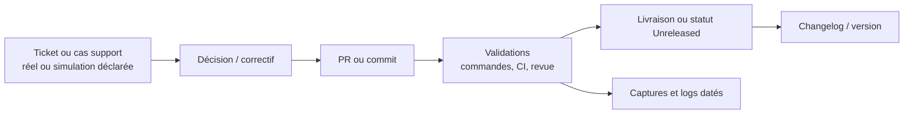

# C4.3.2 — Matrice de traçabilité maintenance

> **Statut : matrice vierge à compléter.** Une cellule non renseignée ne vaut
> pas preuve. Ne renseigner une URL, un numéro de PR, un résultat de validation
> ou une version qu'après vérification de son existence.

Cette matrice relie la consignation d'une anomalie ou d'un cas support au
correctif, à ses validations, puis à sa communication de maintenance
(changelog/version). Elle facilite la traçabilité demandée pour C4.3.2 sans
présumer qu'un correctif a été livré.

| Référence ticket / cas                 | Signal et date                        | Décision / correctif | PR ou commit                               | Validations techniques                       | Validation post-déploiement                               | Changelog                                                 | Version / statut de livraison                    | Preuves à capturer                         | État                                               |
| -------------------------------------- | ------------------------------------- | -------------------- | ------------------------------------------ | -------------------------------------------- | --------------------------------------------------------- | --------------------------------------------------------- | ------------------------------------------------ | ------------------------------------------ | -------------------------------------------------- |
| `[À compléter : URL ou BUG-/SUPPORT-]` | `[À compléter : source + YYYY-MM-DD]` | `[À compléter]`      | `[À compléter : URL, SHA ou « non créé »]` | `[À compléter : commande, run CI, résultat]` | `[À compléter : méthode, environnement, résultat ou N/A]` | `[À compléter : lien/section ou « non requis » justifié]` | `[À compléter : x.y.z / Unreleased / non livré]` | `[À compléter : liens vers captures/logs]` | `[À compléter : ouvert / en validation / clôturé]` |
| `[À compléter]`                        | `[À compléter]`                       | `[À compléter]`      | `[À compléter]`                            | `[À compléter]`                              | `[À compléter]`                                           | `[À compléter]`                                           | `[À compléter]`                                  | `[À compléter]`                            | `[À compléter]`                                    |
| `[À compléter]`                        | `[À compléter]`                       | `[À compléter]`      | `[À compléter]`                            | `[À compléter]`                              | `[À compléter]`                                           | `[À compléter]`                                           | `[À compléter]`                                  | `[À compléter]`                            | `[À compléter]`                                    |

## Contrôle de cohérence par ligne

- [ ] La référence renvoie vers un ticket réellement créé, ou la cellule indique explicitement qu'il ne l'est pas.
- [ ] La décision est cohérente avec l'impact et le statut de l'anomalie.
- [ ] La PR ou le commit correspond au correctif décrit, sans confondre un brouillon avec une fusion.
- [ ] Chaque validation indique sa commande ou méthode, son contexte et son résultat effectif.
- [ ] La validation post-déploiement est marquée `N/A` si aucun déploiement n'était attendu.
- [ ] La section du [CHANGELOG](../../../CHANGELOG.md) et la version reflètent le statut réellement livré ; `Unreleased` est conservé tant qu'aucune version publiée n'est établie.
- [ ] Les captures ou logs associés sont datés, accessibles et anonymisés.

## Chaîne de preuve attendue

Une simulation C4.3.3 peut alimenter la première colonne, mais elle doit rester
identifiée comme telle sur toute la chaîne. Elle ne doit pas être transformée en
retour utilisateur réel dans la matrice.
