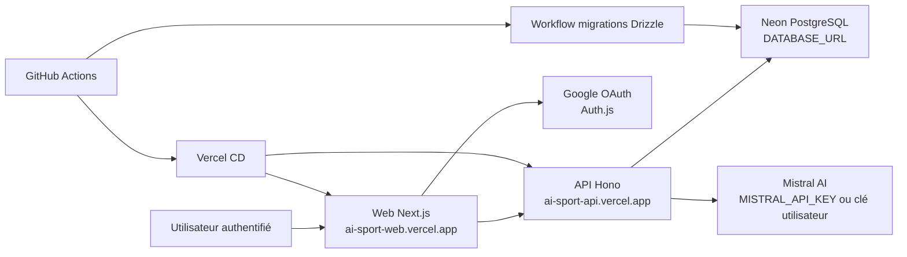

# Livrable Bloc 4 RNCP39583 - Maintien en condition opérationnelle de Alcide

> Bloc officiel : **Maintenir l'application logicielle en condition opérationnelle**
> Projet : **Alcide / alcide**
> Candidat : Kevin
> Version du livrable : 2026-07-28 — état documentaire de l'application `0.13.0-rc.3`
> Format cible : dossier écrit exploitable pour le jury, 20 pages maximum hors annexes

---

## 0. Référentiel et périmètre du livrable

Ce document consolide les preuves de maintenance en condition opérationnelle de Alcide. Il ne réduit pas le Bloc 4 au déploiement : il couvre les mises à jour, la supervision, l'alerting, les anomalies, les correctifs, le support, le journal de versions, le rollback et les recommandations d'amélioration.

Sources RNCP locales consultées :

| Source                                                                                                        | Usage dans ce livrable                                                                       |
| ------------------------------------------------------------------------------------------------------------- | -------------------------------------------------------------------------------------------- |
| `docs/rncp/Référentiel Expert en développement logiciel RNCP39583 (1).pdf`                                    | Activités A4.1 à A4.3, compétences C4.1.1 à C4.3.3, critères d'évaluation Bloc 4             |
| `docs/rncp/25 09 15  Réglement spécial de certification - Expert en développement logiciel RNCP39583 (1).pdf` | Format officiel Bloc 4, dossier de 20 pages, liste des attendus et compétences éliminatoires |
| `docs/rncp/25-26 Modalités_Evaluations_Titre EDL RNCP39583_YNOV_M2_filiere Info (1).pdf`                      | Confirmation du Bloc 4 comme bloc officiel de maintien en condition opérationnelle           |
| [matrice-conformite-rncp39583.md](matrice-conformite-rncp39583.md)                                            | Écarts Bloc 4 déjà identifiés                                                                |
| [dossier-professionnel-rncp39583.md](dossier-professionnel-rncp39583.md)                                      | Synthèse réalignée des preuves existantes                                                    |

Le règlement spécial indique que le dossier écrit Bloc 4 doit comprendre : processus de mise à jour des dépendances, système de supervision, processus de collecte et consignation des anomalies, fiche d'anomalie, traitement d'une anomalie, recommandations argumentées, journal de version et exemple de problème résolu avec le support client.

Compétences éliminatoires à sécuriser :

| Compétence éliminatoire                                      | Exigence jury                                                                      | Réponse dans ce dossier                                                                |
| ------------------------------------------------------------ | ---------------------------------------------------------------------------------- | -------------------------------------------------------------------------------------- |
| **C4.1.2** - Concevoir un système de supervision et d'alerte | Périmètre de supervision, indicateurs, sondes, seuils et modalité de signalement   | Sections 4 et 5                                                                        |
| **C4.2.1** - Consigner les anomalies détectées               | Processus de collecte, informations utiles, reproduction, analyse et préconisation | Sections 6, 7 et document [bloc4-processus-incidents.md](bloc4-processus-incidents.md) |
| **C4.3.2** - Établir un journal des versions déployées       | Versions, corrections et évolutions documentées                                    | Section 9 et [CHANGELOG.md](../../CHANGELOG.md)                                        |

Statut global : **base MCO versionnée avec circuit GitHub de signalement démontré, à compléter par un run de production avant remise**. Le dépôt contient les healthchecks non cacheables, une CI/CD, un monitoring GitHub horaire, des templates d'anomalie/support, des fiches bugs, un changelog, un audit et un rollback documenté. La simulation déclarée du 2026-07-28 prouve l'artefact, l'issue de test et sa fermeture automatique ; elle ne prouve ni la disponibilité réelle de la production, ni un monitor Better Stack, ni une notification e-mail.

Statuts utilisés dans ce livrable :

| Statut                | Signification                                                                        |
| --------------------- | ------------------------------------------------------------------------------------ |
| **Versionné**         | Code, configuration ou documentation présents dans le dépôt                          |
| **Partiel**           | Élément présent, mais couverture, centralisation ou preuve d'exploitation incomplète |
| **À exécuter/capter** | Preuve d'exécution attendue dans GitHub, Vercel, Neon ou un terminal                 |
| **À mettre en place** | Recommandation ou capacité absente, non présentée comme déjà réalisée                |

---

## 1. Présentation de l'application en production

### 1.1 Vue d'ensemble

Alcide est une application web full-stack qui génère des entraînements et programmes sportifs personnalisés par IA. L'utilisateur se connecte via Google OAuth, renseigne son sport, son niveau, ses objectifs et contraintes, puis obtient une séance ou un programme structuré. Les données sont persistées dans PostgreSQL et consultables dans l'espace utilisateur.

| Élément               | Description                                                      | Preuves                                                                                                                    |
| --------------------- | ---------------------------------------------------------------- | -------------------------------------------------------------------------------------------------------------------------- |
| Frontend              | Next.js 14 App Router, TypeScript, Tailwind, Auth.js             | [README.md](../../README.md), `apps/web/`                                                                                  |
| API                   | Hono TypeScript avec routes, controllers, services, repositories | `apps/api/src/`                                                                                                            |
| Base de données       | PostgreSQL / Neon, migrations Drizzle versionnées                | `apps/api/drizzle/`, [db-migrate.yml](../../.github/workflows/db-migrate.yml)                                              |
| IA                    | Mistral AI ou clé IA utilisateur, sortie JSON validée par Zod    | `apps/api/src/services/ai.service.ts`, `mistral.service.ts`, `mistral-program.service.ts`                                  |
| Authentification      | Auth.js côté Web, secret service-to-service Web vers API         | `apps/web/lib/auth.ts`, `apps/api/src/middleware/auth.middleware.ts`, [ADR-004](../adr/ADR-004-service-to-service-auth.md) |
| Déploiement canonique | Web et API sur Vercel, base Neon                                 | [ci-cd.md](../ci-cd.md), [deployment.md](../deployment.md), [ADR-007](../adr/ADR-007-ci-cd-vercel-neon.md)                 |

### 1.2 Architecture de production



La cible officielle du dépôt est :

| Composant       | Plateforme      | URL ou accès                      |
| --------------- | --------------- | --------------------------------- |
| Web             | Vercel          | `https://ai-sport-web.vercel.app` |
| API             | Vercel          | `https://ai-sport-api.vercel.app` |
| Base de données | Neon PostgreSQL | via `DATABASE_URL`                |
| CI/CD           | GitHub Actions  | `.github/workflows/`              |

Docker Compose reste disponible pour démonstration locale ou auto-hébergement, avec PostgreSQL, API et Web, mais ce n'est pas la voie CD canonique.

### 1.3 Variables d'environnement sensibles

Les secrets ne sont pas commités. Les exemples sont fournis dans [.env.example](../../.env.example), `apps/api/.env.example` et `apps/web/.env.example`.

| Variable                                | Usage                                            | Criticité | Où la configurer                         |
| --------------------------------------- | ------------------------------------------------ | --------: | ---------------------------------------- |
| `DATABASE_URL`                          | Connexion Neon/PostgreSQL                        |     Haute | Vercel API, GitHub secret DB             |
| `SERVICE_SECRET`                        | Authentification service-to-service Web vers API |     Haute | Vercel Web + API, GitHub CI              |
| `MISTRAL_API_KEY`                       | Génération IA par défaut                         |     Haute | Vercel API, GitHub CI si tests concernés |
| `AUTH_SECRET`                           | Signature Auth.js                                |     Haute | Vercel Web                               |
| `AUTH_GOOGLE_ID` / `AUTH_GOOGLE_SECRET` | OAuth Google                                     |     Haute | Vercel Web                               |
| `NEXTAUTH_URL`                          | URL publique Web pour callbacks OAuth            |   Moyenne | Vercel Web                               |
| `NEXT_PUBLIC_API_URL`                   | URL publique de l'API côté Web                   |   Moyenne | Vercel Web                               |
| `FRONTEND_URL`                          | CORS API                                         |   Moyenne | Vercel API                               |

Contrôles existants :

- `SERVICE_SECRET` n'est jamais exposé en `NEXT_PUBLIC_*`.
- `validateEnv()` bloque le démarrage API si `DATABASE_URL` ou `SERVICE_SECRET` sont absents.
- Le Docker Compose injecte les secrets depuis `.env`.
- La CD Vercel valide la présence des secrets Vercel/GitHub avant build et deploy.

### 1.4 Dépendances critiques

| Dépendance                     | Rôle                       | Risque MCO                              | Mesure actuelle                                               |
| ------------------------------ | -------------------------- | --------------------------------------- | ------------------------------------------------------------- |
| Next.js / React                | Interface Web et routing   | Régression build/runtime                | `pnpm build`, E2E smoke                                       |
| Hono                           | API HTTP                   | Régression routes/middlewares           | tests API, build API                                          |
| Drizzle / pg                   | Accès PostgreSQL           | Migration ou requête cassée             | migrations versionnées, workflow DB manuel                    |
| Auth.js                        | Sessions OAuth             | Authentification cassée                 | E2E auth, configuration `trustHost` documentée dans changelog |
| Mistral AI                     | Génération d'entraînements | Timeout, JSON invalide, indisponibilité | timeout, retry, validation Zod, logs IA                       |
| Zod                            | Validation entrées/sorties | Contrats invalides                      | tests unitaires, schémas partagés                             |
| GitHub Actions / Vercel / Neon | Déploiement et production  | Livraison ou disponibilité bloquée      | CI/CD documentée, rollback Vercel                             |

---

## 2. Processus de mise à jour des dépendances

### 2.1 Preuves déjà en place

| Preuve                                         | Rôle MCO                                                                                     |
| ---------------------------------------------- | -------------------------------------------------------------------------------------------- |
| [dependabot.yml](../../.github/dependabot.yml) | Surveillance hebdomadaire des dépendances npm et GitHub Actions, le lundi matin Europe/Paris |
| [package.json](../../package.json)             | Version projet, scripts de test/build/audit, pnpm 11.9.0                                     |
| [pnpm-lock.yaml](../../pnpm-lock.yaml)         | Reproductibilité des installations                                                           |
| [ci.yml](../../.github/workflows/ci.yml)       | Lint, typecheck, tests, coverage, build, E2E smoke, Docker build, audit                      |
| [ci-cd.md](../ci-cd.md)                        | Documentation CI/CD, secrets, migrations, smoke tests et rollback                            |
| [CHANGELOG.md](../../CHANGELOG.md)             | Traçabilité des versions, évolutions et correctifs                                           |

Dependabot est configuré pour :

- ouvrir des PR npm hebdomadaires à la racine ;
- limiter à 5 PR ouvertes simultanément ;
- grouper les dépendances de production et de développement ;
- surveiller les GitHub Actions chaque lundi à 06:15 Europe/Paris.

### 2.2 Procédure proposée

| Étape                | Action                                                          | Commande ou preuve                                          | Critère de sortie              |
| -------------------- | --------------------------------------------------------------- | ----------------------------------------------------------- | ------------------------------ |
| 1. Détection         | Lire PR Dependabot ou lancer une revue manuelle                 | GitHub, `pnpm outdated`, `pnpm audit --audit-level=low`     | Mise à jour qualifiée          |
| 2. Qualification     | Identifier type : patch, minor, major, sécurité, runtime, build | changelog éditeur, advisory CVE                             | Risque estimé                  |
| 3. Branche           | Traiter en branche dédiée                                       | `git checkout -b codex/update-deps-...`                     | Changements isolés             |
| 4. Installation      | Mettre à jour avec lockfile                                     | `pnpm install` ou PR Dependabot                             | `pnpm-lock.yaml` cohérent      |
| 5. Audit             | Vérifier les vulnérabilités selon la gate CI                    | `pnpm audit --audit-level=low`                              | Aucune alerte non justifiée    |
| 6. Validation locale | Lancer contrôles qualité                                        | `pnpm lint`, `pnpm typecheck`, `pnpm test`, `pnpm build`    | Tous les contrôles passent     |
| 7. Validation ciblée | Tester la zone impactée                                         | E2E auth, génération IA, healthchecks, migrations si besoin | Pas de régression métier       |
| 8. Merge             | Fusionner après CI verte                                        | `.github/workflows/ci.yml`                                  | CI validée                     |
| 9. Déploiement       | CD Vercel ou manuel selon contexte                              | `.github/workflows/deploy-vercel.yml`                       | Smoke tests prod OK            |
| 10. Journalisation   | Ajouter entrée si changement notable                            | `CHANGELOG.md`                                              | Version ou `Unreleased` à jour |

### 2.3 Fréquence recommandée

| Type de mise à jour       | Fréquence                           | Règle                                             |
| ------------------------- | ----------------------------------- | ------------------------------------------------- |
| Patch sécurité critique   | Immédiate, sous 24 h si exploitable | Prioritaire sur le backlog                        |
| Patch/minor production    | Hebdomadaire via Dependabot         | Merge après CI verte                              |
| Major framework/runtime   | Mensuelle ou par lot planifié       | Revue changelog, tests renforcés, rollback prêt   |
| GitHub Actions            | Hebdomadaire                        | Vérifier changements de permissions               |
| Base de données / Drizzle | Par besoin fonctionnel              | Migration séparée, backup/branche Neon recommandé |

### 2.4 Rollback dépendances

Rollback possible :

- revenir au commit précédent si la régression est détectée avant merge ;
- restaurer la version précédente dans `package.json` et `pnpm-lock.yaml` si la régression est isolée ;
- promouvoir le dernier déploiement sain Vercel si la régression est détectée en production ;
- pour migration DB associée, exécuter la migration inverse ou restaurer depuis branche/backup Neon si une sauvegarde a été créée.

Écart restant : aucune preuve locale ne montre une PR Dependabot réelle traitée de bout en bout. Le processus est donc documenté et compatible avec la configuration existante, mais la preuve d'exploitation doit être capturée lors de la prochaine PR Dependabot.

---

## 3. CI/CD comme garde-fou MCO

La CI/CD sert de contrôle de non-régression avant maintenance, correction ou déploiement.

| Workflow                                                       | Déclenchement                                      | Rôle MCO                                                             |
| -------------------------------------------------------------- | -------------------------------------------------- | -------------------------------------------------------------------- |
| [ci.yml](../../.github/workflows/ci.yml)                       | push, PR, manuel                                   | Vérifier qualité, tests, build, Docker et audit                      |
| [deploy-vercel.yml](../../.github/workflows/deploy-vercel.yml) | CI verte sur `main` si `ENABLE_GHA_VERCEL_CD=true` | Migrer la base, déployer API puis Web et lancer les smoke tests prod |
| [db-migrate.yml](../../.github/workflows/db-migrate.yml)       | manuel                                             | Reprise contrôlée ou migration Drizzle isolée contre la base cible   |

Gates existantes :

- `pnpm install --frozen-lockfile`
- `pnpm typecheck`
- `pnpm lint`
- `pnpm test:coverage`
- `pnpm build`
- smoke E2E public et accessibilité Playwright/axe-core
- build Docker API et Web
- audit `pnpm audit --audit-level=low`, bloquant

Vérification locale réelle du 2026-07-20 sur `0.13.0-rc.3` :
`pnpm audit --audit-level=low` termine avec le code 0 et ne remonte aucune
vulnérabilité connue. Les six alertes low/moderate du lockfile précédent ont été
corrigées par des overrides ciblés ; lint, typecheck, tests, build et Drizzle
ont ensuite été validés. La CI `main` `29747228594` a confirmé l'audit, les
tests et les builds ; la CD `29747592571` a déployé la candidate.

---

## 4. Système de supervision

### 4.1 Sondes et healthchecks existants

| Sonde                   | Statut    | Réponse attendue                                                                                      | Preuve versionnée                                                                      |
| ----------------------- | --------- | ----------------------------------------------------------------------------------------------------- | -------------------------------------------------------------------------------------- |
| API `/health`           | Versionné | Liveness : JSON `status: ok`, service, horodatage et version                                          | [health.routes.ts](../../apps/api/src/routes/health.routes.ts)                         |
| API `/health/ready`     | Versionné | Readiness : `status: ready` et HTTP 200 ; sinon `not_ready` et HTTP 503, avec le détail des contrôles | [health.routes.ts](../../apps/api/src/routes/health.routes.ts)                         |
| Web `/api/health`       | Versionné | JSON `status: ok`, service, horodatage et version                                                     | [route.ts](../../apps/web/app/api/health/route.ts)                                     |
| Anti-cache              | Versionné | Les trois réponses ci-dessus envoient `Cache-Control: no-store, max-age=0`                            | mêmes routes                                                                           |
| Monitoring GitHub       | Versionné | Toutes les heures à `:17`, contrôle API `ready` et Web `ok`, puis artefact de rapport                 | [production-health-monitor.yml](../../.github/workflows/production-health-monitor.yml) |
| Docker PostgreSQL / API | Versionné | `pg_isready` et `wget http://localhost:3001/health`                                                   | [docker-compose.yml](../../docker-compose.yml)                                         |
| CD API / Web            | Versionné | Smoke API sur `/health/ready`, Web sur `/api/health`                                                  | [deploy-vercel.yml](../../.github/workflows/deploy-vercel.yml)                         |

Les réponses de healthcheck et le workflow sont des preuves de configuration. Elles ne constituent pas, à elles seules, la preuve qu'une exécution planifiée a eu lieu : un run réussi et son artefact sont donc demandés dans la checklist de remise.

Commandes de vérification :

```bash
curl https://ai-sport-api.vercel.app/health/ready
curl https://ai-sport-web.vercel.app/api/health
curl -I https://ai-sport-web.vercel.app
```

### 4.2 Périmètre à surveiller

| Zone              | Indicateur                                         | Source actuelle                                  | Statut    |
| ----------------- | -------------------------------------------------- | ------------------------------------------------ | --------- |
| Disponibilité Web | HTTP 200 et `status: ok` sur `/api/health`         | workflow GitHub horaire, healthcheck Web         | Versionné |
| Disponibilité API | HTTP 200 et `status: ready` sur `/health/ready`    | workflow GitHub horaire, readiness API           | Versionné |
| Base de données   | erreurs de connexion, latence requêtes, migrations | logs API, Neon dashboard                         | Partiel   |
| Authentification  | erreurs OAuth, secrets invalides, 401/403          | logs Auth.js/API                                 | Partiel   |
| Génération IA     | timeout, JSON invalide, erreurs fournisseur, durée | logs `[AiService]`, `[MistralProgramService]`    | Partiel   |
| Rate limiting     | dépassements 429                                   | logs `[RateLimit]`                               | Partiel   |
| Sécurité API      | secrets internes invalides, erreurs inattendues    | logs `[Auth]`, `[AppError]`, `[UnexpectedError]` | Partiel   |
| CI/CD             | échecs de pipeline, build, audit                   | GitHub Actions                                   | Versionné |
| Déploiement       | smoke tests prod, build Vercel                     | GitHub Actions, Vercel                           | Versionné |

### 4.3 Logs disponibles

Logs applicatifs existants :

- Hono `logger()` sur toutes les requêtes API.
- `[AppError]` avec code, message, statusCode et détails.
- `[UnexpectedError]` avec message, type, timestamp et stack seulement hors production.
- `[Auth] Secret interne invalide ou manquant` sur tentative non autorisée.
- `[RateLimit] Limite dépassée` avec userId, count, retryAfter et timestamp.
- `[AiService]` et `[MistralProgramService]` avec succès/échec, durée, tentative et erreur.
- `[Startup]` pour validation des variables d'environnement.

Limite actuelle : les logs sont basés sur `console.*`. Ils sont exploitables dans Vercel Logs mais ne constituent pas encore une observabilité structurée centralisée avec rétention, recherche avancée, dashboards et alertes.

### 4.4 Métriques importantes

| Métrique              |                           Objectif proposé | Justification                                 |
| --------------------- | -----------------------------------------: | --------------------------------------------- |
| Disponibilité Web     | 99,0 % mensuel minimum pour prototype RNCP | Application accessible au jury/utilisateur    |
| Disponibilité API     |                     99,0 % mensuel minimum | Génération et consultation dépendent de l'API |
| Healthcheck API       |                        200 en moins de 2 s | Détecter indisponibilité simple               |
| Healthcheck Web       |                        200 en moins de 2 s | Détecter indisponibilité Web                  |
| Erreurs API 5xx       |                         < 1 % des requêtes | Stabilité backend                             |
| Erreurs IA            |                      < 5 % des générations | Dépendance externe Mistral                    |
| Latence génération IA |                           alerte si > 55 s | Risque timeout Vercel/API                     |
| Erreurs DB            |             0 incident critique non traité | Risque perte fonctionnelle                    |
| Échecs auth           |                         suivi hebdomadaire | Détecter mauvaise config OAuth/secrets        |
| CI verte sur `main`   |                    100 % avant déploiement | Non-régression                                |

---

## 5. Alerting

### 5.1 Canal de signalement GitHub configuré

Le canal de signalement opérationnel actuellement **configuré** est GitHub, et non un outil externe : le workflow [Monitoring - Production health](../../.github/workflows/production-health-monitor.yml) est planifié chaque heure à `:17` (et peut être lancé manuellement), appelle les endpoints configurés, attend `ready` pour l'API et `ok` pour le Web, puis produit l'artefact `production-health-report` à chaque exécution.

En cas d'échec, le workflow crée le label `monitoring` si nécessaire et :

- ouvre une issue GitHub intitulée `Production healthcheck failed` si aucune issue ouverte de ce titre et de ce label n'existe ;
- sinon, ajoute le nouveau rapport à l'issue ouverte ;
- après un run réussi, commente puis ferme cette issue ouverte comme rétablie.

Les notifications vers une personne dépendent ensuite des préférences GitHub des destinataires ; aucun e-mail, mobile ou destinataire effectivement notifié n'est affirmé dans ce dossier sans capture. Le workflow est la preuve d'un mécanisme de signalement configuré. La simulation déclarée B4-P01 apporte désormais une preuve de son cycle GitHub, tandis qu'un run de production reste à produire.

#### Exécution déclarée du circuit de simulation

Le 2026-07-28, le circuit a été exécuté avec `simulate_alert`, puis avec `simulate_recovery`. Le run d'alerte [30348338556](https://github.com/Kevinmrgt/aiSport/actions/runs/30348338556) a téléversé son artefact et mis à jour l'[issue #64](https://github.com/Kevinmrgt/aiSport/issues/64). Le run de rétablissement [30348419565](https://github.com/Kevinmrgt/aiSport/actions/runs/30348419565) a fermé cette issue. Les rapports sont conservés dans [B4-P01](bloc4-annexes/preuves-execution-2026-07-28/README.md).

Cette exécution est une **simulation déclarée** : les endpoints de production n'ont été ni sondés ni modifiés. Elle prouve le circuit GitHub, pas un niveau de disponibilité de production.

| Alerte ou signal                        | Statut                | Canal / preuve                                                                                              |
| --------------------------------------- | --------------------- | ----------------------------------------------------------------------------------------------------------- |
| Échec du healthcheck horaire API ou Web | Versionné             | Run GitHub Actions, artefact, puis issue `Production healthcheck failed` selon la logique décrite ci-dessus |
| Échec CI ou CD                          | Versionné             | GitHub checks et logs de workflow                                                                           |
| Smoke test production KO après CD       | Versionné             | Échec du workflow CD                                                                                        |
| Audit `pnpm audit --audit-level=low`    | Versionné et bloquant | Job `security-audit` de [ci.yml](../../.github/workflows/ci.yml)                                            |
| Logs runtime Vercel                     | Partiel               | Dashboard Vercel, sans règle d'alerte versionnée prouvée                                                    |
| Monitoring externe périodique           | À mettre en place     | Better Stack, UptimeRobot, Vercel Monitoring ou équivalent                                                  |

### 5.2 Alertes recommandées

| Alerte                         |                              Seuil proposé | Criticité        | Destinataire      | Canal recommandé            |
| ------------------------------ | -----------------------------------------: | ---------------- | ----------------- | --------------------------- |
| Web `/api/health` indisponible |             2 échecs consécutifs sur 5 min | Haute            | Mainteneur projet | Email + notification mobile |
| API `/health` indisponible     |             2 échecs consécutifs sur 5 min | Haute            | Mainteneur projet | Email + notification mobile |
| Taux 5xx API                   |                           > 1 % sur 15 min | Haute            | Mainteneur projet | Vercel alert + email        |
| Génération IA en échec         |              > 5 échecs en 15 min ou > 5 % | Moyenne à haute  | Mainteneur projet | Logs alert / dashboard      |
| Latence génération IA          |                      p95 > 55 s sur 15 min | Moyenne          | Mainteneur projet | Dashboard + email           |
| Erreurs DB                     | > 0 erreur connexion persistante sur 5 min | Haute            | Mainteneur projet | Neon alert + email          |
| Échecs OAuth                   |     hausse anormale ou 5 erreurs en 15 min | Moyenne          | Mainteneur projet | Logs alert                  |
| Rate limit dépassé             |           > 20 dépassements par user/heure | Faible à moyenne | Mainteneur projet | Dashboard hebdo             |
| CI `main` échouée              |                                    1 échec | Moyenne          | Mainteneur projet | GitHub notification         |
| Vulnérabilité haute            |                        1 advisory confirmé | Haute            | Mainteneur projet | GitHub Dependabot/Security  |

### 5.3 Limites et évolution recommandée

Pour le jury, la formulation exacte est : « GitHub Actions est le canal configuré de détection et de consignation ; son exécution doit être montrée par un run et son artefact. » Better Stack n'est qu'une amélioration envisageable : aucun monitor Better Stack, seuil, destinataire ou alerte externe n'est présenté comme créé.

Si un outil externe est réellement configuré ultérieurement, le rattacher aux mêmes URLs, définir le destinataire et joindre sa capture. En son absence, une capture d'un run vert GitHub et de l'artefact suffit à démontrer le contrôle horaire ; une issue automatique ne doit être jointe que si elle provient d'un incident réel, sans provoquer de panne de production uniquement pour produire une preuve.

---

## 6. Processus de collecte et consignation des anomalies

Le processus complet est détaillé dans [bloc4-processus-incidents.md](bloc4-processus-incidents.md).

Cycle de vie retenu :

| Étape         | Action                                                           | Sortie attendue                  |
| ------------- | ---------------------------------------------------------------- | -------------------------------- |
| Détection     | CI/CD, logs, healthcheck, test manuel, retour utilisateur, audit | Signal d'anomalie                |
| Qualification | Décrire contexte, environnement, composant, fréquence            | Ticket ou fiche anomalie         |
| Priorisation  | Évaluer criticité, impact utilisateur, sécurité, contournement   | Niveau P0 à P3                   |
| Reproduction  | Lister étapes, données, commande, résultat attendu/obtenu        | Reproduction fiable ou hypothèse |
| Assignation   | Désigner responsable correction et validation                    | Propriétaire clair               |
| Analyse       | Identifier cause racine et options de correction                 | Diagnostic                       |
| Correction    | Implémenter correctif en branche                                 | Patch isolé                      |
| Validation    | Tests unitaires, E2E, build, smoke, vérification manuelle        | Non-régression prouvée           |
| Déploiement   | Merge + CI/CD ou procédure manuelle                              | Version corrigée                 |
| Clôture       | Mettre à jour changelog, fiche anomalie et leçons apprises       | Traçabilité Bloc 4               |

Outils actuels :

- fiches Markdown dans `docs/bloc4/bugs/` ;
- [template GitHub « Anomalie Bloc 4 »](../../.github/ISSUE_TEMPLATE/anomaly_report.yml) pour la collecte structurée ;
- [template GitHub « Cas support client Bloc 4 »](../../.github/ISSUE_TEMPLATE/support_case.yml) pour les retours support ;
- Git / commits / branches ;
- GitHub Actions pour validation ;
- `CHANGELOG.md` pour traçabilité versionnée ;
- logs Vercel/GitHub pour signaux runtime ou pipeline.

Le dépôt fournit donc deux canaux de consignation versionnés : les fiches Markdown pour les cas déjà documentés et GitHub Issues pour les nouveaux incidents et cas support. L'existence des templates ne vaut pas preuve d'une issue effectivement créée ; toute issue de mise en situation devra être explicitement marquée « simulation déclarée ».

---

## 7. Fiches anomalies existantes

### 7.1 BUG-001 - Coverage CI sous seuil

Preuve : [BUG-001-coverage-threshold.md](../bloc4/bugs/BUG-001-coverage-threshold.md)

| Élément                | Synthèse                                                                                                                                  |
| ---------------------- | ----------------------------------------------------------------------------------------------------------------------------------------- |
| Contexte               | Le job `test-unit` échouait car la couverture statements était à 54,21 %, sous le seuil CI de 70 %.                                       |
| Impact                 | Pipeline bloqué, aucun build fiable ne pouvait passer.                                                                                    |
| Cause racine           | Couverture insuffisante sur services/middlewares et inclusion de fichiers infrastructure peu testables unitairement.                      |
| Correctif              | Exclusions coverage pour `repositories/`, `routes/`, `index.ts`, `db/`, ajout de tests sur services, controllers et middleware d'erreurs. |
| Test de non-régression | `pnpm test:coverage`, couverture passée à environ 96 %.                                                                                   |
| Statut                 | Résolu.                                                                                                                                   |
| Preuve associée        | Fiche bug, changelog version `0.5.0` et historique coverage décrit.                                                                       |

### 7.2 BUG-002 - README encodé en UTF-16 LE

Preuve : [BUG-002-readme-utf16.md](../bloc4/bugs/BUG-002-readme-utf16.md)

| Élément                | Synthèse                                                                                             |
| ---------------------- | ---------------------------------------------------------------------------------------------------- |
| Contexte               | Le `README.md` était illisible sur GitHub à cause d'un encodage UTF-16 LE.                           |
| Impact                 | Mauvaise lisibilité du dépôt, mauvaise première impression pour le jury, indexation GitHub dégradée. |
| Cause racine           | Création ou redirection sous Windows avec encodage UTF-16 LE.                                        |
| Correctif              | Réécriture en UTF-8 sans BOM et ajout de règles `.gitattributes`.                                    |
| Test de non-régression | Vérification hexadécimale du début de fichier, attendu `# Alcide` en UTF-8.                          |
| Statut                 | Résolu.                                                                                              |
| Preuve associée        | Fiche bug et changelog version `0.9.0`.                                                              |

---

## 8. Traitement complet d'un bug : BUG-001

BUG-001 est le meilleur cas Bloc 4 car il relie une anomalie réelle, un indicateur CI, une cause racine, un correctif, une validation de non-régression et une leçon de maintenance.

| Phase         | Description                                                                                                                             |
| ------------- | --------------------------------------------------------------------------------------------------------------------------------------- |
| Détection     | La CI échoue sur `pnpm test:coverage` avec `Coverage for statements (54.21%) does not meet global threshold (70%)`.                     |
| Qualification | Criticité bloquante CI : le seuil qualité RNCP et le pipeline empêchent une livraison saine.                                            |
| Analyse       | Deux causes : tests insuffisants sur couches métier et inclusion de fichiers infrastructure non adaptés au test unitaire sans DB.       |
| Correction    | Ajout de tests unitaires et configuration coverage plus réaliste. Les repositories restent à couvrir par tests d'intégration DB futurs. |
| Validation    | `pnpm test:coverage` redevient passant avec couverture supérieure au seuil.                                                             |
| Déploiement   | Le correctif suit le flux Git/CI ; la version est consignée dans le changelog.                                                          |
| Leçon apprise | Définir dès le départ les fichiers éligibles au coverage unitaire et distinguer tests unitaires, intégration DB et E2E.                 |

Lien avec C4.2.2 : le correctif tire profit de l'intégration continue, car la détection et la validation passent par le pipeline de tests.

---

## 9. Journal des versions

Preuve principale : [CHANGELOG.md](../../CHANGELOG.md)

Le changelog suit une structure proche de Keep a Changelog et trace les versions `0.1.0` à `0.13.0-rc.3`, avec sections `Added`, `Changed`, `Fixed` et `Security`.

| Version       | Date       | Évolutions ou corrections MCO notables                                                                                                        |
| ------------- | ---------- | --------------------------------------------------------------------------------------------------------------------------------------------- |
| `0.13.0-rc.3` | 2026-07-20 | Candidate de référence documentaire : correctifs de recette authentifiée ; à ne pas confondre avec une preuve de production jointe au dossier |
| `0.13.0-rc.2` | 2026-07-20 | Readiness API, healthchecks non cacheables, workflow de monitoring GitHub, artefact et templates d'issues Bloc 4                              |
| `0.12.0`      | 2026-04-16 | Pagination/filtres, dashboard, statistiques utilisateur, correction Auth.js `trustHost` sur Vercel                                            |
| `0.11.0`      | 2026-04-13 | Tests `validateEnv`, déploiement Vercel/Neon, documentation CI/CD enrichie                                                                    |
| `0.10.0`      | 2026-04-13 | Healthcheck Web `/api/health`, fail-fast env vars API                                                                                         |
| `0.9.0`       | 2026-04-13 | Correction BUG-002 README UTF-8, `.gitattributes`                                                                                             |
| `0.8.0`       | 2026-04-13 | Tests axe-core, seed de démonstration                                                                                                         |
| `0.7.0`       | 2026-04-13 | CRA Bloc 4, cahier de recettes enrichi                                                                                                        |
| `0.6.0`       | 2026-04-13 | Dockerfiles, Docker Compose, guide déploiement                                                                                                |
| `0.5.0`       | 2026-04-13 | Rate limiting, BUG-001, veille technologique                                                                                                  |
| `0.4.0`       | 2026-04-13 | E2E Playwright, revue OWASP, CI enrichie                                                                                                      |
| `0.3.0`       | 2026-04-13 | Suppression workout, 404/error boundary, coverage fix                                                                                         |
| `0.2.0`       | 2026-04-13 | Auth service-to-service, liste et détail workouts                                                                                             |
| `0.1.0`       | 2026-04-13 | Bootstrap monorepo, API Hono, PostgreSQL, Mistral, CI initiale                                                                                |

Cohérence documentaire vérifiée le 2026-07-28 : [package.json](../../package.json) et [deployment.md](../deployment.md) indiquent la candidate `0.13.0-rc.3`, et [CHANGELOG.md](../../CHANGELOG.md) contient son entrée datée du 2026-07-20. Cette version est la référence de ce dossier ; son statut de candidate interdit de la présenter comme une preuve de déploiement sans run CD et smoke tests associés.

---

## 10. Rollback et reprise

### 10.1 Rollback Vercel

Procédure déjà documentée dans [ci-cd.md](../ci-cd.md) :

1. Ouvrir le dashboard Vercel du projet Web ou API.
2. Aller dans `Deployments`.
3. Sélectionner le dernier déploiement sain.
4. Choisir `Promote to Production`.
5. Vérifier les healthchecks Web/API.

Critères de déclenchement :

- smoke test production KO après déploiement ;
- hausse d'erreurs 5xx ;
- authentification cassée ;
- génération IA indisponible à cause d'une régression applicative ;
- rollback plus rapide qu'un hotfix pour restaurer le service.

### 10.2 Base de données et migrations

Les migrations Drizzle sont séparées du build Vercel et déclenchées manuellement par [db-migrate.yml](../../.github/workflows/db-migrate.yml). Cette séparation limite le risque de modification DB implicite.

Stratégie recommandée :

- éviter les migrations destructrices sans migration inverse ;
- créer une branche/backup Neon avant migration sensible ;
- appliquer d'abord les migrations compatibles backward si possible ;
- conserver la migration inverse dans le dossier Drizzle lorsqu'elle est nécessaire ;
- valider l'application après migration avec healthchecks et parcours métier.

### 10.3 Reprise après incident

| Incident              | Action immédiate                                                              | Validation                              |
| --------------------- | ----------------------------------------------------------------------------- | --------------------------------------- |
| Déploiement Web cassé | Promouvoir dernier déploiement Web sain                                       | `/api/health`, page login, page accueil |
| Déploiement API cassé | Promouvoir dernier déploiement API sain                                       | `/health`, génération test si possible  |
| Migration DB cassée   | Stopper déploiement applicatif, restaurer backup/branche ou migration inverse | requêtes clés et parcours authentifié   |
| Secret mal configuré  | Corriger variable Vercel/GitHub, redéployer                                   | logs startup, auth, healthchecks        |
| IA indisponible       | Vérifier fournisseur, clé, quotas, fallback utilisateur si disponible         | génération test                         |

---

## 11. Manuel de mise à jour synthétique

Le runbook complet est dans [bloc4-runbook-maintenance.md](bloc4-runbook-maintenance.md).

Commandes principales :

```bash
pnpm install --frozen-lockfile
pnpm lint
pnpm typecheck
pnpm test
pnpm test:coverage
pnpm build
pnpm db:migrate
pnpm test:e2e:smoke
```

Checklist post-déploiement :

- CI verte sur `main`.
- Migrations Drizzle appliquées si le schéma a changé.
- `SERVICE_SECRET` identique côté Web et API.
- OAuth Google callback configuré.
- `https://ai-sport-api.vercel.app/health/ready` répond 200 avec `status: ready`.
- `https://ai-sport-web.vercel.app/api/health` répond 200 avec `status: ok`.
- Génération d'entraînement testée avec un compte authentifié.
- Changelog mis à jour si le changement est notable.

---

## 12. Collaboration support client

Aucun support client réel n'est présent dans le dépôt. L'exemple suivant est donc **simulé explicitement** pour répondre à C4.3.3, à partir d'un problème réaliste déjà observé dans le projet.

### Cas support simulé : génération trop lente ou échouée

| Élément                | Description                                                                                                                                       |
| ---------------------- | ------------------------------------------------------------------------------------------------------------------------------------------------- |
| Source du retour       | Utilisateur pilote simulé via email support                                                                                                       |
| Contexte               | L'utilisateur tente de générer un programme multi-semaines et reçoit un message d'erreur après attente longue.                                    |
| Problème à résoudre    | La génération IA peut dépasser les limites d'exécution Vercel ou revenir avec un JSON invalide.                                                   |
| Diagnostic support     | Vérification des logs `[MistralProgramService]`, durée totale, tentative, erreurs de validation Zod, statut fournisseur IA.                       |
| Réponse utilisateur    | Informer que la génération a échoué côté service IA, proposer de réduire le nombre de semaines ou réessayer, annoncer un correctif de robustesse. |
| Contribution technique | Ajustement des timeouts, limitation du budget global, retry conditionnel, validation Zod et message d'erreur propre.                              |
| Validation             | Test génération programme, logs succès, absence d'erreur 500 non maîtrisée.                                                                       |
| Clôture                | Ticket clôturé après confirmation utilisateur simulée et ajout au changelog si changement notable.                                                |

Exemple de réponse support simulée :

> Bonjour, nous avons identifié que la génération d'un programme long pouvait dépasser le temps maximal disponible côté hébergement. Un correctif limite désormais le budget d'appel IA, journalise les erreurs et renvoie un message clair lorsqu'une génération doit être relancée. Merci de réessayer avec un programme plus court si le fournisseur IA est momentanément lent.

À produire pour transformer cette simulation en preuve réelle :

- créer un canal support réel ou formulaire de contact ;
- conserver un ticket daté ;
- relier le ticket à un commit ou une PR ;
- demander une validation de l'utilisateur ou du commanditaire.

---

## 13. Recommandations d'amélioration

| Recommandation                                  | Source                     | Gain attendu                             | Coût / délai                | Priorité |
| ----------------------------------------------- | -------------------------- | ---------------------------------------- | --------------------------- | -------- |
| Ajouter un monitoring externe Web/API           | Complément au canal GitHub | Alerte indépendante et mesure d'uptime   | Faible, 0,5 j               | Moyenne  |
| Remplacer `console.*` par logger structuré Pino | OWASP A09, logs actuels    | Recherche, corrélation, niveaux, export  | Moyen, 1 à 2 j              | Haute    |
| Centraliser logs et alertes                     | Limite Vercel logs seuls   | Diagnostic incident plus rapide          | Moyen, 1 à 2 j              | Haute    |
| Activer alertes Vercel/Neon                     | Déploiement Vercel/Neon    | Détection 5xx, quotas, DB                | Faible à moyen              | Haute    |
| Ajouter tests d'intégration DB                  | BUG-001 leçon apprise      | Couvrir repositories et migrations       | Moyen, 2 à 3 j              | Haute    |
| Créer sauvegarde/branche Neon avant migration   | Risque DB                  | Rollback DB crédible                     | Faible, 0,5 j par migration | Haute    |
| Formaliser SLO/SLA simples                      | Critères supervision       | Pilotage disponibilité                   | Faible, 0,5 j               | Moyenne  |
| Ajouter observabilité IA                        | Logs IA partiels           | Suivi coût, latence, erreurs fournisseur | Moyen, 1 à 2 j              | Moyenne  |
| Mettre rate limiting dans Redis/Upstash         | Limite in-memory           | Cohérence multi-instances Vercel         | Moyen, 1 à 2 j              | Moyenne  |
| Créer documentation utilisateur/support         | Écart support client       | Réduire demandes support                 | Faible, 1 j                 | Moyenne  |

---

## 14. Écarts et preuves à produire

### 14.1 Preuves techniques déjà présentes dans le dépôt

| Preuve versionnée               | Référence                                                                                                             | Ce qu'elle démontre                                          | Ce qu'elle ne démontre pas                        |
| ------------------------------- | --------------------------------------------------------------------------------------------------------------------- | ------------------------------------------------------------ | ------------------------------------------------- |
| Healthchecks API/Web `no-store` | [API](../../apps/api/src/routes/health.routes.ts), [Web](../../apps/web/app/api/health/route.ts)                      | Contrats `ok`/`ready`, version et anti-cache                 | Réponse publique effective à une date donnée      |
| Monitoring GitHub horaire       | [workflow](../../.github/workflows/production-health-monitor.yml)                                                     | Planification, contrôle JSON, artefact et traitement d'échec | Un run, un artefact ou une issue réellement créés |
| Templates GitHub Issues         | [anomalie](../../.github/ISSUE_TEMPLATE/anomaly_report.yml), [support](../../.github/ISSUE_TEMPLATE/support_case.yml) | Champs de collecte C4.2.1/C4.3.3                             | Une issue ou un retour utilisateur réel           |
| CI/CD, migrations et rollback   | [CI/CD](../ci-cd.md), [déploiement](../deployment.md)                                                                 | Gates, smoke tests et reprise documentés                     | Une capture finale de chaque opération            |
| BUG-001, BUG-002 et changelog   | [fiches](../bloc4/bugs/), [CHANGELOG](../../CHANGELOG.md)                                                             | Cas déjà consignés et journal de versions                    | Un ticket GitHub équivalent                       |

### 14.2 Éléments à capter ou à compléter

| Sujet               | État honnête                                                  | Éléments attendus                                                                                 |
| ------------------- | ------------------------------------------------------------- | ------------------------------------------------------------------------------------------------- |
| Supervision GitHub  | Mécanisme configuré ; simulation déclarée B4-P01 jointe       | Ajouter un run vert en mode `production` et son artefact avant remise                             |
| Signalement GitHub  | Création/commentaire/fermeture démontrés par l'issue test #64 | Ne pas confondre l'issue de test avec un incident réel                                            |
| Monitoring externe  | Non configuré dans les preuves fournies                       | Optionnel : Better Stack ou équivalent, uniquement s'il est réellement mis en place               |
| Processus anomalies | Templates et fiches présents                                  | Une issue de mise en situation peut être ajoutée, avec la mention visible « simulation déclarée » |
| Support client      | Cas décrit en section 12, sans retour réel                    | Ticket support réel ou mise en situation datée, explicitement déclarée                            |
| Rollback DB         | Stratégie décrite, backup/branche non joint                   | Capture seulement si une migration sensible est effectuée                                         |

### 14.3 Checklist réaliste avant dépôt

La checklist détaillée et priorisée est dans [bloc4-preuves-mco-a-completer.md](bloc4-preuves-mco-a-completer.md). Le minimum à joindre est :

1. un run vert de `Monitoring - Production health` et l'artefact associé ;
2. un run CI final vert, ainsi que les smoke tests si un déploiement est invoqué ;
3. une anomalie structurée (fiche existante ou issue), et un cas support clairement réel ou clairement simulé ;
4. la cohérence de version `0.13.0-rc.3` entre le dossier, `package.json`, le changelog et le guide de déploiement ;
5. seulement si applicable, la preuve d'un rollback/migration ou d'un monitor externe réellement configuré.

---

## 15. État MCO à présenter au jury — `0.13.0-rc.3`

| Élément versionné          | Référence                                                                                        | Formulation exacte pour le jury                                                                                                                   |
| -------------------------- | ------------------------------------------------------------------------------------------------ | ------------------------------------------------------------------------------------------------------------------------------------------------- |
| Monitoring horaire         | [production-health-monitor.yml](../../.github/workflows/production-health-monitor.yml)           | « Un workflow GitHub est configuré à l'heure pour contrôler la readiness API et le healthcheck Web. »                                             |
| Signalement d'un échec     | même workflow                                                                                    | « En cas d'échec, il est configuré pour créer ou alimenter l'issue GitHub `Production healthcheck failed`, puis la fermer après rétablissement. » |
| Preuve d'exécution         | [B4-P01](bloc4-annexes/preuves-execution-2026-07-28/README.md)                                   | « Une simulation d'alerte/rétablissement est jointe ; un run production vert reste à ajouter. »                                                   |
| Collecte anomalies/support | [templates GitHub](../../.github/ISSUE_TEMPLATE/) et fiches `BUG-001` / `BUG-002`                | « Les champs de qualification sont imposés par template ; le cas support de ce dossier reste simulé tant qu'aucun retour réel n'est joint. »      |
| Contrats de santé          | [API](../../apps/api/src/routes/health.routes.ts), [Web](../../apps/web/app/api/health/route.ts) | « Les endpoints ne sont pas mis en cache et leur repli de version source est `0.13.0-rc.3`. »                                                     |

Ne pas déclarer qu'un monitor Better Stack, une alerte e-mail, une capture ou une issue GitHub existent si la pièce correspondante n'est pas jointe. Better Stack reste une recommandation facultative ; le canal opérationnel démontrable dans le dépôt est GitHub Actions/GitHub Issues.

---

## 16. Conclusion Bloc 4

Alcide dispose d'une base MCO versionnée : application déployable, CI/CD, healthchecks `no-store`, readiness API, monitoring GitHub horaire, logs applicatifs, audit, migrations contrôlées, fiches bugs, changelog et rollback Vercel. Les compétences éliminatoires sont adressées de la manière suivante :

- **C4.1.2** : sondes, readiness, monitoring horaire et canal GitHub de signalement sont configurés ; un run/artefact est encore à joindre. L'alerting externe n'est pas revendiqué.
- **C4.2.1** : les anomalies peuvent être consignées via fiches Markdown ou templates GitHub ; une issue de démonstration doit rester explicitement simulée si elle ne provient pas d'un incident réel.
- **C4.3.2** : le changelog constitue un journal de versions exploitable, aligné sur la candidate documentaire `0.13.0-rc.3`.

Le dossier doit être présenté au jury comme une maintenance opérationnelle progressive : les preuves techniques versionnées sont réelles, les preuves d'exécution encore manquantes sont listées sans les inventer, et les recommandations décrivent une trajectoire réaliste vers une exploitation plus mature.
