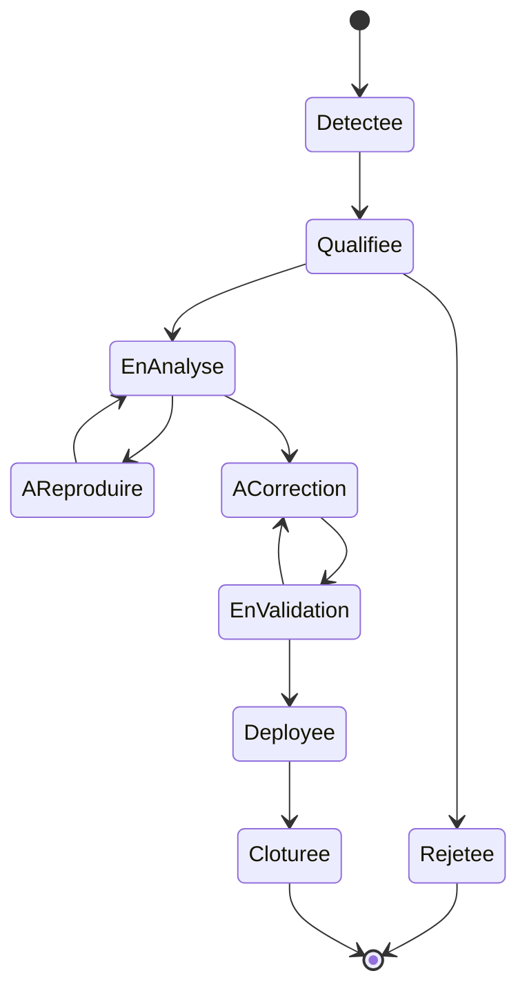

# Processus de gestion des incidents et anomalies Bloc 4 - SportCoach IA

> Projet : **SportCoach IA / aiSport**  
> Bloc RNCP39583 : **Maintenir l'application logicielle en condition opérationnelle**  
> Version : 2026-05-07  
> Objet : processus de collecte, qualification, correction, validation et clôture des anomalies.

---

## 1. Objectif

Ce document formalise le processus de gestion des anomalies de SportCoach IA. Il répond directement à la compétence éliminatoire **C4.2.1** : consigner les anomalies détectées en élaborant un processus de collecte et consignation, en utilisant des outils de collecte et en intégrant toutes les informations pertinentes afin de déterminer le correctif à mettre en place.

Il complète :

- [bloc4-mco-rncp39583.md](bloc4-mco-rncp39583.md)
- [bloc4-runbook-maintenance.md](bloc4-runbook-maintenance.md)
- [bloc4-fiche-anomalie-modele.md](bloc4-fiche-anomalie-modele.md)
- [BUG-001-coverage-threshold.md](../bloc4/bugs/BUG-001-coverage-threshold.md)
- [BUG-002-readme-utf16.md](../bloc4/bugs/BUG-002-readme-utf16.md)

---

## 2. Définitions

| Terme | Définition |
|---|---|
| Anomalie | Comportement différent du résultat attendu, détecté en développement, CI, recette ou production |
| Incident | Anomalie ayant un impact utilisateur, exploitation, sécurité ou disponibilité |
| Bug | Défaut applicatif reproductible nécessitant une correction code, configuration ou documentation |
| Correctif | Modification permettant de résoudre ou contourner l'anomalie |
| Non-régression | Vérification que la correction n'a pas cassé une fonctionnalité existante |
| Contournement | Solution temporaire réduisant l'impact sans corriger la cause racine |

---

## 3. Sources de détection

| Source | Exemples | Preuve ou outil |
|---|---|---|
| CI GitHub Actions | lint, typecheck, tests, coverage, build, Docker, audit | [.github/workflows/ci.yml](../../.github/workflows/ci.yml) |
| CD Vercel | build Vercel, déploiement, smoke test prod | [.github/workflows/deploy-vercel.yml](../../.github/workflows/deploy-vercel.yml) |
| Healthchecks | API `/health`, Web `/api/health` | `apps/api/src/routes/health.routes.ts`, `apps/web/app/api/health/route.ts` |
| Logs API | `[AppError]`, `[UnexpectedError]`, `[Auth]`, `[RateLimit]`, `[AiService]` | Vercel logs, code API |
| Logs Web | erreurs Next.js/Auth.js, error boundary | Vercel logs, `apps/web/app/error.tsx` |
| Base de données | migration KO, connexion DB, requête en erreur | Neon, Drizzle, GitHub Actions |
| Audit sécurité | vulnérabilité haute ou critique | `pnpm audit --audit-level=high`, Dependabot |
| Test manuel | parcours login, génération, consultation, dashboard | cahier de recette, runbook |
| Retour utilisateur/support | email, ticket, message commanditaire | `.github/ISSUE_TEMPLATE/support_case.yml` |
| Monitoring GitHub Actions | échec healthcheck production Web/API | `.github/workflows/production-health-monitor.yml`, issue `Production healthcheck failed` |

---

## 4. Niveaux de criticité

| Niveau | Nom | Définition | Délai cible de première analyse | Exemple SportCoach IA |
|---|---|---|---:|---|
| P0 | Critique | Indisponibilité production, perte de données, faille sécurité exploitable, authentification cassée pour tous | 1 h | API ou Web inaccessible, migration destructive, secret exposé |
| P1 | Haute | Fonction majeure indisponible sans contournement, CI bloquante sur `main`, génération IA impossible pour une majorité d'utilisateurs | 4 h | `pnpm test:coverage` bloque tout déploiement, 5xx sur génération |
| P2 | Moyenne | Fonction dégradée avec contournement, bug UX important, documentation critique illisible | 1 jour ouvré | README illisible, dashboard partiellement faux |
| P3 | Faible | Anomalie mineure, cosmétique, amélioration de documentation, inconfort sans impact majeur | 5 jours ouvrés | libellé imprécis, log à améliorer |

Critères aggravants :

- données utilisateur impactées ;
- sécurité ou secret concerné ;
- absence de contournement ;
- impact jury ou démonstration RNCP ;
- régression introduite par une mise à jour récente ;
- incident reproductible sur production.

---

## 5. Règles de priorisation

Priorité = criticité + probabilité + exposition + effort de correction.

| Critère | Questions |
|---|---|
| Impact utilisateur | Combien d'utilisateurs sont touchés ? Le parcours principal est-il bloqué ? |
| Impact sécurité | Un secret, une donnée personnelle ou un contrôle d'accès est-il concerné ? |
| Impact exploitation | Le déploiement, les migrations ou les healthchecks sont-ils bloqués ? |
| Reproductibilité | Le bug est-il systématique, fréquent, rare ou non reproduit ? |
| Contournement | Existe-t-il une solution temporaire acceptable ? |
| Effort | Le correctif est-il localisé, risqué, dépendant d'un fournisseur externe ? |

Règle de décision :

- P0 : restaurer le service d'abord, analyser ensuite en détail.
- P1 : corriger ou rollback dans la journée.
- P2 : planifier dans le prochain lot de maintenance.
- P3 : traiter lorsque le coût est faible ou lors d'une passe qualité.

---

## 6. Cycle de vie d'une anomalie



| Statut | Description | Sortie attendue |
|---|---|---|
| Détectée | Signal brut reçu | entrée à qualifier |
| Qualifiée | Impact, composant, environnement et criticité renseignés | priorité assignée |
| À reproduire | Informations insuffisantes | étapes ou données complémentaires |
| En analyse | Cause racine recherchée | diagnostic |
| À corriger | Solution décidée | branche ou patch |
| En validation | Correctif prêt, tests en cours | preuve de non-régression |
| Déployée | Correctif livré | version et déploiement identifiés |
| Clôturée | Utilisateur ou mainteneur valide | fiche complétée |
| Rejetée | Non reproductible, hors périmètre ou comportement attendu | justification écrite |

---

## 7. Modèle de ticket incident

Un ticket ou une fiche doit contenir au minimum :

| Champ | Obligatoire | Exemple |
|---|---|---|
| ID | Oui | `BUG-003` |
| Titre | Oui | `Génération programme en erreur 503` |
| Date de détection | Oui | `2026-05-07` |
| Source | Oui | CI, log, utilisateur, audit |
| Environnement | Oui | local, CI, preview, production |
| Composant | Oui | Web, API, DB, IA, Auth, CI/CD |
| Criticité | Oui | P0, P1, P2, P3 |
| Description | Oui | résumé clair du problème |
| Étapes de reproduction | Oui si possible | commandes ou parcours utilisateur |
| Résultat attendu | Oui | comportement normal |
| Résultat obtenu | Oui | erreur observée |
| Impact | Oui | utilisateur, sécurité, livraison |
| Cause racine | À compléter | diagnostic validé |
| Correctif | À compléter | code/config/doc |
| Tests réalisés | À compléter | non-régression |
| Version corrigée | À compléter | `0.12.1` ou `Unreleased` |
| Statut | Oui | détectée, en analyse, résolue |
| Liens | Oui si disponibles | fichiers, commits, workflows, logs |

Le modèle complet est disponible dans [bloc4-fiche-anomalie-modele.md](bloc4-fiche-anomalie-modele.md).

---

## 8. Processus détaillé

### 8.1 Détection

Action :

- collecter le signal sans le modifier ;
- conserver le message d'erreur exact ;
- noter date, environnement, URL ou commande ;
- joindre logs ou captures si disponibles.

Exemples :

- `ERROR: Coverage for statements (54.21%) does not meet global threshold (70%)`
- HTTP 500 sur `/workouts/generate`
- `curl https://ai-sport-api.vercel.app/health` échoue
- retour utilisateur "la génération tourne puis échoue"

### 8.2 Qualification

Action :

- identifier le composant : Web, API, DB, IA, Auth, CI/CD, documentation ;
- déterminer l'environnement : local, CI, preview, production ;
- classer la criticité P0 à P3 ;
- rechercher si l'anomalie est déjà connue.

Questions :

- le service est-il indisponible ?
- une donnée est-elle perdue ou exposée ?
- la CI empêche-t-elle toute livraison ?
- l'utilisateur peut-il contourner ?

### 8.3 Reproduction

Action :

- écrire des étapes minimales ;
- préciser les données de test ;
- isoler la commande ou le parcours utilisateur ;
- si non reproductible, conserver le statut `À reproduire`.

Exemple commande :

```bash
pnpm test:coverage
```

Exemple parcours :

```text
1. Se connecter avec Google.
2. Aller sur /programs/generate.
3. Demander un programme de 8 semaines.
4. Valider le formulaire.
5. Observer le message d'erreur ou le timeout.
```

### 8.4 Analyse

Action :

- lire les logs ;
- comparer avec le dernier changement ;
- vérifier le changelog, la branche et le workflow ;
- identifier la cause racine ;
- choisir correctif, rollback ou contournement.

Sortie attendue :

- cause probable ;
- fichiers concernés ;
- risque du correctif ;
- stratégie de validation.

### 8.5 Correction

Règles :

- corriger en branche dédiée si possible ;
- limiter le périmètre du patch ;
- ajouter ou adapter un test de non-régression ;
- ne pas masquer l'erreur sans traiter la cause ;
- documenter l'écart si correction différée.

Commandes :

```bash
pnpm lint
pnpm typecheck
pnpm test
pnpm build
```

### 8.6 Validation

Niveau de validation selon criticité :

| Criticité | Validation minimale |
|---|---|
| P0 | test ciblé + healthchecks + smoke production après rollback ou hotfix |
| P1 | test ciblé + `pnpm test` + `pnpm build` + CI |
| P2 | test ciblé + suite concernée + build si code impacté |
| P3 | revue documentaire ou test léger selon nature |

Pour une correction IA :

- tester succès ;
- tester erreur fournisseur ou timeout si possible ;
- vérifier logs `[AiService]` ou `[MistralProgramService]` ;
- vérifier message utilisateur non technique.

Pour une correction DB :

- vérifier migration ;
- vérifier requête concernée ;
- tester parcours authentifié ;
- prévoir rollback ou backup.

### 8.7 Déploiement

Flux standard :

1. Commit ou PR.
2. CI verte.
3. Migration DB manuelle si nécessaire.
4. CD Vercel API puis Web.
5. Smoke tests production.
6. Vérification manuelle du parcours impacté.

### 8.8 Clôture

Clôturer uniquement si :

- cause racine renseignée ;
- correctif décrit ;
- test de non-régression noté ;
- version corrigée ou état `Unreleased` indiqué ;
- lien vers preuve disponible ;
- utilisateur/support informé si retour utilisateur.

---

## 9. SLA et SLO proposés

### 9.1 SLO de disponibilité

| Indicateur | Cible prototype RNCP | Mesure |
|---|---:|---|
| Web disponible | 99,0 % mensuel | HTTP 200 `/api/health` |
| API disponible | 99,0 % mensuel | HTTP 200 `/health` |
| CI `main` exploitable | 100 % avant déploiement | GitHub Actions |
| Smoke tests post-CD | 100 % passants | workflow Vercel CD |

### 9.2 SLA de traitement interne

Ces SLA sont des engagements internes recommandés, pas un contrat client réel.

| Criticité | Première analyse | Contournement ou rollback | Correctif cible |
|---|---:|---:|---:|
| P0 | 1 h | 2 h | 24 h |
| P1 | 4 h | 1 jour | 2 jours ouvrés |
| P2 | 1 jour ouvré | selon impact | prochain lot de maintenance |
| P3 | 5 jours ouvrés | non requis | opportuniste |

---

## 10. Preuves à conserver

| Preuve | Pourquoi |
|---|---|
| Message d'erreur exact | Reproduction et diagnostic |
| Logs runtime | Cause racine |
| URL ou commande | Reproduction |
| Capture GitHub Actions | Validation CI |
| Capture Vercel/Neon si production | Preuve d'exploitation |
| Fichiers modifiés | Traçabilité technique |
| Tests lancés | Non-régression |
| Changelog | Journal de maintenance |
| Échange support | Preuve C4.3.3 |

Règle : une anomalie Bloc 4 sans preuve de reproduction ou de validation doit rester au statut `Partiel` ou `À compléter`.

---

## 11. Validation de correction

Checklist :

- [ ] La cause racine est explicitée.
- [ ] Le correctif est décrit.
- [ ] Les fichiers impactés sont listés.
- [ ] Les tests pertinents sont exécutés.
- [ ] La CI est verte si changement code.
- [ ] Les healthchecks sont OK si changement production.
- [ ] Le changelog est mis à jour si changement notable.
- [ ] La fiche anomalie est clôturée.
- [ ] Une leçon apprise ou action préventive est ajoutée si utile.

---

## 12. Cas réels déjà documentés

| ID | Titre | Criticité | Statut | Apport Bloc 4 |
|---|---|---|---|---|
| BUG-001 | Seuil de couverture CI échoue à 54 % | P1 / Bloquant CI | Résolu | Détection CI, analyse, correctif, non-régression |
| BUG-002 | README encodé en UTF-16 LE | P2 / Documentation critique | Résolu | Détection manuelle, cause racine Windows, correction et vérification |

---

## 13. Cas support simulé

Le projet ne contient pas de support client réel. Pour le dossier Bloc 4, un cas support simulé peut être utilisé à condition de le signaler explicitement.

Cas recommandé :

| Élément | Description |
|---|---|
| Retour | "La génération d'un programme long échoue après attente." |
| Acteur support | Support applicatif simulé |
| Diagnostic | Logs `[MistralProgramService]`, timeout, JSON invalide ou budget Vercel dépassé |
| Contribution technique | Ajustement du budget global, retry, validation Zod, message utilisateur |
| Validation | Génération test et logs de succès |
| Limite | Simulation, pas une preuve client réelle |

À transformer en preuve réelle dès qu'un retour utilisateur ou commanditaire existe.

---

## 14. Amélioration continue du processus

Actions prioritaires :

1. Créer un dossier ou un outil unique pour les tickets : GitHub Issues, Linear ou fichiers Markdown normalisés.
2. Ajouter un identifiant unique pour chaque anomalie : `BUG-003`, `INC-001`, `SEC-001`.
3. Capturer les exécutions CI/CD liées aux corrections.
4. Mettre en place un monitoring externe pour générer des incidents réels de disponibilité.
5. Ajouter une revue mensuelle des bugs, incidents, dépendances et recommandations.
